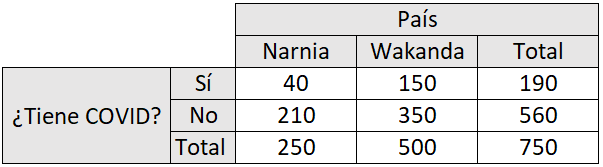
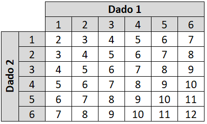
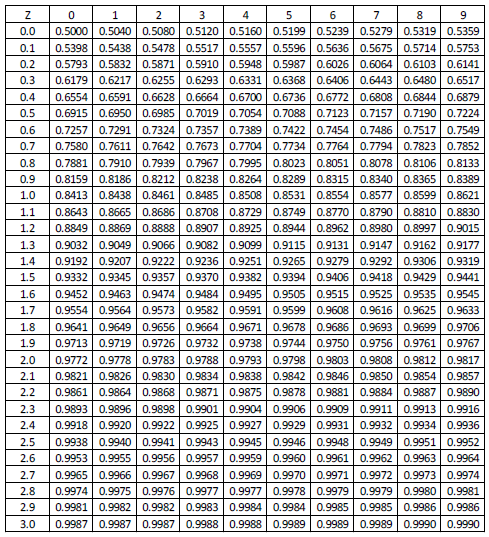

```{r setup, include = FALSE, purl = FALSE}
options(htmltools.dir.version = FALSE)
library(knitr)
opts_chunk$set(
  fig.align="center",  
  fig.height=4, #fig.width=6,
  dpi=300, #fig.path='Figs/',
  cache=T,#, echo=F, warning=F, message=F,
  echo = TRUE,
  message = FALSE,
  warning = FALSE,
  error = FALSE,
  out.width = "90%"
  )
library(tidyverse)
library(hrbrthemes)
library(fontawesome)
library(patchwork)
xaringanExtra::use_scribble(pen_size = 1)
xaringanExtra::use_search(show_icon = FALSE)
htmltools::tagList(
  xaringanExtra::use_clipboard(
    button_text = "<i class=\"fa fa-clipboard\"></i>",
    success_text = "<i class=\"fa fa-check\" style=\"color: #90BE6D\"></i>",
  ),
  rmarkdown::html_dependency_font_awesome()
)
```

# Nivelación

### Objetivos

- Repasar conceptos que probablemente han visto antes, pero de forma aplicada y con ejemplos en `R`

- Generar un lenguaje común

--

En el mundo de la Estadística/Econometría/Machine Learning se habla generalmente de **modelos**.

--

Queremos ver conceptos que nos ayuden a entender mejor ese "mundo" (y su nomenclatura) al revisarlos en la 2da parte del módulo 2. 

---

# ¿Para qué?

.pull-left[

### En particular

```{r, echo = FALSE, out.width = "100%"}
knitr::include_graphics("../Imagenes/RegOutput.jpeg")
```

$$Y=\beta_0+\beta_1X_1+\beta_2X_2+\beta_3X_3+\epsilon$$

]
--

.pull-right[

### En general

```{r, echo = FALSE, out.width = "140%"}
knitr::include_graphics("../Imagenes/ProcesoDS.png")
```

]

---

# ¿Qué veremos?

- Conceptos estadísticos
 * Conjuntos
 * Probabilidad
 * Variables discretas y continuas
 * Medidas de tendencia central y dispersión
 * Teorema del límite central
 * Distribuciones conjuntas
 * Distribuciones: Normal, $\chi^2$, $t$, $F$
- `R`

---
class: inverse, center, middle
name: reg

# Conjuntos

<html><div style='float:left'></div><hr color='#EB811B' size=1px width=796px></html>

---

# Proceso aleatorio

En un proceso aleatorio hay más de una posibilidad de resultado y la predicción de algún resultado particular es difícil:

Clásicos ejemplos:
  * tirar una moneda
  * tirar un dado

---

# Proceso aleatorio

### Espacio muestral

Es el conjunto de todos los posibles resultados de un proceso aleatorio.
--

 - Dados: $S=\{1,2,3,4,5,6\}$
 - Moneda: $S=\{C,S\}$

--

### Evento

Es un subconjunto del espacio muestral.

--

Para el caso del dado, digamos que: 

- $A$ representa el evento de que al tirar un dado el resultado es un número par: $A=\{2,4,6\}$
--

- $B$ representa el evento de que al tirar un dado el resultado es un número impar: $B=\{1,3,5\}$
--

- $C$ representa el evento de que al tirar un dado el resultado es un número primo: $C=\{2,3,5\}$

---

# Diagrama de Venn

```{r venn, echo = FALSE}
knitr::include_graphics("../Imagenes/venn.jpg")
```

---

# Complemento de un evento

.pull-left[
**Definición**: el complemento de un evento son todos los resultados en el espacio muestral que no son el evento mismo.

**Ejemplo**: el complemento del evento $C$ es el conjunto de resultados de tirar un dado que no corresponden a números primos.

**Notación**: $\Large  C^c$

$\Large C^c:\{1,4,6\}$
]

.pull-right[
```{r venn2, echo = FALSE}
knitr::include_graphics("../Imagenes/venn.jpg")
```
]

---

# Complemento de un evento

Definir tres *vectores* $A$, $B$, $C$

```{r complemento}
A <- c(2,4,6)
B <- c(1,3,5)
C <- c(2,3,5)
```

--

Definir un vector que contiene los elementos de $A$ y $B$

```{r complemento2}
AyB <- union(A, B)
```

--

Ver que elementos que están en $A$ o $B$, no están en $C$

```{r complemento3}
setdiff(AyB, C)
```

--

Para ver que hace una función (por ejemplo `setdiff()`) usar `?setdiff`

---

# Eventos mutuamente excluyentes

.pull-left[
**Definición**: los eventos mutuamente excluyentes son eventos que no pueden ocurrir al mismo tiempo.

**Ejemplo**: el evento $A$ y el evento $B$ son mutuamente excluyentes porque el resultado de tirar un dado no puede ser par e impar al mismo tiempo.

Los eventos $A$ y $C$ no son mutuamente excluyentes solamente porque 2 es tanto par como primo.
]

.pull-right[
```{r venn3, echo = FALSE}
knitr::include_graphics("../Imagenes/venn.jpg")
```
]

---

# Eventos mutuamente excluyentes

¿Existe al menos un elemento de $A$ igual a un elemento en $C$?

--

```{r mutuamente}
intersect(A, C)
```

$A$ y $C$ **no** son mutuamente excluyentes

--

¿Existe al menos un elemento de $B$ igual a un elemento en $C$?

--

```{r mutuamente2}
intersect(B, C)
```

$B$ y $C$ **no** son mutuamente excluyentes

--

¿Existe al menos un elemento de $A$ igual a un elemento en $B$?

```{r mutuamente3}
intersect(A, B)
```

$A$ y $B$ son mutuamente excluyentes

---

# Notación de conjuntos

.pull-left[

|Descripción |Notación    |Lectura  |Elementos|
| -------    |:-------    |:------- |:------- |
|Unión       | $A \cup C$ |A o C    | $\{2,3,4,5,6\}$ |
|Intersección| $A \cap C$ |A y C    | $\{2\}$ |

]

.pull-right[
```{r venn4, echo = FALSE}
knitr::include_graphics("../Imagenes/venn.jpg")
```
]

---

# Notación de conjuntos

.pull-left[

|Descripción |Notación    |Lectura  |Elementos|
| -------    |:-------    |:------- |:------- |
|Unión       | $A \cup C$ |A o C    | $\{2,3,4,5,6\}$ |
|Intersección| $A \cap C$ |A y C    | $\{2\}$ |

```{r conjunto}
union(A, C)
intersect(A, C)
```

]

.pull-right[
```{r venn5, echo = FALSE}
knitr::include_graphics("../Imagenes/venn.jpg")
```
]

---
class: inverse, center, middle
name: reg

# Probabilidades

<html><div style='float:left'></div><hr color='#EB811B' size=1px width=796px></html>

---

# Definamos probabilidad

## Definición "frecuentista"

La probabilidad de un resultado está definida por la **proporción de veces** que ese resultado es observado a través de un **alto número de repeticiones de procesos aleatorios**.

--

Asuman que repetimos el proceso aleatorio de tirar una moneda y que registramos $X$, el número de veces que sale *cara* en $n$ tiradas de moneda. Entonces:

$$\Large P(Cara)=\lim_{n\to\infty}\frac{X}{n}$$

--

$$\Large P(Cara)=\frac{1}{2}$$
---

# En la práctica

```{r seed, echo = FALSE}
set.seed(1)
```

Definamos un vector *moneda* con los posibles eventos y simulemos una sola tirada de esa moneda.
```{r moneda}
moneda <- c("cara", "sello")
sample(moneda, 1)
```

--

Repitamos 5 veces este proceso
```{r moneda2}
tirar_moneda <- sample(moneda, 5, replace = TRUE)
table(tirar_moneda)
```
Dados estos resultados, vemos que $P(Cara)=\frac{3}{5}=60\%$

---

# En la práctica

```{r seed2, echo = FALSE}
set.seed(1)
```

Definamos un vector *moneda* con los posibles eventos y simulemos una sola tirada de esa moneda.
```{r moneda3}
moneda <- c("cara", "sello")
sample(moneda, 1)
```

Repitamos 5.000 veces este proceso
```{r moneda4}
tirar_moneda <- sample(moneda, 5000, replace = TRUE)
table(tirar_moneda)
```

En este caso vemos que $P(Cara)=\frac{2448}{5000}=48,96\%$

---

# En la práctica

```{r simularmoneda, echo = FALSE}
tirar_moneda_10000 <- sample(moneda, 10000, replace = TRUE)
frec_cara <- cumsum(tirar_moneda_10000 == 'cara') / 1:10000
as.data.frame(cbind(x = 1:10000, y = frec_cara)) %>% 
  ggplot(aes(x = x, y = y)) +
  geom_hline(yintercept = 0.5, linetype = 2) +
  geom_line(col = "red", size = 1) +
  #geom_point() +
  ylim(0, 1) +
  labs(y = "Frecuencia relativa", x = "Número de tiros") +
  theme_bw()
```


---

# Definamos probabilidad

## Definición "bayesiana"

Al definir una probabilidad, además de considerar el número de veces que un resultado ocurre, la aproximación *bayesiana* considera información previa (*prior*) que se tenga sobre ese resultado.

**No profundizaremos en este tema pero lo dejo como antecedente.**

---

# Cosas a saber sobre las probabilidades

+ $0 \leq P(A) \leq 1$: La probabilidad de cualquier evento se encuentra entre cero y uno
+ $P(S)=1$: El conjunto de eventos es igual a 1

--

### Probabilidad de eventos complementarios

$P(A)+P(A^c)=1$. Por ejemplo, si sabemos que la **probabilidad de que llueva es 0.1**, entonces sabemos también que la **probabilidad de que no llueva es 0.9**.

--

### Regla de Independencia y Multiplicación

Dos procesos son independientes si el saber el resultado de uno no afecta el resultado de otro. Por ejemplo, tirar dos monedas al aire.

--

Si el evento $A$ y $B$ son independientes, entonces: $P(A \cap B)=P(A) \times P(B)$

--

La probabilidad de sacar dos *caras* en dos tiradas de una misma moneda es: $\frac{1}{2} \times \frac{1}{2}=\frac{1}{4}$

---
class: inverse, center, middle
name: reg

# Probabilidad Conjunta/Marginal/Condicional

<html><div style='float:left'></div><hr color='#EB811B' size=1px width=796px></html>

---

# GSS 2018

La *General Social Survey* (GSS) es una encuesta sociológica que se hace en Estados Unidos desde 1972. Es una encuesta muy completa que entrega información sobre distintos aspectos sobre los residentes del país.

```{r gss, echo = FALSE}

```

---

# Eventos

Digamos que $B$ representa el evento de aleatoriamente seleccionar una persona de esta muestra que **cree en la vida después de la muerte**.

--

Digamos que $C$ representa el evento de aleatoriamente seleccionar una persona de esta muestra que **ha tomado un curso universitario de ciencias**.

---

# Probabilidad marginal

```{r gss3, echo = FALSE}

```

$P(B)$ representa una *probabilidad marginal*. Así también $P(C)$, $P(B^C)$, y $P(C^C)$.

Para calcular estas probabilidad solo debemos usar los valores en los márgenes de la tabla (por eso el nombre).

--

$\large P(B)=\frac{860}{1050}$

$\large P(C)=\frac{450}{1050}$

---

# Probabilidad conjunta

```{r gss2, echo = FALSE}

```

Noten que los eventos $B$ y $C$ **no son mutualmente excluyentes**. Una persona seleccionada aleatoriamente puede creer en la vida después de la muerte y podría haber tomado un curso universitario de ciencias. $B \cap C \neq \emptyset$

--

$\large P(B \cap C)=\frac{375}{1050}$

--

Noten también que $P(B \cap C)=P(C \cap B)$. El orden no importa.

---

# Regla de adición

```{r gss5, echo = FALSE}

```

$\large P(B \cup C)=P(B)+P(C)-P(B \cap C)$

$\large P(B \cup C)=\frac{860}{1050}+\frac{450}{1050}-\frac{375}{1050}=\frac{935}{1050}$

--

<br>

$\large P(B \cup C)=P(B^c)+P(C^c)+P(B \cap C)$

$\large P(B \cup C)=\frac{485}{1050}+\frac{75}{1050}+\frac{375}{1050}=\frac{935}{1050}$

---

# Probabilidad condicional

```{r gss4, echo = FALSE}

```

$P(B|C)$ representa una *probabilidad condicional* ("Probabilidad de B dado C"). Así también $P(B^C|C)$, $P(C|B)$, y $P(C|B^C)$.

--

Para calcular estas probabilidades nos enfocamos en las filas o columnas de la *información dada* o la condición. En otras palabras, reducimos el espacio muestral a esta información dada o condición.

--

La probabilidad de que una persona seleccionada aleatoriamente **crea en la vida después de la muerta DADO que ha tomado un curso universitario de ciencias**:

$\large P(B|C)=\frac{375}{450}$

--

El orden acá si importa: $P(B|C) \neq P(C|B)$

---

# Probabilidad condicional

### Teorema de Bayes

$$\Large P(A|B)=\frac{P(B|A)\times P(A)}{P(B)}$$

--

Nuevamente, no profundizaremos en este tema. Pero bueno tenerlo en el radar.

--

En el módulo tres hablarán un poco más sobre este tema (*Naive Bayes*)

---
class: inverse, center, middle
name: reg

# Ejercicio

<html><div style='float:left'></div><hr color='#EB811B' size=1px width=796px></html>

---

# Caso hipotético

```{r narniawakanda, echo = FALSE}

```

`EjercicioProbabilidadesDisc.R`
---

# Tengan en cuenta

```{r tipodatos, echo = FALSE}
knitr::include_graphics("../Imagenes/TipoDatos.png")
```

---

# Respuestas

```{r narniawakanda2, echo = FALSE}

```

```{r tablanarniawakanda, echo = FALSE}
tabla <- data.frame(
  "Narnia" = c(40, 210, 250),
  "Wakanda" = c(150, 350, 500),
  "Total" = c(190, 560, 750)
)
rownames(tabla) <- c("COVID_Si", "COVID_No", "Total")
```

.pull-left[

$P(COVID\ No)$

```{r nwej1}
tabla[2,3]/tabla[3,3]
```

$P(Narnia \cap COVID\ No)$

```{r nwej2}
tabla[2,1]/tabla[3,3]
```

]

.pull-right[

$P(COVID\ Si|Narnia)$

```{r nwej3}
tabla[1,1]/tabla[3,1]
```

$P(Wakanda|COVID\ No)$

```{r nwej4}
tabla[2,2]/tabla[2,3]
```

]


---
class: inverse, center, middle
name: reg

# Variables aleatorias discretas

<html><div style='float:left'></div><hr color='#EB811B' size=1px width=796px></html>

---

# Variables aleatorias discretas

Una función que asigna un resultado numérico a un proceso aleatorio se conoce como **variable aleatoria**.

--

Para una **variable aleatoria discreta**, estos resultados numéricos toman valores aislados (entre dos números no existe ninguno intermedio) y los posibles valores son finitos.

--

Usaremos letras mayúsculas, como $X$, $Y$, y $Z$, para representar variables aleatorias y minúsculas ( $x$, $y$, y $z$) para indicador resultados observados.

---

# Variable aleatorias discretas

Proceso aleatorio: Tirar 3 veces una misma moneda.

--

Espacio muestral: $\{CCC,CCS,CSC,SCC,CSS,SCS,SSC,SSS\}$

--

Digamos que $X$ es una variable aleatoria discreta que representa el número total de *caras* en 3 tiros de moneda. ¿Cuál es $P(X=2)$?

--

$P(X=2)=\frac{3}{8}=0.375$

--

| x             | 0     | 1     | 2     | 3     |
|---            |---    |---    |---    |---    |
| $\small P(X=x)=f(x)$ | $f(0)$=0,125 | $f(1)$=0,375 | $f(2)$=0,375 | $f(3)$=0,125 |

--

```{r tresmonedas}
resultados <- replicate(expr = sum(sample(moneda, 3, replace = TRUE) == "cara"), n = 10000)
table(resultados)/10000
```

---

# Función de Masa de Probabilidad

Para una variable aleatoria discreta, $X$, la distribución de todos los valores posibles de $x$ puede ser graficada con una Función de Masa de Probabilidad (Probability Mass Function - **pmf**)

```{r pmf, echo = FALSE}
data.frame(cbind(x = 0:3, "f" = c(0.125, 0.375, 0.375, 0.125), yend = rep(0,5))) %>% 
  ggplot(aes(x = x, y = f, xend = x, yend = yend)) +
  geom_point() +
  ylim(0, 0.4) +
  geom_segment() +
  theme_bw()
```

---

# Función de Distribución Acumulada

|     | x             | 0     | 1     | 2     | 3     |
|--   |---            |---    |---    |---    |---    |
| pmf | $\small P(X=x)=f(x)$ | $f(0)$=0,125 | $f(1)$=0,375 | $f(2)$=0,375 | $f(3)$=0,125 |
| cdf | $\small P(X<=x)=F(x)$| $F(0)$=0,125 | $F(1)$=0,5   | $F(2)$=0,875 | $F(3)$=1     |

```{r pdfdisc, echo = FALSE}
data.frame(cbind(x = 0:3, "F" = c(0.125, 0.5, 0.875, 1), yend = rep(0,5))) %>% 
  ggplot(aes(x = x, y = F, xend = x, yend = yend)) +
  geom_point() +
  ylim(0, 1) +
  geom_segment() +
  theme_bw()
```

---

# Medidas de tendencia central

$$\{1,2,3,3,4,5,6,7,8,9,10,11,12\}$$

--

.pull-left[
**Esperanza** o Valor Esperado

Valor promedio/medio (ponderado).

```{r media}
mean(c(1,2,3,3,4,5,6,7,8,9,10,11,12))
```

**Mediana**

Valor ( $x$) que divide las observaciones en dos grupos de igual tamaño.

```{r mediana}
median(c(1,2,3,3,4,5,6,7,8,9,10,11,12))
```

]

.pull-right[

**Moda**

Valor con la mayor probabilidad de ocurrencia (o mayor valor de la función de densidad)

```{r moda}
table(c(1,2,3,3,4,5,6,7,8,9,10,11,12))
```

]

---

# Esperanza/Valor Esperado

Si repetimos muchas veces este proceso aleatorio de tirar una moneda tres veces, ¿cuantas *caras* esperamos ver en promedio?

--

| x             | 0     | 1     | 2     | 3     |
|---            |---    |---    |---    |---    |
| $\small P(X=x)=f(x)$ | 0,125 | 0,375 | 0,375 | 0,125 |

--

$E(X)=\sum{[x*f(x)]}$

--

$E(X)=(0 \times 0.125)+(1 \times 0.375)+(2 \times 0.375)+(3 \times 0.125)$

$E(X) = \mu = 1.5$

--

```{r}
mean(resultados)
```

--

**¿Cómo interpretamos que al tirar tres monedas el valor esperado sean 1.5 caras?**

---

# Interpretación en la práctica

Podemos decir que $\mu = 1.5$ al tirar tres monedas es lo mismo que esperar obtener 15 caras al repetir este proceso 10 veces. De hecho:

--

.pull-left[
```{r tresmonedasdiez}
resultado_final <- vector()
for (i in 1:10000){
  resultado_por_proceso <- vector()
  for (j in 1:10){
    resultado_por_proceso[j] <- sum(sample(moneda, 3, replace = TRUE) == "cara")
  }
  resultado_final[i] <- sum(resultado_por_proceso)
}
```
]

.pull-right[
```{r graftresmonedasdiez, echo = FALSE}
resultado_final %>% 
  as_tibble() %>% 
  ggplot(aes(x = value)) +
  geom_histogram(binwidth = 1, fill = "light grey", color = "grey") +
  geom_vline(xintercept = 15, color = "red") +
  theme_bw() +
  labs(x = "valor", y = "conteo")
```
]

--

Si simulamos 10.000 escenarios donde tiramos 10 veces 3 monedas y contamos el número de *caras*, obtenemos que el valor más probable (esperado) es 15.

---

# Medidas de dispersión

- Varianza

- Desviación estándar

- Coeficiente de variación

- Rango intercuartil

--

```{r, echo = FALSE, out.width = "80%"}
knitr::include_graphics("../Imagenes/BoxPlot.PNG")
```


---

# Varianza

Probablemente han visto algo como esto:

$$Var(X)=\frac{1}{n}\sum_i^n(x_i-\mu)^2$$

--

Otra forma de verlo (una generalización):

$$\Large Var(X)=E[(X-\mu)^2]$$
--

$$\Large Var(X)=E[(X-E(X))^2]$$

--

$$\Large Var(X)=\sigma^2=E(X^2)-[E(X)]^2$$
---

# Varianza

| x             | 0     | 1     | 2     | 3     |
|---            |---    |---    |---    |---    |
| $\small P(X=x)=f(x)$ | 0,125 | 0,375 | 0,375 | 0,125 |

$\large Var(X)=E(X^2)-E[(X)]^2=E(X^2)-1.5^2$

--

$\large E(X^2)=\sum{[x^2*f(x)]}$

--

$\large E(X^2)=(0^2 \times 0.125)+(1^2 \times 0.375)+(2^2 \times 0.375)+(3^2 \times 0.125)$

$\large E(X^2)=3$

--

$\large Var(X)=3-1.5^2=3-2.25=0.75=\sigma^2$

--

```{r varresultados}
var(resultados)
```

--

Desviación estándar: $\sigma=\sqrt{0.75}=0.8660254$

---

# Algo interesante...

La variable aleatoria, $X$, correspondiente al resultado de tirar tres monedas **sigue una distribución binomial** que depende de, $n$, número de intentos de un proceso aleatorio y, $p$, la probabilidad de éxito. 

--

$n$ y $p$ los denominamos como **parámetros de la distribución**.

--

$$X \sim  Binomial(n, p)$$
.pull-left[

$S=\{0,1,...,n\}$

<br>

$P(X=x)=f(x)=\binom{n}{k}p^x(1-p)^{n-x}$

<br>

$E(X)=np$

$Var(X)=np(1-p)$

]

--

.pull-right[

```{r binom1}
dbinom(x = 3, size = 3, prob = 0.5) #pmf
```
```{r binom2}
pbinom(q = 3, size = 3, prob = 0.5) #cdf
```

$E(X)=3 \times 0.5=1.5$

$Var(X)=3 \times 0.5 \times (1-0.5)=0.75$

]

---

# Algo interesante...

La variable aleatoria, $X$, correspondiente al resultado de tirar tres monedas **sigue una distribución binomial** que depende de, $n$, número de intentos de un proceso aleatorio y, $p$, la probabilidad de éxito. 

$n$ y $p$ los denominamos como **parámetros de la distribución**.

```{r dist_binom, echo = FALSE, fig.height=4}
plot(seq(0,50,by = 1), dbinom(seq(0,50,by = 1), 50, 0.5),
     type = "l",
     ylim = c(0,0.3),
     ylab = "P(X=x)",
     xlab = NA) 
points(seq(0,50,by = 1), dbinom(seq(0,50,by = 1), 50, 0.5), col = 1)

lines(seq(0,50,by = 1), dbinom(seq(0,50,by = 1), 10, 0.5), col = 2)
points(seq(0,50,by = 1), dbinom(seq(0,50,by = 1), 10, 0.5), col = 2)

lines(seq(0,50,by = 1), dbinom(seq(0,50,by = 1), 50, 0.8), col = 3)
points(seq(0,50,by = 1), dbinom(seq(0,50,by = 1), 50, 0.8), col = 3)

lines(seq(0,50,by = 1), dbinom(seq(0,50,by = 1), 20, 0.8), col = 4)
points(seq(0,50,by = 1), dbinom(seq(0,50,by = 1), 20, 0.8), col = 4)

legend("topright", 
       c("n = 50; p = 0.5", "n = 10; p = 0.5", 
         "n = 50; p = 0.8", "n = 20; p = 0.8"), 
       col = 1:4 , 
       lty = 1)
```

---
class: inverse, center, middle
name: reg

# Ejercicio

<html><div style='float:left'></div><hr color='#EB811B' size=1px width=796px></html>

---

# Suma de tirar dos dados

```{r imgdados, echo = FALSE, out.width='400px'}

```

`EjercicioDatos.R`

---

# Suma de tirar dos dados

```{r imgdados2, echo = FALSE, out.width='400px'}

```

$S=\{2,3,4,5,6,7,8,9,10,11,12\}$

--

¿Cuál es la *pmf* y *cdf*?

|     |                      | 2| 3| 4| 5| 6| 7| 8| 9|10|11|12|
|--   |---                   |--|--|--|--|--|--|--|--|--|--|--|
| pmf | $\small P(X=x)=f(x)$ |  |  |  |  |  |  |  |  |  |  |  |
| cdf | $\small P(X<=x)=F(x)$|  |  |  |  |  |  |  |  |  |  |  |

Calcule $E(X)$, $Var(X)$, y $\sigma$

---

# Respuestas

¿Cuál es la *pmf* y *cdf*?

|     |                      | 2   | 3   | 4   | 5   | 6   | 7   | 8   | 9   |10   |11   |12   |
|--   |---                   |--   |--   |--   |--   |--   |--   |--   |--   |--   |--   |--   |
| pmf | $\small P(X=x)=f(x)$ |0.028|0.056|0.083|0.111|0.139|0.167|0.139|0.111|0.083|0.056|0.028|
| cdf | $\small P(X<=x)=F(x)$|0.028|0.083|0.167|0.278|0.417|0.583|0.722|0.833|0.917|0.972|1    |

```{r ejdados, echo = FALSE}
dado1 <- 1:6
dado2 <- 1:6
combinaciones <- expand.grid("dado1" = dado1, "dado2" = dado2)
combinaciones$suma_dados <- combinaciones$dado1 + combinaciones$dado2
```

--

```{r pmfdados}
pmf <- table(combinaciones$suma_dados)/nrow(combinaciones)
pmf
```

---

# Respuestas

¿Cuál es la *pmf* y *cdf*?

|     |                      | 2   | 3   | 4   | 5   | 6   | 7   | 8   | 9   |10   |11   |12   |
|--   |---                   |--   |--   |--   |--   |--   |--   |--   |--   |--   |--   |--   |
| pmf | $\small P(X=x)=f(x)$ |0.028|0.056|0.083|0.111|0.139|0.167|0.139|0.111|0.083|0.056|0.028|
| cdf | $\small P(X<=x)=F(x)$|0.028|0.083|0.167|0.278|0.417|0.583|0.722|0.833|0.917|0.972|1    |

```{r ejdados2, echo = FALSE}
dado1 <- 1:6
dado2 <- 1:6
combinaciones <- expand.grid("dado1" = dado1, "dado2" = dado2)
combinaciones$suma_dados <- combinaciones$dado1 + combinaciones$dado2
```


```{r cdfdados}
cdf <- cumsum(pmf)
cdf
```

---

# Respuestas

Calcule $E(X)$, $Var(X)$, y $\sigma$

.pull-left[

### Desde las formulas

```{r dadosej1, collapse = TRUE}
espacio_muestral <- unique(combinaciones$suma_dados)
```

```{r dadosej2, collapse = TRUE}
(e_x <- sum(espacio_muestral*pmf))
(varianza_dados <- (sum(espacio_muestral^2*pmf))-(sum(e_x^2)))
sqrt(varianza_dados)
```

]

--

.pull-right[

### Simular

```{r dadosej3, collapse = TRUE}
guardar_suma <- replicate(
  expr = sum(sample(1:6, 2,replace = TRUE)),
  n = 10000)

mean(guardar_suma)
var(guardar_suma)
sd(guardar_suma)
```
]

---

# Otras distribuciones discretas

.pull-left[

Distribución Geométrica: $X$ es el número de *fracasos* antes de observar el primer *éxito* en  procesos independientes.
 - $X \sim Geom(p)$

<br>

 - $f(x)=(1-p)^xp$
 - $E(X)=\frac{1-p}{p}$
 - $Var(X)=\frac{1-p}{p^2}$
 
<br>

 - `dgeom(x, prob)` (pmf) y `pgeom(q, prob)` (cdf)
  
]

.pull-right[

Distribución Poisson: $X$ es el número de ocurrencias de un evento dentro de un espacio o tiempo **finito**.
 - $X \sim Poisson(\lambda)$
 
<br>

 - $f(x)=\frac{\lambda^x}{x!}e^{-\lambda}$
 - $E(X)=Var(X)=\lambda$
 
<br>

 - `dpois(x, lambda)` (pmf) y `ppois(lambda)` (cdf)

]

---

# Otras distribuciones discretas

.pull-left[

Distribución Geométrica: $X$ es el número de *fracasos* antes de observar el primer *éxito* en  procesos independientes.
 - $X \sim Geom(p)$

```{r dist_geom, echo = FALSE, fig.height=7}
plot(dgeom(seq(0, 10, by = 1), prob = 0.2), type = "l", col = 1,
     ylim = c(0,0.9),
     xlab = NA, ylab = "P(X = x)") 
points(dgeom(seq(0, 10, by = 1), prob = 0.2), col = 1)
lines(dgeom(seq(0, 10, by = 1), prob = 0.5), col = 2)
points(dgeom(seq(0, 10, by = 1), prob = 0.5), col = 2)
lines(dgeom(seq(0, 10, by = 1), prob = 0.8), col = 3)
points(dgeom(seq(0, 10, by = 1), prob = 0.8), col = 3)

legend("topright", 
       c("p = 0.2", "p = 0.5", "p = 0.8"), 
       col = 1:3 , 
       lty = 1)
```

  
]

.pull-right[

Distribución Poisson: $X$ es el número de ocurrencias de un evento dentro de un espacio o tiempo **finito**.
 - $X \sim Poisson(\lambda)$
 
```{r dist_poisson, echo = FALSE, fig.height=7}
plot(dpois(seq(0, 20, by = 1), lambda = 1), type = "l", col = 1,
     ylim = c(0,0.4),
     xlim = c(1, 20),
     xlab = NA, ylab = "P(X = x)") 
points(dpois(seq(0, 20, by = 1), lambda = 1), col = 1)
lines(dpois(seq(0, 20, by = 1), lambda = 4), col = 2)
points(dpois(seq(0, 20, by = 1), lambda = 4), col = 2)
lines(dpois(seq(0, 20, by = 1), lambda = 10), col = 3)
points(dpois(seq(0, 20, by = 1), lambda = 10), col = 3)

legend("topright", 
       c("lambda = 1", "lambda = 4", "lambda = 10"), 
       col = 1:3 , 
       lty = 1)
```


]

---
class: inverse, center, middle
name: reg

# Variables aleatorias continuas

<html><div style='float:left'></div><hr color='#EB811B' size=1px width=796px></html>

---

# Variables aleatorias continuas

A diferencia de las variables discretas (que pueden tomar un número finito de valores), las variables continuas pueden tomar un **"número infinito de valores posibles"**.

--

El concepto de número infinito de valores posibles es una **abstracción matemática** ya que en la práctica todas las mediciones que hagamos consisten en un número finito (ingreso de una persona, longitud de un objeto, tiempo transcurrido).

La utilidad de considerar variables como continuas es que hace el **"manejo matemático" más fácil**.

--

En este caso no hablamos de distribución de función de masa de probabilidad (*pmf*) sino que de **función de densidad de probabilidad** (*pdf* en inglés).

--

La función de distribución acumulada (*cdf*) para una variable continua se define de forma similar al caso discreto ( $P(X<=x)$).

---

# Función de densidad de probabilidad

La función de densidad de probabilidad muestra la posibilidad relativa de la variable aleatoria continua en el espacio muestral. Esta debe cumplir que:

--

Para todo valor posible, la probabilidad tiene que ser mayor o igual a cero.
$$\Large  f(x) \geq 0\ \forall\ x \in S_X$$

--

La suma de todos los casos posibles (área bajo la curva) debe ser igual a uno.
$$\Large  \int_{x \in S_X}f(x)dx=1$$

--

Todo evento corresponde a una porción del área bajo la curva.
$$\Large  P(X \in B)=\int_{X \in B}f(x)$$

---

# Ejemplo pdf

```{r datosVAcont, echo = FALSE}
f_var_cont <- function(x){
  12*(x^2)*(1-x)
}

datos_va <- data.frame("f" = f_var_cont(seq(from = 0, to = 1, by = 0.001)),
           "x" = seq(from = 0, to = 1, by = 0.001)) 

datos_va2 <- data.frame("f" = f_var_cont(seq(from = 0.25, to = 0.5, by = 0.001)),
                       "x" = seq(from = 0.25, to = 0.5, by = 0.001)) 

datos_va3 <- data.frame("f" = f_var_cont(seq(from = 0, to = 0.75, by = 0.001)),
                        "x" = seq(from = 0, to = 0.75, by = 0.001)) 
```

$$f(x)=12x^2(1-x)\ si \ 0 \leq x \leq 1$$
```{r vacont1, echo = FALSE}
datos_va %>% 
  ggplot(aes(x = x, y = f)) +
  geom_line() +
  theme_minimal()
```

---

# ¿ $\large f(x)$ mayor o igual a 0?

.pull-left[

$f(x)=12x^2(1-x)$

<br>

$x^2 \geq 0$

$(1-x) \geq 0$

<br>

$f(x) \geq 0\ \forall\ x \in S_X$  **OK**

]

.pull-right[

```{r vacont2, echo = FALSE}
datos_va %>% 
  ggplot(aes(x = x, y = f)) +
  geom_line() +
  theme_minimal()
```

$$f(x)=12x^2(1-x)\ si \ 0 \leq x \leq 1$$

]

---

# Área bajo la curva = 1

.pull-left[

$\int_{0}^{1}12 (x^2)(1-x)dx$

<br>

$12\int_{0}^{1} (x^2-x^3)dx$

<br>

$12\Big[\frac{x^3}{3}-\frac{x^4}{4}\bigg|_{0}^{1}\Big]$

$12(\frac{1^3}{3}-\frac{1^4}{4})-12(\frac{0^3}{3}-\frac{0^4}{4})=\frac{12}{3}-\frac{12}{4}=4-3=1$

```{r vacont3}
f_ejemplo <- function(x){12*(x^2)*(1-x)}
integrate(f_ejemplo, 0, 1)
```

$\int_{x \in S_X}f(x)dx=1$  **OK**

]

.pull-right[

```{r vacont4, echo = FALSE}
datos_va %>% 
  ggplot(aes(x = x, y = f)) +
  geom_area(fill = "red", alpha = 0.5) +
  geom_line() +
  theme_minimal()
```

$$f(x)=12x^2(1-x)\ si \ 0 \leq x \leq 1$$

]

---

# Probabilidad = porción del área

.pull-left[

$P(0.25 < X < 0.5)=\int_{0.25}^{0.5}12(x^2)(1-x)dx$

<br>

$12\int_{0.25}^{0.5}(x^2-x^3)dx$

<br>

$12\Big[\frac{x^3}{3}-\frac{x^4}{4}\bigg|_{0.25}^{0.5}\Big]=0.2617188$

```{r vacont5}
integrate(f_ejemplo, 0.25, 0.5)
```

<br>

$P(X \in B)=\int_{X \in B}f(x)$  **OK**
]

.pull-right[

```{r, echo = FALSE}
datos_va %>% 
  ggplot(aes(x = x, y = f)) +
  geom_area(data = datos_va2, fill = "red", alpha = 0.5) +
  geom_line() +
  theme_minimal()
```

$$f(x)=12x^2(1-x)\ si \ 0 \leq x \leq 1$$

]

---

# Probabilidad de un $x$ = 0

.pull-left[

$P(X = x_i)=0$

<br>

$P(X=0.4)=\int_{0.4}^{0.4}12(x^2)(1-x)dx$

<br>

$12\int_{0.4}^{0.4}(x^2-x^3)dx$

<br>

$12\Big[\frac{x^3}{3}-\frac{x^4}{4}\bigg|_{0.4}^{0.4}\Big]=0$

```{r vacont6}
integrate(f_ejemplo, 0.4, 0.4)
```

]

.pull-right[

```{r vacont7, echo = FALSE}
datos_va %>% 
  ggplot(aes(x = x, y = f)) +
  geom_segment(x = 0.4, xend = 0.4, y = 0, yend = f_var_cont(0.4), col = "red", alpha = 0.5) +
  geom_line() +
  theme_minimal()
```

$$f(x)=12x^2(1-x)\ si \ 0 \leq x \leq 1$$

]

---

# CDF

```{r cdfcont, echo = FALSE}
cdf <- function(x){
  12*((x^3)/3 - (x^4)/4)
}

datos_va_der <- data.frame("f" = cdf(seq(from = 0, to = 1, by = 0.001)),
                           "x" = seq(from = 0, to = 1, by = 0.001)) 

datos_va_der2 <- data.frame("f" = cdf(seq(from = 0, to = 0.75, by = 0.001)),
                            "x" = seq(from = 0, to = 0.75, by = 0.001)) 
```

.pull-left[

$P(X \leq x)=F(x)=\int_{l}^{x}f(x)dx$


<br>

$F(0.75)=\int_{0}^{0.75}12(x^2)(1-x)dx$

<br>

$12\int_{0}^{0.75}(x^2-x^3)dx$

$12\Big[\frac{x^3}{3}-\frac{x^4}{4}\bigg|_{0}^{0.75}\Big]=0.7382812$

<br>

$F'(x)=f(x)$

]

.pull-right[

```{r vacont8, echo = FALSE}
datos_va %>% 
  ggplot(aes(x = x, y = f)) +
  geom_area(data = datos_va3, fill = "red", alpha = 0.5) +
  geom_line() +
  theme_minimal()
```

$$f(x)=12x^2(1-x)\ si \ 0 \leq x \leq 1$$


```{r vacont9, echo = FALSE}
datos_va_der %>% 
  ggplot(aes(x = x, y = f)) +
  geom_segment(x = 0, xend = 0.75, 
               y = 0.7382812, yend = 0.7382812,
               linetype = 2, col = "red", size = 1) +
  geom_area(data = datos_va_der2, fill = "red", alpha = 0.5)  +
  geom_line() +
  theme_minimal()
```
$$F(x)=4x^3-3x^4\ si \ 0 \leq x \leq 1$$

]

---

# Valor esperado

.pull-left[
$E(X)=\int_{x \in S_X}(x*f(x))dx$

<br>

$\int_{0}^{1}(x)(12)(x^2)(1-x)dx$

<br>

$12\int_{0}^{1}(x^4-x^5)dx$

<br>

$12\Big[\frac{x^4}{4}-\frac{x^5}{5}\bigg|_{0}^{1}\Big]=0.6$

]

.pull-right[
```{r func_valor_esperado_cont}
f_ejemplo_e <- function(x){x*(12*(x^2)*(1-x))}
integrate(f_ejemplo_e, 0, 1)
```
]

---

# Varianza

.pull-left[
$Var(X)=E(X^2)-E(X)^2$

<br>

$E(X^2)=\int_{0}^{1}x^2(12)(x^2)(1-x)dx$

<br>

$E(X^2)=12\int_{0}^{1}(x^4-x^5)dx$

<br>

$12\Big[\frac{x^5}{5}-\frac{x^6}{6}\bigg|_{0}^{1}\Big]=0.4$

<br>

$Var(X)=0.4-0.6^2=0.04$
]

.pull-right[
```{r func_varanza_cont}
f_ejemplo_var <- function(x){x^2*(12*(x^2)*(1-x))}
integrate(f_ejemplo_var, 0, 1)[[1]] - (integrate(f_ejemplo_e, 0, 1))[[1]]^2
```
]

---
class: inverse, center, middle
name: reg

# Ejercicio

<html><div style='float:left'></div><hr color='#EB811B' size=1px width=796px></html>

---

# Ejercicio

`EjercicioProbabilidadesCont.R`

---

# Respuestas

```{r  resp_distnormal, echo = FALSE}
f_ejer <- function(x){(1/(sqrt(2*pi)))*(exp(1)^(-(x^2)/(2)))}
plot(seq(-7,7,0.1), f_ejer(seq(-7,7,0.1)))
```


---
class: inverse, center, middle
name: reg

# Distribución normal (o gaussiana)

<html><div style='float:left'></div><hr color='#EB811B' size=1px width=796px></html>

---

# Distribución normal

Esta es una distribución continua con características muy particulares (y de mucha utilidad).

.pull-left[

$$X \sim \mathcal{N}(\mu, \sigma^2)$$

<br>

$$f(x)=\frac{1}{\sqrt{2\pi}\sigma}e^{-\frac{(x-\mu)^2}{2\sigma^2}}$$

<br>

$$E(X)=\mu$$

$$Var(X)=\sigma^2$$

]

.pull-right[

.center[Promedio = Mediana = Moda]

$$P(X < \mu)=0.5$$

```{r normal, echo = FALSE}
dnorm(seq(-4,4,length = 100), mean = 0, sd = 1) %>% 
  enframe() %>% 
  ggplot(aes(x = seq(-4,4,length = 100), y = value)) +
  geom_line() +
  geom_area(data = slice(enframe(dnorm(seq(-4,4,length = 100), mean = 0, sd = 1)), 1:50), aes(x = seq(-4,4,length = 100)[1:50], y = value), fill = "red", alpha = 0.5) +
  theme_void()
```

]

---

# Parámetros de la distribución

$$X \sim \mathcal{N}(\mu, \sigma^2)$$

- $\mu$: centro de la distribución
- $\sigma^2$: dispersión de la distribución

```{r normal2, echo = FALSE}
g1 <- dnorm(seq(0, 200, length = 100), mean = 100, sd = 15) %>% 
  enframe() %>% 
  ggplot(aes(x = seq(0, 200, length = 100), y = value)) +
  geom_line() +
  theme_minimal() +
  labs(x = NULL, y = NULL, title = "N(100, 225)") +
  theme(plot.title = element_text(hjust = 0.5))

g2 <- dnorm(seq(0, 200, length = 100), mean = 100, sd = 30) %>% 
  enframe() %>% 
  ggplot(aes(x = seq(0, 200, length = 100), y = value)) +
  geom_line() +
  theme_minimal() +
  labs(x = NULL, y = NULL, title = "N(100, 900)") +
  theme(plot.title = element_text(hjust = 0.5))

g3 <- dnorm(seq(0, 200, length = 100), mean = 90, sd = 15) %>% 
  enframe() %>% 
  ggplot(aes(x = seq(0, 200, length = 100), y = value)) +
  geom_line() +
  theme_minimal() +
  labs(x = NULL, y = NULL, title = "N(90, 225)") +
  theme(plot.title = element_text(hjust = 0.5))

g4 <- dnorm(seq(0, 200, length = 100), mean = 90, sd = 30) %>% 
  enframe() %>% 
  ggplot(aes(x = seq(0, 200, length = 100), y = value)) +
  geom_line() +
  theme_minimal() +
  labs(x = NULL, y = NULL, title = "N(90, 900)") +
  theme(plot.title = element_text(hjust = 0.5))

(g1|g2)/(g3|g4)
```

---

# Ejemplo práctico

Digamos que las notas de una prueba con un máximo de 100 puntos se distribuye de forma normal con media 80 y desviación estándar de 5.

--

$$X \sim \mathcal{N}(80, 5^2)$$

```{r ejnorm, echo = FALSE}
dnorm(seq(60, 100, length = 100), mean = 80, sd = 5) %>% 
  enframe() %>% 
  ggplot(aes(x = seq(-60, 100, length = 100), y = value)) +
  geom_line() +
  theme_minimal() +
  labs(x = "x", y = "Densidad")
```

---

# Calcular probabilidades

**¿Cuál es la probabilidad de que un estudiante tenga menos de 75 puntos?**

--

.pull-left[
```{r ejpnorm}
pnorm(75, mean = 80, sd = 5)
```

]

.pull-right[
```{r ejnorm2, echo = FALSE}
dnorm(seq(60, 100,length = 100), mean = 80, sd = 5) %>% 
  enframe() %>% 
  ggplot(aes(x = seq(60, 100,length = 100), y = value)) +
  geom_line() +
  geom_area(data = slice(enframe(dnorm(seq(60, 100,length = 100), mean = 80, sd = 5)), 1:38), 
            aes(x = seq(60, 100,length = 100)[1:38], y = value), fill = "red", alpha = 0.5) +
  theme_minimal() +
  labs(x = "x", y = "f(x)")
```
]

--

Si un estudiante saca 75 puntos, el percentil al que pertenece es el 15.86%

---

# Calcular probabilidades

**¿Cuál es la probabilidad de que un estudiante tenga más de 85 puntos?**

.pull-left[


]

.pull-right[
```{r ejnorm3, echo = FALSE}
dnorm(seq(60, 100,length = 100), mean = 80, sd = 5) %>% 
  enframe() %>% 
  ggplot(aes(x = seq(60, 100,length = 100), y = value)) +
  geom_line() +
  geom_area(data = slice(enframe(dnorm(seq(60, 100,length = 100), mean = 80, sd = 5)), 63:100), 
            aes(x = seq(60, 100,length = 100)[63:100], y = value), fill = "red", alpha = 0.5) +
  theme_minimal() +
  labs(x = "x", y = "f(x)")
```
]

---

# Calcular probabilidades

¿Cuál es la probabilidad de que un estudiante tenga más de 85 puntos?

.pull-left[

```{r ejnorm4}
1 - pnorm(85, mean = 80, sd = 5)
```

```{r ejnorm5}
pnorm(85, mean = 80, sd = 5, lower.tail = FALSE)
```

]

.pull-right[
```{r ejnorm6, echo = FALSE}
dnorm(seq(60, 100,length = 100), mean = 80, sd = 5) %>% 
  enframe() %>% 
  ggplot(aes(x = seq(60, 100,length = 100), y = value)) +
  geom_line() +
  geom_area(data = slice(enframe(dnorm(seq(60, 100,length = 100), mean = 80, sd = 5)), 63:100), 
            aes(x = seq(60, 100,length = 100)[63:100], y = value), fill = "red", alpha = 0.5) +
  theme_minimal() +
  labs(x = "x", y = "f(x)")
```
]

---

# N° de $\sigma$ de la media

**Un/a estudiantetuvo 85 puntos en la prueba. ¿A cuántas desviaciones estándar está desde la media?**

```{r calcsigma}
(85-80)/5
```

--

**Un/a estudiante tuvo 77.5 puntos en la prueba. ¿A cuántas desviaciones está desde la media?**

```{r calcsigma2}
(77.5-80)/5
```

---

# Z-score

$$Z=\frac{X-\mu}{\sigma}$$

--

Podemos calcular *Z-scores* sin importar la distribución de los datos (no tienen que distribuir normalmente). Este solo muestra a cuantas desviaciones estándar se encuentra un valor de la media.

--

Una propiedad interesante de las distribuciones normales es que cualquier combinación lineal de variables aleatorias normales será también normal. Sabiendo esto, resulta que el *Z-Score* nos permite convertir cualquier distribución normal en una **distribución normal estándar** y así aprovechar las propiedades de esta.

---

# Distribución normal estándar

$$X \sim \mathcal{N}(0, 1)$$

.pull-left[

$$f(x)=\frac{1}{\sqrt{2\pi}}e^{-\frac{x^2}{2}}=\phi(x)$$


```{r normal3, echo = FALSE}
dnorm(seq(-4, 4, length = 100), mean = 0, sd = 1) %>% 
  enframe() %>% 
  ggplot(aes(x = seq(-4, 4, length = 100), y = value)) +
  geom_line() +
  theme_minimal() +
  labs(x = "x", y = "Densidad") +
  theme(plot.title = element_text(hjust = 0.5))
```

```{r dnorm}
dnorm(0, mean = 0, sd = 1)
```
]

.pull-right[

$$F(x)=P(X<x)=\int_{-\infty}^X\phi(x)dx=\Phi(x)$$

```{r normal4, echo = FALSE}
pnorm(seq(-4, 4, length = 100), mean = 0, sd = 1) %>% 
  enframe() %>% 
  ggplot(aes(x = seq(-4, 4, length = 100), y = value)) +
  geom_line() +
  theme_minimal() +
  labs(x = "x", y = "Probabilidad") +
  theme(plot.title = element_text(hjust = 0.5))
```

```{r pnorm}
pnorm(0, mean = 0, sd = 1)
```

]

---

# Quizás recuerdan esto

.pull-left[

```{r z_table, echo = FALSE, out.width="120%"}

```

]

.pull-right[

```{r norm0_1, echo = FALSE}
dnorm(seq(-3, 3, length = 100), mean = 0, sd = 1) %>% 
  enframe() %>% 
  ggplot(aes(x = seq(-3, 3, length = 100), y = value)) +
  geom_line() +
  geom_segment(x = 2, xend = 2, y = 0, yend = 0.055, color = "red") +
  geom_text(aes(x = 2.15, y = 0.01), label = "z = 2", size = 5, col = "red") +
  theme_minimal() +
  labs(x = NULL, y = NULL, title = "N(0, 1)") +
  theme(plot.title = element_text(hjust = 0.5))
```

```{r pnormz2}
pnorm(q = 2, mean = 0, sd = 1)
```

]

---

# Distribución normal estándar

Un **68.27%** de las observaciones están a **una** desviación estándar de la media.

```{r pnormest}
pnorm(1, mean = 0, sd = 1) - pnorm(-1, mean = 0, sd = 1)
```
```{r normest, echo = FALSE}
dnorm(seq(-4,4,length = 100), mean = 0, sd = 1) %>% 
  enframe() %>% 
  ggplot(aes(x = seq(-4,4,length = 100), y = value)) +
  geom_line() +
  geom_area(data = slice(enframe(dnorm(seq(-4,4,length = 100), mean = 0, sd = 1)), 38:63), aes(x = seq(-4,4,length = 100)[38:63], y = value), fill = "red", alpha = 0.5) +
  theme_void()
```

---

# Distribución normal estándar

Un **95.45%** de las observaciones están a **dos** desviaciones estándar de la media.

```{r pnormest2}
pnorm(2, mean = 0, sd = 1) - pnorm(-2, mean = 0, sd = 1)
```

```{r normest2, echo = FALSE}
dnorm(seq(-4,4,length = 100), mean = 0, sd = 1) %>% 
  enframe() %>% 
  ggplot(aes(x = seq(-4,4,length = 100), y = value)) +
  geom_line() +
  geom_area(data = slice(enframe(dnorm(seq(-4,4,length = 100), mean = 0, sd = 1)), 25:76), aes(x = seq(-4,4,length = 100)[25:76], y = value), fill = "red", alpha = 0.5) +
  theme_void()
```

---

# Distribución normal estándar

Un **99.73%** de las observaciones están a **tres** desviaciones estándar de la media.

```{r pnormest3}
pnorm(3, mean = 0, sd = 1) - pnorm(-3, mean = 0, sd = 1)
```

```{r normest3, echo = FALSE}
dnorm(seq(-4,4,length = 100), mean = 0, sd = 1) %>% 
  enframe() %>% 
  ggplot(aes(x = seq(-4,4,length = 100), y = value)) +
  geom_line() +
  geom_area(data = slice(enframe(dnorm(seq(-4,4,length = 100), mean = 0, sd = 1)), 13:88), aes(x = seq(-4,4,length = 100)[13:88], y = value), fill = "red", alpha = 0.5) +
  theme_void()
```

---
class: inverse, center, middle
name: reg

# Ejercicio

<html><div style='float:left'></div><hr color='#EB811B' size=1px width=796px></html>

---

# Ejercicio 

`EjercicioDistNormal.R`

---

# Respuestas

```{r resp_dist_norm, collapse=TRUE}
# ¿Cuál es la probabilidad de que alguien mida menos de 1.6 metros?
pnorm(160, mean = 177, sd = 10)

# ¿Cuál es la probabilidad de que alguien mida más de 1.8 metros?
1 - pnorm(180, 177, 10)
pnorm(180, 177, 10, lower.tail = FALSE)

# ¿Cuál es la probabilidad de que alguien mida entre 1.6 y 1.8 metros?
pnorm(180, 177, 10) - pnorm(160, 177, 10)
```


---

# Otras distribuciones continuas

.pull-left[

Distribución Uniforme Continua
 - $X \sim U(a,b)$

<br>

 - $f(x)=\frac{1}{b-a}\ si\ a \leq x \leq b$
 
<br>

 - $E(X)=\frac{b+a}{2}$
 
 - $Var(X)=\frac{(b-a)^2}{12}$
 
<br>

 - `dunif(x, min, max)` (pmf) y `punif(q, min, max)` (cdf)
  
]

.pull-right[

Distribución Exponencial
 - $X \sim Exp(\lambda)$
 
<br>

 - $f(x)=\lambda e^{-\lambda x}\ si\ x \in [0, \inf]\ y\ \lambda > 0$
 
<br>

 - $E(X)=\frac{1}{\lambda}$
 - $Var(X)=\frac{1}{\lambda^2}$
 
<br>

 - `dexp(x, rate)` (pmf) y `pexp(x, rate)` (cdf)

]

---

# Otras distribuciones continuas

.pull-left[

Distribución Uniforme Continua
 - $X \sim U(a,b)$

```{r dist_unif, echo = FALSE, fig.height=7}
plot(dunif(seq(0,1, by = 0.1), 0, 1), type = "l", col = 1,
     ylab = "P(X = x)") 
points(dunif(seq(0,1, by = 0.1), 0, 1), col = 1)
```

  
]

.pull-right[

Distribución Exponencial
 - $X \sim Exp(\lambda)$
 
```{r dist_exp, echo = FALSE, fig.height=7}
plot(dexp(seq(0, 20, by = 1), rate = 0.5), type = "l", col = 1,
     ylim = c(0,1),
     xlim = c(0, 20),
     xlab = NA, ylab = "P(X = x)") 
points(dexp(seq(0, 20, by = 1), rate = 0.5), col = 1)
lines(dexp(seq(0, 20, by = 1), rate = 1), col = 2)
points(dexp(seq(0, 20, by = 1), rate = 1), col = 2)
lines(dexp(seq(0, 20, by = 1), rate = 4), col = 3)
points(dexp(seq(0, 20, by = 1), rate = 4), col = 3)

legend("topright", 
       c("lambda = 1", "lambda = 4", "lambda = 10"), 
       col = 1:3 , 
       lty = 1)
```

]

---
class: inverse, center, middle
name: reg

# Teorema del Límite Central

<html><div style='float:left'></div><hr color='#EB811B' size=1px width=796px></html>

---

# Teorema del límite central

*Si ciertas condiciones se cumplen, la distribución muestral se distribuirá de forma normal con media igual al parámetro poblacional. La desviación estándar será inversamente proporcional a la raiz cuadrada del tamaño muestral*

--

### Población vs Muestra

- **Población**: grupo bien definido de sujetos (por ejemplo, población de un país)
- **Muestra**: Subconjunto de individuos provenientes de una población que se obtienen a través de algún procedimiento de muestreo (ej. muestreo aleatorio simple)

--

Buscamos aprender algo de la **población** a través de una **muestra** (o varias). A esto lo denominamos **inferencia** (hablaremos más de esto en el módulo 2)

---

# Censo

Asumamos que estos datos ( $N=10.000$) corresponden al total del país.

```{r censo}
censo <- read.csv("../datos/muestra_censo_2017.csv")
str(censo)
```

Analicemos la variable `edad`.

---

# Distribución de edad

```{r histedad, echo = FALSE}
hist(censo$edad, breaks = 100)
```

.center[**Claramente no sigue una distribución normal**]

---

# Sabemos $\mu$ y $\sigma$

Debido a que tenemos la información de todas las personas sabemos cual es el promedio y la desviación estándar de la población.

```{r mediasdpobcenso}
mean(censo$edad)
sd(censo$edad)
```

--

Pero practicamente nunca sabremos estos parámetros poblacionales, y lo que tenemos que hacer es sacar conclusiones desde **muestras** (hacer estimaciones).

--

Si sacamos una muestra desde una población y calculamos un parámetro, por ejemplo la media, llamamos a esto una **estimación puntual**.

---

# Muestras

Una muestra de 100 observaciones

```{r samp1}
mean(sample(censo$edad, 100))
```

--

Una segunda muestra de 100 observaciones

```{r samp2}
mean(sample(censo$edad, 100))
```

--

Una tercera muestra de 100 observaciones

```{r samp3}
mean(sample(censo$edad, 100))
```

--

.center[ **¿Qué pasa si repetimos esto muchas veces?** ]

---

# 10.000 muestras con $n$=100

Sacamos 10.000 muestras de tamaño 100 y graficamos la distribución de cada uno de los promedios calculados:

```{r distpromediocenso, echo = FALSE, out.width="80%"}
guardar_mediacenso <- replicate(expr = mean(sample(censo$edad, 100)), n = 10000)

hist(guardar_mediacenso, main = NA, xlab = NA, breaks = 100, 
     xlim = c(29,43),
     ylim = c(0,450))
abline(v = mean(guardar_mediacenso), col = "red", lwd = 3)
abline(v = mean(censo$edad), col = "blue", lwd = 2, lty = 2)
```

**¡La distribución de las estimaciones de cada muestra aproximan una distribución normal con media igual a la media poblacional!**

---

# 10.000 muestras con $n$=500

Sacamos 10.000 muestras de tamaño 500 y graficamos la distribución de cada uno de los promedios calculados:

```{r distpromediocenso2, echo = FALSE, out.width="80%"}
guardar_mediacenso2 <- replicate(expr = mean(sample(censo$edad, 500)), n = 10000)

hist(guardar_mediacenso2, main = NA, xlab = NA, breaks = 100, 
     xlim = c(29,43),
     ylim = c(0,450))
abline(v = mean(guardar_mediacenso2), col = "red", lwd = 3)
abline(v = mean(censo$edad), col = "blue", lwd = 2, lty = 2)
```

¡La distribución de las estimaciones de cada muestra aproximan una distribución normal con media igual a la media poblacional! **¡Y a mayor tamaño muestral menor la dispersión!**

---

# Aplica también a proporciones

Proporción de personas que se identifican como parte de algún pueblo originario:

```{r propuebloorig}
round(table(censo$p_originario)/10000, 3)*100
```

```{r, echo = FALSE, out.width="70%"}
guardar_proporigcenso <- replicate(expr = (round(table(sample(censo$p_originario, 200))/200, 3)*100)[[2]], 
                                   n = 10000)

hist(guardar_proporigcenso, main = NA, xlab = NA, breaks = 30)
abline(v = mean(guardar_proporigcenso), col = "red", lwd = 3)
abline(v = (round(table(censo$p_originario)/10000, 3)*100)[[2]], col = "blue", lwd = 2, lty = 2)
```


---

# Teorema del límite central

*Si ciertas condiciones se cumplen, la distribución muestral se distribuirá de forma normal con media igual al parámetro poblacional. La desviación estándar será inversamente proporcional a la raiz cuadrada del tamaño muestral*

--

<br>

$$\bar{x} \sim aproximadamente\ N(\mu, \frac{\sigma^2}{n})$$

$$p \sim aproximadamente\ N(\pi, \frac{\pi (1-\pi)}{n})$$

--

<br>

**Muy relevante a la hora de hacer inferencia a partir de muestras**

---
class: inverse, center, middle
name: reg

# Distribuciones conjuntas

<html><div style='float:left'></div><hr color='#EB811B' size=1px width=796px></html>

---

# Distribuciones conjuntas

Si $X$ e $Y$ son dos variables aleatorias, la **distribución conjunta** de $X$ e $Y$ permite calcular las probabilidades de eventos que involucren a ambas variables.

--

Por ejemplo, la probabilidad de que alguien mida entre 1.7 y 1.8 metros y que pese entre 60 y 80 kilogramos.

--

Desde una distribución conjunta podemos obtener **distribuciones marginales** (distribución de cada variable) y **distribuciones condicionales**.

--

### Esperanzas condicionales

Si $X$ e $Y$ no son independientes, entonces saber algo de $X$ me puede ayudar a predecir/explicar $Y$.

--

$E(Y|X)$ es una **función** que me dice para cada valor de $X$, la esperanza de $Y$ de aquellos individuos con ese valor de $X$.

---

# Relaciones entre variables

### Covarianza

$Cov(X,Y) = \frac{\sum_{1}^{n}(X-\bar{X})(Y-\bar{Y})}{n}$

$Cov(X,Y) = E(XY)-E(X)E(Y)$

### Correlación

Mismo signo que $Cov(X,Y)$ pero adimensional (entre -1 y 1)

$\rho_{X,Y}=\frac{\sigma_{X,Y}}{\sigma_X \sigma_Y}=\frac{Cov(X,Y)}{\sqrt{Var(X)Var(Y)}}=\frac{Cov(X,Y)}{\sigma_X \sigma_Y}$

---

# Relaciones entre variables

.pull-left[

```{r, echo = FALSE, fig.height=6}
plot(mtcars$hp, mtcars$mpg)
```

]

.pull-right[

```{r}
str(mtcars)
```

]

---

# Relaciones entre variables

.pull-left[

**Covarianza caballos de fuerza (`hp`)/millas por galón (`mpg`)**

```{r}
cov(mtcars$hp, mtcars$mpg)
```

**Correlación caballos de fuerza (`hp`)/millas por galón (`mpg`)**

```{r}
cor(mtcars$hp, mtcars$mpg)
```

]

.pull-right[

```{r}
str(mtcars)
```

]

---
class: inverse, center, middle
name: reg

# Distribuciones derivadas de la Normal

<html><div style='float:left'></div><hr color='#EB811B' size=1px width=796px></html>

---

# Distribución $\chi^2$

La distribución $\chi^2$ corresponde a la suma de $M$ distribuciones normales estándar al cuadrado.

$$Z^2_1+...+Z^2_M \sim \chi^2_M\ con\ Z_m \sim \mathcal{N}(0,1)$$

--

<br>

Para una variable $X$ que siga una distribución $\chi^2_M$:

- $E(X)=M$
- $Moda=M$
- $Var(X)=2\times M$

--

<br>

`dchisq(x, df)` (pmf) y `pchisq(q, df)` (cdf)

---

# Distribución $\chi^2$

```{r chi_2, echo = FALSE, out.height="120%"}
curve(dchisq(x, df = 1), 
      xlim = c(0, 15), 
      xlab = "x", 
      ylab = "Densidad", 
      main = "Variables aleatorias distribuidas chi-cuadrado")

for (M in 2:7) {
  curve(dchisq(x, df = M),
        xlim = c(0, 15), 
        add = T, 
        col = M)
}

legend("topright", 
       as.character(1:7), 
       col = 1:7 , 
       lty = 1, 
       title = "n° dist. norm.")
```

---

# Distribución $t$

Corresponde al ratio entre una normal y la raíz cuadrada de una chi-cuadrado.

Si $Z$ es una distribución normal estándar, $W$ es una variable aleatoria chi-cuadrado, $\chi^2_M$, y ambas son independientes. Entonces:

$$\frac{Z}{\sqrt{Q/M}}=X \sim t_M$$

--

$X$ es una variable aleatoria que sigue una distribución *t-student* (o solo t). 

$t_M$ es simétrica y con forma de campana similar a una distribución normal. De hecho, tiende a $N(0,1)$ cuando el número de observaciones es grande (se suele decir que mayor a 30).

Para una variable $X$ que siga una distribución $t_M$:

- $E(X)=0$
- $Var(X)=\frac{M}{M-2}$

`dt(x, df)` (pmf) y `pt(q, df)` (cdf)

---

# Distribución $t$

```{r dist_t, echo = FALSE}
curve(dnorm(x), 
      xlim = c(-4, 4), 
      xlab = "x", 
      lty = 2, 
      ylab = "Densidad", 
      main = "Densidades de distribuciones t")

curve(dt(x, df = 2), 
      xlim = c(-4, 4), 
      col = 2, 
      add = T)

curve(dt(x, df = 4), 
      xlim = c(-4, 4), 
      col = 3, 
      add = T)

curve(dt(x, df = 25), 
      xlim = c(-4, 4), 
      col = 4, 
      add = T)

legend("topright", 
       c("N(0, 1)", "M=2", "M=4", "M=25"), 
       col = 1:4, 
       lty = c(2, 1, 1, 1))
```

---

# Distribución $F$

Ratio de dos distribuciones chi-cuadrado.

Si $W$ es una variable distribuida $\chi^2_M$ y $V$ es una variable distribuida $\chi^2_N$ (con ambas variables independientes entre sí), entonces:

$$\frac{W/M}{V/N}=X \sim F_{M,N}$$
$X$ es una variable aleatoria que sigue una distribución $F_{M,N}$

`df(x, df1, df2)` (pmf) y `pf(q, df1, df2)` (cdf)

---
class: inverse, center, middle
name: reg

# Lo que se viene

<html><div style='float:left'></div><hr color='#EB811B' size=1px width=796px></html>

---

# Módulo 2

- 3 clases intensivo de `R`:
  * Visualización
  * Manipulación
  * Transformación
  
- 3 clases de inferencia estadística (y `R`):
  * Pruebas de hipótesis
  * Regresiones lineales
  * Modelo logit/probit
  * Inferencia vs Predicción