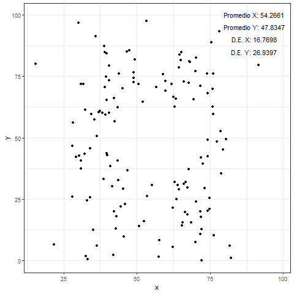
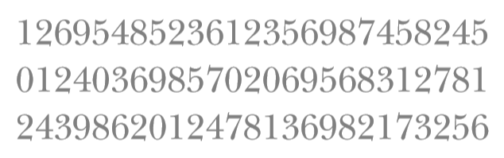
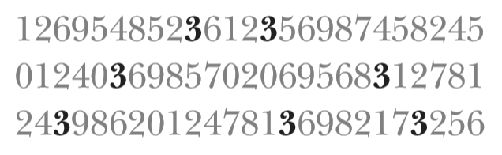
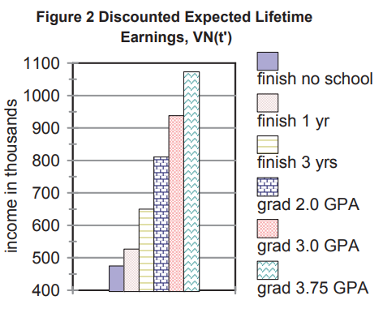
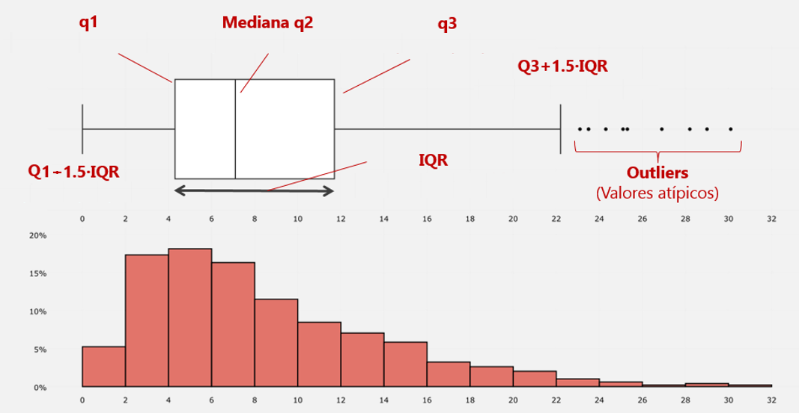
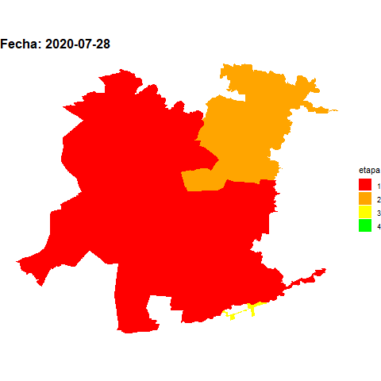
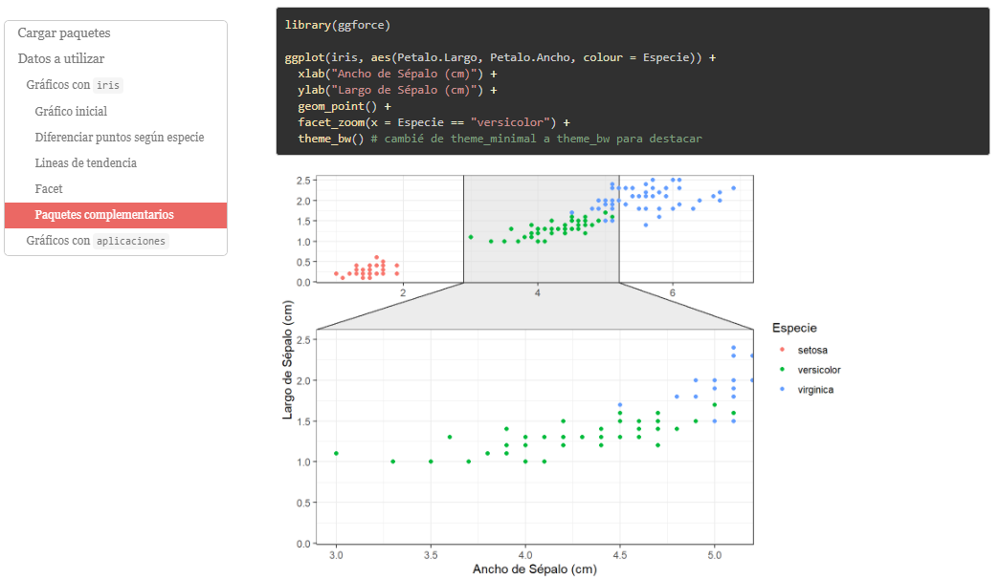

```{r setup, include = FALSE, purl = FALSE}
options(htmltools.dir.version = FALSE)
library(knitr)
opts_chunk$set(
  fig.align="center",  
  fig.height=4, #fig.width=6,
  dpi=300, #fig.path='Figs/',
  cache=T,#, echo=F, warning=F, message=F,
  echo = TRUE,
  message = FALSE,
  warning = FALSE,
  error = FALSE,
  out.width = "90%"
  )
library(tidyverse)
library(hrbrthemes)
library(fontawesome)
library(patchwork)
xaringanExtra::use_scribble(pen_size = 1)
htmltools::tagList(
  xaringanExtra::use_clipboard(
    button_text = "<i class=\"fa fa-clipboard\"></i>",
    success_text = "<i class=\"fa fa-check\" style=\"color: #90BE6D\"></i>",
  ),
  rmarkdown::html_dependency_font_awesome()
)
```

# Información general

- 6 clases: dos partes (3 c/u)
- Office hours (*Zoom*): horario por definir
- Ayudantías: 1 y 22 de julio
- Web curso para preguntas fuera de horario de clases
- Dedicación de tiempo
- PPTs se subirán al terminar cada clase

---

# Qué, Por qué y Cómo de este curso

### ¿Qué?

- R
- Visualización de datos
- Manejo de datos
- Reportar resultados
- Inferencia Estadística/Econometría

---

# Qué, Por qué y Cómo de este curso

### ¿Qué?

```{r, out.width='80%',  echo = FALSE, out.width='750px'}
knitr::include_graphics("../Imagenes/ProcesoDS.png")
```

---

# Qué, Por qué y Cómo de este curso

## ¿Por qué?

- Análisis/Investigación reproducible
- Control/Flexibilidad

---

# Reproducibilidad

**Objetivo: realizar un reporte basado en datos de [Datos Públicos](http://datos.gob.cl/)**

---

# Reproducibilidad

**Objetivo: realizar un reporte basado en datos de [Datos Públicos](http://datos.gob.cl/)**

.pull-left[

**<span style="color:red">SIN PROGRAMACIÓN</span>**

1. Ingresar a la web y descargar datos
2. Limpiar, ordenar, y analizar datos en *MS Excel*
3. Escribir documento en *MS Word*
4. Guardar en "algún lado" (ojalá no en "Mis Documentos" o "Descargas")

]

---

# Reproducibilidad

**Objetivo: realizar un reporte basado en datos de [Datos Públicos](http://datos.gob.cl/)**

.pull-left[

**<span style="color:red">SIN PROGRAMACIÓN</span>**

1. Ingresar a la web y descargar datos
2. Limpiar, ordenar, y analizar datos en *MS Excel*
3. Escribir documento en *MS Word*
4. Guardar en "algún lado" (ojalá no en "Mis Documentos" o "Descargas")

]

.pull-right[

**<span style="color:green">CON PROGRAMACIÓN</span>**

1. Crear una carpeta para el proyecto/tarea
    * `datos`
    * `gráficos`
    * `resultados`
2. Descargar datos desde `R`
3. Limpiar, ordenar, y analizar datos en `R`
4. Escribir documento en `R Markdown`

]

---

# Reproducibilidad

**Seis meses después quieres repetir la tarea (o un/a colega)**

---

# Reproducibilidad

**Seis meses después quieres repetir la tarea (o un/a colega)**

.pull-left[

**<span style="color:red">SIN PROGRAMACIÓN</span>**

1. Recordar que se hizo
2. Ingresar a la web y descargar datos
3. Limpiar, ordenar, y analizar datos en *MS Excel*
4. Escribir documento en *MS Word*
5. Guardar en "algún lado" (ojalá no en "Mis Documentos" o "Descargas")

]

---

# Reproducibilidad

**Seis meses después quieres repetir la tarea (o un/a colega)**

.pull-left[

**<span style="color:red">SIN PROGRAMACIÓN</span>**

1. Recordar que se hizo
2. Ingresar a la web y descargar datos
3. Limpiar, ordenar, y analizar datos en *MS Excel*
4. Escribir documento en *MS Word*
5. Guardar en "algún lado" (ojalá no en "Mis Documentos" o "Descargas")

]

.pull-right[

**<span style="color:green">CON PROGRAMACIÓN</span>**

1. Ejecutar el código

]

---

# ¿Cómo?

- **RStudio Cloud**
  * Pero vayan practicando en la versión de escritorio

- **Aprender haciendo**
  * Demostración - Ejercicio
  * Todo código que se muestre estará disponible

---

# Dicho eso...

- **Este curso no es suficiente**
  + Requiere de dedicación y práctica para poder sacar el mayor provecho
  + Prueba y error

- **Contamos con horas finitas de clases**
  + Hay detalles que no podremos cubrir y que es importante que puedan revisar/practicar por su parte
  + Trataré de ir mencionando estos a medida que avancemos

---

# Fuentes valiosas de información 

```{r, echo = FALSE, out.width='450px'}
knitr::include_graphics("../Imagenes/FuentesInformacion.PNG")
```

---

# Fuentes valiosas de información 

```{r, echo = FALSE, out.width='600px'}
knitr::include_graphics("../Imagenes/Libros.PNG")
```

- https://r4ds.had.co.nz/ | https://es.r4ds.hadley.nz/
- http://faculty.marshall.usc.edu/gareth-james/ISL/

---

# Además de google...

No se aburran de usar `?nombrefunción`. Ej: `?ggplot`

```{r, echo=FALSE, out.width='500px'}
knitr::include_graphics("../Imagenes/Help.PNG")
```

---

# ¿Qué veremos hoy?

- **<span style="color:red">Visualización de datos</span>**
- Manejo de datos
- Transformación de datos
- Reportar resultados
- Inferencia Estadística/Econometría

---

# Pero antes...

### Recordemos

- Instalar paquetes: `install.packages("nombrepaquete")`

- Cargar paquetes: `library(nombrepaquete)`

- Principales paquetes que usaremos:
  * `readr`: cargar datos
  * `tidyr`: lograr datos *tidy* (ordenados)
  * `dplyr`: "verbos" (funciones) de manipulación de datos
  * `ggplot2`: visualización

---

# Pero antes...

### Recordemos

- Funciones, `funcion(argumento1, argumento2, ...)`
  * `log(x = 100, base = 10)`
  * `log(100, 10)`
  * `filter(censo, region == "RM")`
  
- `%>%`: "Encadenar" código
  * `censo %>% filter(region == "RM)`

- `+`: "Sumar" capas en `ggplot2`

---

# Imprime pero no guarda

```{r, echo = FALSE}
library(readr)
```

```{r}
read_csv("../datos/datos_mundo.csv")
```

---

# Guarda pero no imprime

```{r}
datos_mundo <- read_csv("../datos/datos_mundo.csv")
```

---

# Guarda e imprime

```{r}
datos_mundo <- read_csv("../datos/datos_mundo.csv")
datos_mundo
```

---

# Guarda e imprime

```{r}
(datos_mundo <- read_csv("../datos/datos_mundo.csv"))
```

---

# Mala práctica

```{r, eval = FALSE}
library(readr)
library(dplyr)
library(ggplot2) 
datos_mundo <- read_csv("datos/datos_mundo.csv")
ggplot(filter(datos_mundo, anio == 2007), aes(x = ExpVida, y = pob)) + geom_point()
```

---

# Buena práctica

```{r, eval = FALSE}
# Cargar paquetes
library(readr)
library(dplyr)
library(ggplot2) 

# Cargar datos
datos_mundo <- read_csv("/datos/datos_mundo.csv")

# Crear subset con datos del año 2007
datos_mundo_select <- datos_mundo %>% 
  filter(anio == 2007)

# Gráfico de ExpVida vs pob
ggplot(datos_mundo_select, aes(x = ExpVida, y = pob)) + 
  geom_point()
```

---

# ¿Qué veremos hoy?

- **<span style="color:red">Visualización de datos</span>**
- Manejo de datos
- Transformación de datos
- Reportar resultados
- Inferencia Estadística/Econometría

---

# ¿Por qué visualizar?

Dos razones principales:
1. **Para uno**: entender los datos con el fin de guiar análisis posteriores (análisis exploratorio)

```{r, echo = FALSE, out.width='50%'}

```

---

# ¿Por qué visualizar?

Dos razones principales:
1. **Para uno**: entender los datos con el fin de guiar análisis posteriores (análisis exploratorio)
2. **Para otros**: contar una historia sobre los datos y resultados con el fin de comunicar algo

```{r, echo = FALSE, out.width='75%'}
knitr::include_graphics("../Imagenes/napoleon_minard.png")
```
.center[*(Charles Joseph Minard, 1869)*]

---

# ¿Por qué visualizar?

Dos razones principales:
1. **Para uno**: entender los datos con el fin de guiar análisis posteriores (análisis exploratorio)
2. **Para otros**: contar una historia sobre los datos y resultados con el fin de comunicar algo

## Lo que deberíamos buscar

- Mostrar los datos y no mentir con estos
  + Contar una historia (¿una relación? ¿causalidad? ¿un patrón? ¿un quiebre?)
  + Transmitir y convencer
- Minimizar aspectos innecesarios
- Visualizaciones deben complementar el texto y tener suficiente información para "sobrevivir por sí mismas"

---

# Una idea general

- El cerebro solo puede procesar un cierto número de atributos de forma instantánea (*pre-attentive attributes*)
  + Forma, posición, color, tamaño


- Queremos buscar la variación justa en estos atributos para enfocarnos en lo que importa

--

### ¿Cuántos 3 hay?

```{r, echo = FALSE, purl = FALSE, out.width='600px'}

```

---

# Una idea general

- El cerebro solo puede procesar un cierto número de atributos de forma instantánea (*pre-attentive attributes*)
  + Forma, posición, color, tamaño


- Queremos buscar la variación justa en estos atributos para enfocarnos en lo que importa


### ¿Y ahora?

```{r, echo = FALSE, purl = FALSE, out.width='600px'}

```

---

# Principios de (Edward) Tufte 

https://www.edwardtufte.com/tufte/

- Muestra los datos
- Maximiza el ratio entre datos y *tinta* (o texto)
- Evita *tinta* que no corresponda a datos 
- No ser redundante en la información
- Evita la *basura visual*
- Prefiere disposiciones horizontales

---

# ¿Qué opinan?

```{r, echo = FALSE, purl = FALSE, out.width='600px'}

```

---

# Apliquemos los principios

```{r, echo  = FALSE, purl = FALSE, out.width='800px'}
datos_graf <- data.frame(
  educ = c("Finish no school", "Finish 1 year", "Finish 3 years", "Graduate, 2.0 GPA", "Graduate, 3.0 GPA", "Graduate, 3.75 GPA"),
  inc = c(480, 520, 650, 810, 940, 1070)
)

ggplot(datos_graf, aes(x = reorder(educ, -inc), y = inc, label = inc)) +
  geom_col(width = 0.5, fill = "dark blue") +
  geom_text(nudge_y = 40, size = 3) +
  coord_flip() +
  labs(x = NULL, y = NULL) +
  scale_y_continuous(n.breaks = 9) +
  theme_minimal() +
  theme(panel.grid.major.y = element_blank(),
        panel.grid.minor.y = element_blank(),
        panel.grid.major.x = element_blank(),
        panel.grid.minor.x = element_blank(),
        axis.text.x = element_blank()) +
  labs(title = "Discounted Expected Lifetime Earnings, VN(t')",
       subtitle = "(Income in thousands)")
```

---

# ¿Qué hay por detrás?

### `R` - `ggplot2`

```{r, eval=FALSE, purl = FALSE}
ggplot(datos_graf, aes(x = reorder(educ, -inc), y = inc, label = inc)) +
  geom_col(width = 0.5, fill = "dark blue") +
  geom_text(nudge_y = 40, size = 3) +
  coord_flip() +
  labs(x = NULL, y = NULL) +
  scale_y_continuous(n.breaks = 9) +
  theme_minimal() +
  theme(panel.grid.major.y = element_blank(),
        panel.grid.minor.y = element_blank(),
        panel.grid.major.x = element_blank(),
        panel.grid.minor.x = element_blank(),
        axis.text.x = element_blank()) +
  labs(title = "Discounted Expected Lifetime Earnings, VN(t')",
       subtitle = "(Income in thousands)")
```

---
class: inverse, center, middle
name: reg

# Visualización de datos con **ggplot2**

<html><div style='float:left'></div><hr color='#EB811B' size=1px width=796px></html>

---

# Lógica de ggplot2

"gg" por [Grammar of Graphics](https://www.springer.com/gp/book/9780387245447)

```{r, echo = FALSE, purl = FALSE, out.width='600px'}
knitr::include_graphics("../Imagenes/CapasGgplot.png")
```

---

# Forma general de ggplot2

```{r, eval = FALSE, purl = FALSE}
library(ggplot2)
ggplot(datos, aes(x = var1, y = var2)) +
  geom_XXX(...) +
  otros(...)
```

- `geom_point()`
- `geom_line()`
- `geom_xxxx()`
- `facet`
- `theme`

---
class: inverse, center, middle
name: reg

# Demo - Visualizar Datos de indicadores de países

<html><div style='float:left'></div><hr color='#EB811B' size=1px width=796px></html>

---

# Demo - Script

- `CodigoViz.R`

---

# Datos 

```{r}
library(readr)
library(ggplot2)
(datos_mundo <- read_csv("../datos/datos_mundo2007.csv"))
```

---

# Histograma 
## Gráfico base (datos)

```{r}
ggplot(datos_mundo)
```

---

# Histograma 
## Agregar capa (aes)

```{r}
ggplot(datos_mundo, aes(x = gdpPercap))
```

---

# Histograma
## Agregar capa (geom)

```{r}
ggplot(datos_mundo, aes(x = gdpPercap)) +
  geom_histogram() #<<
```

---

# Histograma
## Cambiar algunos argumentos

```{r}
ggplot(datos_mundo, aes(x = gdpPercap)) +
  geom_histogram(bins = 100, fill = "blue") #<<
```

---

# Histograma
## Cambiar algunos argumentos

```{r, out.width="80%"}
ggplot(datos_mundo, aes(x = gdpPercap)) +
  geom_histogram(binwidth = 5000, col = "blue") #<<
```

---

# Histograma

.pull-left[
```{r, out.width="70%"}
ggplot(datos_mundo, aes(x = gdpPercap)) +
  geom_histogram(binwidth = 1000, col = "white")
```

```{r, out.width="70%"}
ggplot(datos_mundo, aes(x = gdpPercap)) +
  geom_histogram(binwidth = 10000, col = "white")
```

]

.pull-right[
```{r, out.width="70%"}
ggplot(datos_mundo, aes(x = gdpPercap)) +
  geom_histogram(binwidth = 5000, col = "white")
```

```{r, out.width="70%"}
ggplot(datos_mundo, aes(x = gdpPercap)) +
  geom_histogram(binwidth = 15000, col = "white")
```

]

---

# Muchos argumentos

**NO OLVIDAR**: Siempre consulten `?nombrefunción`. Ej: `?ggplot`

```{r, echo=FALSE, purl = FALSE, out.width='500px'}
knitr::include_graphics("../Imagenes/Help.PNG")
```

---

# Más de una variable

```{r}
ggplot(datos_mundo, aes(x = continente, y = gdpPercap))
```

---

# Capa de puntos (geom_point)

```{r}
ggplot(datos_mundo, aes(x = continente, y = gdpPercap)) +
  geom_point() #<<
```

---

# Boxplot

```{r}
ggplot(datos_mundo, aes(x = continente, y = gdpPercap)) +
  geom_boxplot() #<<
```

---

# ¿Qué nos muestra el boxplot?

```{r, echo=FALSE, purl = FALSE, out.width='800px'}

```

---

# Juntar más de una capa (geom)

```{r}
ggplot(datos_mundo, aes(x = continente, y = gdpPercap)) +
  geom_boxplot()
```

---

# Juntar más de una capa (geom)

```{r}
ggplot(datos_mundo, aes(x = continente, y = gdpPercap)) +
  geom_boxplot() +
  geom_point() #<<
```

---

# Invertir los ejes

```{r}
ggplot(datos_mundo, aes(x = continente, y = gdpPercap)) +
  geom_boxplot() +
  geom_point() +
  coord_flip() #<<
```

---

# Gráfico de dispersión 

```{r}
ggplot(datos_mundo, aes(x = gdpPercap, y = ExpVida)) +
  geom_point()
```

---

# Cambiar el color de los puntos

```{r}
ggplot(datos_mundo, aes(x = gdpPercap, y = ExpVida)) +
  geom_point(col = "red") #<<
```

---

# Color para agregar más información

```{r}
ggplot(datos_mundo, aes(x = gdpPercap, y = ExpVida)) +
  geom_point(aes(col = continente)) #<<
```

---

# Linea de tendencia

```{r}
ggplot(datos_mundo, aes(x = gdpPercap, y = ExpVida)) +
  geom_point() +
  geom_smooth() #<<
```

---

# Linea de tendencia

```{r}
ggplot(datos_mundo, aes(x = gdpPercap, y = ExpVida)) +
  geom_point() +
  geom_smooth(se = FALSE, method = "lm") #<<
```

---

# Linea de tendencia

```{r}
ggplot(datos_mundo, aes(x = gdpPercap, y = ExpVida)) +
  geom_point() +
  geom_smooth(se = FALSE, method = "lm", formula = y ~ log(x)) #<<
```

---
class: inverse, center, middle
name: reg

# Ejercicio

<html><div style='float:left'></div><hr color='#EB811B' size=1px width=796px></html>

---

# Ejercicio - Script

- `EjercicioViz.R`

---
class: inverse, center, middle
name: reg

# Demo - Datos COVID Chile

<html><div style='float:left'></div><hr color='#EB811B' size=1px width=796px></html>

---

# COVID en Chile

### ¿Segunda o primera ola?

```{r, echo = FALSE}
library(patchwork)

g1 <- read_csv("../datos/DatosCOVIDRegion.csv") %>% 
  filter(region == "Total") %>% 
  ggplot(aes(x = fecha, y = casos_nuevos)) +
  geom_line(aes(y = casos_nuevos_d), col = "blue", alpha = 0.3) +
  geom_line(size = 1, col = "blue") +
  theme_minimal() +
  labs(x = NULL, y = NULL, title = "Casos diarios COVID-19 a nivel nacional")

g2 <- read_csv("../datos/DatosCOVIDRegion.csv") %>% 
  filter(region == "Total") %>% 
  ggplot(aes(x = fecha, y = fallecidos)) +
  geom_line(aes(y = fallecidos_d), col = "red", alpha = 0.3) +
  geom_line(size = 1, col = "red") +
  theme_minimal() +
  labs(x = NULL, y = NULL, title = "Fallecidos diarios por COVID-19 a nivel nacional")

g1/g2
```

<font size="2"> Datos obtenidos desde repositorio del Ministerio de Ciencia y Tecnología (https://github.com/MinCiencia/Datos-COVID19). Los datos han sido manipulados, no citar.</font>

---

# Demo - Script

- `CodigoCovidViz.R`

---

# Datos COVID-19 
## Cargar datos

```{r}
library(readr)
(datos_covid <- read_csv("../datos/DatosCOVIDRegion.csv"))
```

```{r, echo = FALSE}
datos_covid <- datos_covid %>% filter(region != "Total")
```

---

# Gráfico base

```{r graf1}
library(ggplot2)
ggplot(datos_covid, aes(x = fecha, y = casos_nuevos))
```

---

# Agregar `geom` de lineas 
## Pero algo se ve mal

```{r graf4}
ggplot(datos_covid, aes(x = fecha, y = casos_nuevos)) +
  geom_line() #<<
```

---

# Una linea para cada región

```{r graf4b}
ggplot(datos_covid, aes(x = fecha, y = casos_nuevos, group = region)) + #<<
  geom_line()
```

---

# Una linea para cada región

```{r graf5}
ggplot(datos_covid, aes(x = fecha, y = casos_nuevos, col = region)) + #<<
  geom_line()
```

---

# Cada linea en su propio panel

```{r graf8}
ggplot(datos_covid, aes(x = fecha, y = casos_nuevos, col = region)) +
  geom_line() +
  facet_wrap(vars(region)) #<<
```

---

# Cada linea en su propio panel

```{r graf8b}
ggplot(datos_covid, aes(x = fecha, y = casos_nuevos, col = region)) +
  geom_line() +
  facet_wrap(vars(region), scales = "free_y") #<<
```

---

# Cada linea en su propio panel

```{r graf8c}
ggplot(datos_covid, aes(x = fecha, y = casos_nuevos, col = region)) +
  geom_line() +
  facet_wrap(vars(region), scales = "free_y", ncol = 5) #<<
```

---

# Fondo blanco parece mejor

```{r graf9}
ggplot(datos_covid, aes(x = fecha, y = casos_nuevos, col = region)) +
  geom_line() +
  facet_wrap(vars(region), scales = "free_y") +
  theme_bw() #<<
```

---

# Fondo blanco parece mejor

```{r graf9b}
ggplot(datos_covid, aes(x = fecha, y = casos_nuevos, col = region)) +
  geom_line() +
  facet_wrap(vars(region), scales = "free_y") +
  theme_minimal() #<<
```

---

# La leyenda no sirve mucho

```{r graf10}
ggplot(datos_covid, aes(x = fecha, y = casos_nuevos, col = region)) +
  geom_line() +
  facet_wrap(vars(region), scales = "free_y") +
  theme_minimal() +
  theme(legend.position = "none") #<<
```

---

# Modificar *theme*

```{r, echo = FALSE, purl = FALSE, out.width='700px'}
knitr::include_graphics("../Imagenes/ggplot2Elements.jpg")
```

---

# "Themes" prefabricados

https://ggplot2.tidyverse.org/reference/ggtheme.html

```{r, echo = FALSE, purl = FALSE}
knitr::include_url("https://ggplot2.tidyverse.org/reference/ggtheme.html")
```

---

# La leyenda no sirve mucho

```{r}
ggplot(datos_covid, aes(x = fecha, y = casos_nuevos, col = region)) +
  geom_line() +
  facet_wrap(vars(region), scales = "free_y") +
  theme_minimal() +
  theme(legend.position = "none")
```

---

# Cambiemos el *theme*

```{r, out.width="75%"}
ggplot(datos_covid, aes(x = fecha, y = casos_nuevos, col = region)) +
  geom_line() +
  facet_wrap(vars(region), scales = "free_y") +
  theme_void() + #<<
  theme(legend.position = "none")
```

---

# Títulos/Ejes

```{r, out.width="75%"}
ggplot(datos_covid, aes(x = fecha, y = casos_nuevos, col = region)) +
  geom_line() +
  facet_wrap(vars(region), scales = "free_y") + 
  theme_void() + theme(legend.position = "none") +
  labs(title = "¿Segunda ola?", #<<
       subtitle = "Casos diarios de COVID-19 en Chile por región", #<<
       x = NULL, y = NULL) #<<
```

---

# Último detalle

```{r, out.width="70%"}
ggplot(datos_covid, aes(x = fecha, y = casos_nuevos, col = region)) +
  geom_line(aes(y = casos_nuevos_d)) + #<<
  geom_line() +
  facet_wrap(vars(region), scales = "free_y") + 
  theme_void() + theme(legend.position = "none") +
  labs(title = "¿Segunda ola?",
       subtitle = "Casos diarios de COVID-19 en Chile por región",
       x = NULL, y = NULL) 
```

---

# Último detalle

```{r, out.width="70%"}
ggplot(datos_covid, aes(x = fecha, y = casos_nuevos, col = region)) +
  geom_line(aes(y = casos_nuevos_d), alpha = 0.3) + #<<
  geom_line() +
  facet_wrap(vars(region), scales = "free_y") + 
  theme_void() + theme(legend.position = "none") +
  labs(title = "¿Segunda ola?", 
       subtitle = "Casos diarios de COVID-19 en Chile por región",
       x = NULL, y = NULL) 
```

---

# Gráfico final

```{r, out.width="120%", echo = FALSE}
ggplot(datos_covid, aes(x = fecha, y = casos_nuevos, col = region)) +
  geom_line(aes(y = casos_nuevos_d), alpha = 0.3) + #<<
  geom_line() +
  facet_wrap(vars(region), scales = "free_y") + 
  theme_void() + theme(legend.position = "none") +
  labs(title = "¿Segunda ola?", 
       subtitle = "Casos diarios de COVID-19 en Chile por región",
       x = NULL, y = NULL) 
```

---

# Resumen

```{r}
ggplot(datos_covid, aes(x = fecha, y = casos_nuevos))
```

---

# Resumen

```{r}
ggplot(datos_covid, aes(x = fecha, y = casos_nuevos, col = region)) +
  geom_line()
```

---

# Resumen

```{r}
ggplot(datos_covid, aes(x = fecha, y = casos_nuevos, col = region)) +
  geom_line() +
  facet_wrap(vars(region), scales = "free_y")
```

---

# Resumen

```{r, out.width='90%'}
ggplot(datos_covid, aes(x = fecha, y = casos_nuevos, col = region)) +
  geom_line() +
  facet_wrap(vars(region), scales = "free_y") + 
  theme_void()
```

---

# Resumen

```{r, out.width='80%'}
ggplot(datos_covid, aes(x = fecha, y = casos_nuevos, col = region)) +
  geom_line() +
  facet_wrap(vars(region), scales = "free_y") + 
  theme_void() +
  theme(legend.position = "none")
```

---

# Resumen

```{r, out.width='70%'}
ggplot(datos_covid, aes(x = fecha, y = casos_nuevos, col = region)) +
  geom_line() +
  facet_wrap(vars(region), scales = "free_y") + 
  theme_void() +
  theme(legend.position = "none") +
  labs(title = "¿Segunda ola?",
       subtitle = "Casos diarios de COVID-19 en Chile por región", x = NULL, y = NULL)
```

---

# Resumen

```{r, out.width='65%'}
ggplot(datos_covid, aes(x = fecha, y = casos_nuevos, col = region)) +
  geom_line(aes(y = casos_nuevos_d, col = region), alpha = 0.3) +
  geom_line() +
  facet_wrap(vars(region), scales = "free_y") + 
  theme_void() + 
  theme(legend.position = "none") +
  labs(title = "¿Segunda ola?",
       subtitle = "Casos diarios de COVID-19 en Chile por región", x = NULL, y = NULL)
```

---
class: inverse, center, middle
name: reg

# Ejercicio

<html><div style='float:left'></div><hr color='#EB811B' size=1px width=796px></html>

---

# Ejercicio - Script

- `EjercicioVizII.R`

---

# Muchas más posibilidades 

https://www.data-to-viz.com/

```{r, echo = FALSE, purl = FALSE, fig.align="center"}
knitr::include_url("https://www.data-to-viz.com/")
```

---

# Muchas más posibilidades 

```{r, echo = FALSE, out.width='70%'}

```

---

# Para que revisen 

- `EjemplosViz.html`

```{r, echo = FALSE, out.width="120%"}

```

---

# Siguiente clase

- Manejo de datos

```{r, out.width='80%',  echo = FALSE, out.width='750px'}
knitr::include_graphics("../Imagenes/ProcesoDS.png")
```
