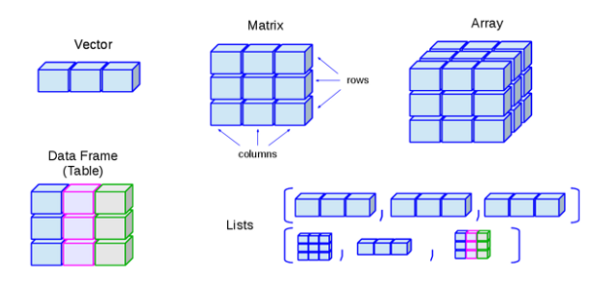
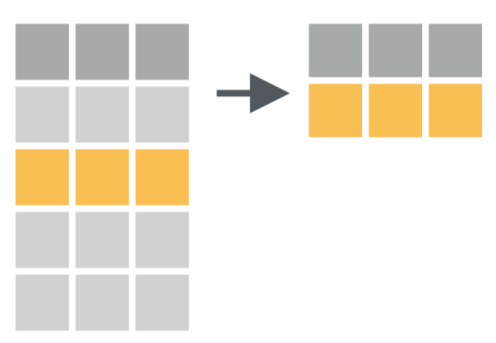
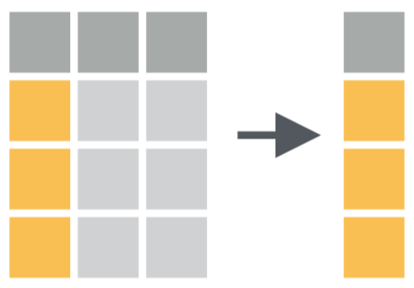
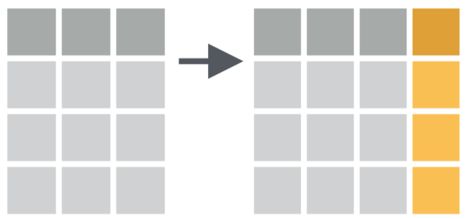

```{r setup, include=FALSE}
options(htmltools.dir.version = FALSE)
library(knitr)
opts_chunk$set(
  fig.align="center",  
  fig.height=4, #fig.width=6,
  # out.width="748px", #out.length="520.75px",
  dpi=300, #fig.path='Figs/',
  cache=T,#, echo=F, warning=F, message=F,
  echo = TRUE,
  message = FALSE,
  warning = FALSE,
  error = FALSE,
  out.width = "90%"
  )
library(tidyverse)
library(hrbrthemes)
library(fontawesome)
library(patchwork)
xaringanExtra::use_scribble()
xaringanExtra::use_search(show_icon = FALSE)
htmltools::tagList(
  xaringanExtra::use_clipboard(
    button_text = "<i class=\"fa fa-clipboard\"></i>",
    success_text = "<i class=\"fa fa-check\" style=\"color: #90BE6D\"></i>",
  ),
  rmarkdown::html_dependency_font_awesome()
)
```

# ¿Qué veremos hoy?

- Visualización de datos
- **<span style="color:red">Manejo de datos</span>**
- Transformación de datos/`R Markdown`
- Inferencia Estadística/Econometría

---

# Pero antes...

- `EjercicioGrafAlcaldes.R`

---

# Recordemos el contexto

```{r, out.width='80%',  echo = FALSE, out.width='750px'}
knitr::include_graphics("../Imagenes/ProcesoDS.png")
```

---

# Datos *tidy* (ordenados)

- Cada columna es una variable
- Cada fila es una observación
- Cada celda corresponde a un valor

```{r, out.width='80%',  echo = FALSE, out.width='750px'}
knitr::include_graphics("../Imagenes/TidyData.png")
```

---

# Pipe

`%>%` nos permite definir nuestras acciones como una secuencia

- **Código "anidado"**
```{r, eval = FALSE}
estacionar(manejar(buscar(llaves), hacia = "trabajo"))
```

- **Código "por partes"**
```{r, eval = FALSE}
paso1 <- buscar(llaves)
paso2 <- manejar(paso1, hacia = "trabajo")
paso3 <- estacionar(paso2)
```

- **Código como secuencia**
```{r, eval = FALSE}
llaves %>% 
  buscar() %>% 
  manejar(hacia = "trabajo") %>% 
  estacionar()
```

---

# Pipe

```{r, eval = FALSE}
log(sqrt(10))

paso1 <- sqrt(10)
paso2 <- log(paso1)

10 %>% sqrt() %>% log()
```

```{r, eval = FALSE}
summary(iris)
iris %>% summary()
```

```{r, eval = FALSE}
round(3.45, digits = 1)
3.45 %>% round(digits = 1)
```

--

## Ojo

- No confundir `%>%` de `dplyr` con `+` de `ggplot2`
- `%>%` nos permite tomar un output y pasarlo/encadenarlo en la siguiente operación
- `+` nos permite crear capas en un gráfico

---
class: inverse, center, middle
name: reg

# Manejo de datos

<html><div style='float:left'></div><hr color='#EB811B' size=1px width=796px></html>

---

# Foco en *data frames*

```{r tipodatos, echo = FALSE}

```

---

# Manejo de datos - Script

- `ManejoDatos.R`

---

# Datos ONU

```{r cargar}
library(readr) # Cargar datos
library(dplyr) # Verbos de manipulación de datos
datosONU_tidy <- read_csv("../datos/DatosONU_tidy.csv")
names(datosONU_tidy)
```

---

# Datos ONU 

```{r, echo = FALSE}
datosONU_tidy <- select(datosONU_tidy,
                        -labor_force_participation_rate_female_percent_of_female_population_ages_15_modeled_ilo_estimate,
                        -public_spending_on_education_total_percent_of_government_expenditure,
                        -malnutrition_prevalence_weight_for_age_percent_of_children_under_5,
                        -health_expenditure_per_capita_ppp_constant_2005_international,
                        -poverty_headcount_ratio_at_2_a_day_ppp_percent_of_population)
```

```{r}
glimpse(datosONU_tidy)
```

```{r, echo = FALSE}
datosONU_tidy <- read_csv("../datos/DatosONU_tidy.csv")
```

---

# Funciones para manejo de datos

**dplyr** se basa en el concepto de funciones como verbos para manipular *data frames*

- `filter`: elige filas que cumplan criterio
- `slice`: elige filas según posición
- `select`: elige columnas según su nombre/posición
- `mutate`: crear nuevas columnas
- `rename`: cambio de nombre de columnas
- `arrange`: reordenar filas
- `distinct`: filtra valores únicos de filas
- `summarise`: reducir variables a valores
- ... (muchas más)

<br>
<br>
<br>
<br>
<br>

Más información en la [web del paquete](https://dplyr.tidyverse.org/)

---

# Reglas de dplyr para sus funciones

1. Primer argumento siempre es un *data frame*
2. Los siguientes argumentos describen que se hace con el *data frame*
3. El resultado siempre será un *data frame*

```{r, eval = FALSE}
funcion(datos, instruccion1, instruccion2, ...)
```

---
class: inverse, center, middle
name: reg

# filter()

<html><div style='float:left'></div><hr color='#EB811B' size=1px width=796px></html>

---

# Seleccionar filas

- `filter` permite seleccionar un subconjunto de filas de un *data frame*
  * Ej: filas donde la columna `X` es mayor a `n`.
- Se pueden poner muchas condiciones de forma simple

```{r, out.width='80%', echo = FALSE, out.width='450px'}

```

---

# Seleccionar filas

#### <span style="color:red">Solo las observaciones correspondientes a Chile</span>

```{r}
datosONU_tidy %>% 
  filter(country_name == "Chile")
```

---

# Seleccionar filas

#### <span style="color:red">Solo las observaciones correspondientes a Chile y para años posteriores al 2000</span>

```{r}
datosONU_tidy %>% 
  filter(country_name == "Chile", year > 2000)
```

---

# Seleccionar filas

#### <span style="color:red">Solo las observaciones correspondientes al 2000 o al 2007</span>

```{r}
datosONU_tidy %>% 
  filter(year == 2000 | year == 2007)
```

---

# Operadores lógicos

.pull-left[

```{r, echo = FALSE}
Operador <- c("<", "<=", ">", ">=", "==", "!=", "x|y", "x&y")
Definicion <- c("menor", "menor o igual", "mayor", "mayor o igual", "estrictamente igual", "distinto", "x O y", "x Y y")

knitr::kable(data.frame("Operador" = Operador,
           "Definición" = Definicion), format = "html")
```

]

.pull-right[

```{r, echo = FALSE}
Operador2 <- c("is.na(x)", "!is.na(x)", "x %in% y", "!(x %in% y)", "!x")
Definicion2 <- c("test: valor NA (nulo)", "x perteneciente a y", "x perteneciente a y", "todo lo perteneciente a y que no es x", "no x")

knitr::kable(data.frame("Operador" = Operador2,
           "Definición" = Definicion2), format = "html")
```

]

---

# Seleccionar filas

#### <span style="color:red">Solo las observaciones correspondientes a los años 1995, 2000, y 2005</span>

```{r}
datosONU_tidy %>% 
  filter(year == 1995 | year == 2000 | year == 2005)
```

---
# Seleccionar filas

#### <span style="color:red">Solo las observaciones correspondientes a los años 1995, 2000, y 2005</span>

```{r}
datosONU_tidy %>% 
  filter(year %in% c(1995, 2000, 2005))
```

---

# Seleccionar filas

#### <span style="color:red">Solo las observaciones **NO** correspondientes a los años 1995, 2000, y 2005</span>

```{r}
datosONU_tidy %>% 
  filter(!year %in% c(1995, 2000, 2005))
```

---

# Seleccionar filas por posición

#### <span style="color:red">La quinta fila</span>

```{r}
datosONU_tidy %>% 
  slice(5)
```

---

# Seleccionar filas por posición

#### <span style="color:red">Las primeras cinco filas</span>

```{r}
datosONU_tidy %>% 
  slice(1:5)
```

---
class: inverse, center, middle
name: reg

# select()

<html><div style='float:left'></div><hr color='#EB811B' size=1px width=796px></html>

---

# Seleccionar columnas/variables

- `select` permite seleccionar un subconjunto de columnas de un *data frame*
  * U ordenarlas de una forma en particular
- Se pueden seleccionar por nombre o por posición

```{r, out.width='80%', echo = FALSE, out.width='450px'}

```

---

# Seleccionar columnas/variables

#### <span style="color:red">Seleccionar 5 variables/columnas</span>

```{r}
datosONU_tidy %>% 
  select(country_name, income_group, region, year, population_total)
```

---

# Seleccionar columnas/variables

#### <span style="color:red">Dejar todas las columnas menos dos</span>

```{r}
datosONU_tidy %>% 
  select(-region, -income_group)
```

---

# Funciones "de ayuda"

#### <span style="color:red">Dejar todas las columnas que contengan *per capita*</span>

```{r}
datosONU_tidy %>% 
  select(contains("per_capita"))
```

---

# Funciones "de ayuda"

#### <span style="color:red">Dejar todas las columnas que contengan *per capita* o *poverty*</span>

```{r}
datosONU_tidy %>% 
  select(contains("per_capita") | contains("poverty"))
```

---

# Funciones "de ayuda"

#### <span style="color:red">Dejar todas las columnas que contengan *per capita* o *poverty*</span>

```{r}
datosONU_tidy %>% 
  select(contains(c("per_capita", "poverty")))
```

---

# Funciones "de ayuda"

#### <span style="color:red">Dejar todas las columnas que contengan *per capita* y *co2*</span>

```{r}
datosONU_tidy %>% 
  select(contains("per_capita") & contains("co2"))
```

---

# Funciones "de ayuda"

#### <span style="color:red">Dejar todas las columnas que comiencen con *p*</span>

```{r}
datosONU_tidy %>% 
  select(starts_with("p"))
```

---

# Funciones "de ayuda"

#### <span style="color:red">Dejar todas las columnas numéricas</span>

```{r}
datosONU_tidy %>% 
  select(where(is.numeric))
```

---
class: inverse, center, middle
name: reg

# mutate()

<html><div style='float:left'></div><hr color='#EB811B' size=1px width=796px></html>

---

# Crear columnas/variables

- `mutate` permite generar nuevas columnas/variables en un *data frame*
  * Ej: nueva columna `Z` igual a la división entre las columnas `X` e `Y`
- Nuevas columnas pueden o no depender de columnas ya existentes
- Se pueden generar más de una columna en un comando

```{r, out.width='80%', echo = FALSE, out.width='450px'}

```

---

# Crear columnas/variables

#### <span style="color:red">Nueva columna calculando el logaritmo de una existente</span>

```{r}
datosONU_tidy %>%
  select(country_name, year, co2_emissions_metric_tons_per_capita)
```

---

# Crear columnas/variables

#### <span style="color:red">Nueva columna calculando el logaritmo de una existente</span>

```{r}
datosONU_tidy %>%
  select(country_name, year, co2_emissions_metric_tons_per_capita) %>% 
  mutate(log_co2_emissions = log(co2_emissions_metric_tons_per_capita))
```

---

# Cambiar nombres de columnas

#### <span style="color:red">Nombres muy largos</span>

```{r}
names(datosONU_tidy)
```

---

# Cambiar nombres de columnas

`rename` - estructura a seguir

```{r, eval = FALSE}
rename(datos, NuevoNombre = AntiguoNombre)
```

---

# Cambiar nombres de columnas

```{r, eval = FALSE}
datosONU_tidy %>% 
  rename(
    "co2_emissions"             = "co2_emissions_metric_tons_per_capita",
    "fertility_rate"            = "fertility_rate_total_births_per_woman",
    "forest_area"               = "forest_area_percent_of_land_area",
    "gdp_per_capita"            = "gdp_per_capita_constant_2005_us",
    "health_expenditure"        = "health_expenditure_per_capita_ppp_constant_2005_international",
    "labor_force_participation" = "labor_force_participation_rate_female_percent_of_female_population_ages_15_modeled_ilo_estimate",
    "life_expectancy"           = "life_expectancy_at_birth_total_years",
    "malnutrition_prevalence"   = "malnutrition_prevalence_weight_for_age_percent_of_children_under_5",
    "urban_population"          = "urban_population_percent_of_total",
    "fossil_fuel_consumption"   = "fossil_fuel_energy_consumption_percent_of_total",
    "poverty"                   = "poverty_headcount_ratio_at_2_a_day_ppp_percent_of_population",
    "public_spending_education" = "public_spending_on_education_total_percent_of_government_expenditure"
  )
```

---

# No olvidar "guardar" los resultados

#### <span style="color:red">Sobreescribir *data frame*</span>

```{r}
datosONU_tidy <- datosONU_tidy %>% 
  rename(
    "co2_emissions"             = "co2_emissions_metric_tons_per_capita",
    "fertility_rate"            = "fertility_rate_total_births_per_woman",
    "forest_area"               = "forest_area_percent_of_land_area",
    "gdp_per_capita"            = "gdp_per_capita_constant_2005_us",
    "health_expenditure"        = "health_expenditure_per_capita_ppp_constant_2005_international",
    "labor_force_participation" = "labor_force_participation_rate_female_percent_of_female_population_ages_15_modeled_ilo_estimate",
    "life_expectancy"           = "life_expectancy_at_birth_total_years",
    "malnutrition_prevalence"   = "malnutrition_prevalence_weight_for_age_percent_of_children_under_5",
    "urban_population"          = "urban_population_percent_of_total",
    "fossil_fuel_consumption"   = "fossil_fuel_energy_consumption_percent_of_total",
    "poverty"                   = "poverty_headcount_ratio_at_2_a_day_ppp_percent_of_population",
    "public_spending_education" = "public_spending_on_education_total_percent_of_government_expenditure"
  )
```

---

# No olvidar "guardar" los resultados

#### <span style="color:red">Crear nuevo *data frame*</span>

```{r, eval = FALSE}
datosONU_tidy_nuevo <- datosONU_tidy %>% 
  rename(
    "co2_emissions"             = "co2_emissions_metric_tons_per_capita",
    "fertility_rate"            = "fertility_rate_total_births_per_woman",
    "forest_area"               = "forest_area_percent_of_land_area",
    "gdp_per_capita"            = "gdp_per_capita_constant_2005_us",
    "health_expenditure"        = "health_expenditure_per_capita_ppp_constant_2005_international",
    "labor_force_participation" = "labor_force_participation_rate_female_percent_of_female_population_ages_15_modeled_ilo_estimate",
    "life_expectancy"           = "life_expectancy_at_birth_total_years",
    "malnutrition_prevalence"   = "malnutrition_prevalence_weight_for_age_percent_of_children_under_5",
    "urban_population"          = "urban_population_percent_of_total",
    "fossil_fuel_consumption"   = "fossil_fuel_energy_consumption_percent_of_total",
    "poverty"                   = "poverty_headcount_ratio_at_2_a_day_ppp_percent_of_population",
    "public_spending_education" = "public_spending_on_education_total_percent_of_government_expenditure"
  )
```

---

# Revisar resultado del cambio de nombre

```{r}
names(datosONU_tidy)
```

---
class: inverse, center, middle
name: reg

# summarise() / group_by()

<html><div style='float:left'></div><hr color='#EB811B' size=1px width=796px></html>

---

# Reducir variables a valores

### Número de observaciones

```{r}
datosONU_tidy %>% 
  summarise(n_observaciones = n())
```

### Número de países

```{r}
datosONU_tidy %>% 
  summarise(n_paises = n_distinct(country_name))
```

---

# Reducir variables a valores

### Promedio de la columna *fertility_rate*

```{r}
datosONU_tidy %>% 
  summarise(promedio_fertility_rate = mean(fertility_rate, na.rm = TRUE))
```

### Máximo valor de *gdp_per_capita*

```{r}
datosONU_tidy %>% 
  summarise(max_gdp_per_capita = max(gdp_per_capita, na.rm = TRUE))
```

---

# Reducir variables a valores

#### <span style="color:red">Se puede calcular más de un valor a la vez</span>

```{r}
datosONU_tidy %>% 
  summarise(n_observaciones         = n(),
            n_paises                = n_distinct(country_name),
            promedio_fertility_rate = mean(fertility_rate, na.rm = TRUE),
            max_gdp_per_capita      = max(gdp_per_capita, na.rm = TRUE))
```

---

# Agrupar observaciones

#### <span style="color:red">Por si sola no pasa nada</span>

```{r}
datosONU_tidy %>% 
  group_by(region)
```

---

# Agrupar observaciones

#### <span style="color:red">Pero con `summarise` aparecen las ventajas</span>

```{r}
datosONU_tidy %>% 
  group_by(region) %>% 
  summarise(n_observaciones = n())
```

---

# Agrupar observaciones

#### <span style="color:red">Pero con `summarise` aparecen las ventajas</span>

```{r}
datosONU_tidy %>% 
  group_by(region) %>% 
  summarise(n_observaciones = n(),
            n_paises = n_distinct(country_name),
            promedio_fertility_rate = mean(fertility_rate, na.rm = TRUE))
```

---

# Agrupar observaciones

#### <span style="color:red">Se puede agrupar por más de una variable/columna</span>

```{r}
datosONU_tidy %>% 
  group_by(region, income_group) %>% 
  summarise(n_paises = n_distinct(country_name))
```

---
class: inverse, center, middle
name: reg

# Otras funciones

<html><div style='float:left'></div><hr color='#EB811B' size=1px width=796px></html>

---

# Ordenar filas según columnas

```{r}
datosONU_tidy
```

---

# Ordenar filas según columnas

#### <span style="color:red">Ordenar según la columna *year*</span>

```{r}
datosONU_tidy %>% 
  arrange(year)
```

---

# Ordenar filas según columnas

#### <span style="color:red">Ordenar según la columna *year* (descendente) e *income_group*</span>

```{r}
datosONU_tidy %>% 
  arrange(-year, income_group)
```

---

# Dejar valores únicos

.pull-left[

#### <span style="color:red">Tantos valores como observaciones hay</span>

```{r}
datosONU_tidy %>% 
  select(income_group)
```
]

.pull-right[

#### <span style="color:red">Pero son pocos valores únicos/distintos</span>

```{r}
datosONU_tidy %>% 
  distinct(income_group)
```
]

---

# Dejar valores únicos

#### <span style="color:red">Se puede hacer para cualquier combinación de columnas/variables</span>

```{r}
datosONU_tidy %>% 
  distinct(income_group, region) %>% 
  arrange(income_group, region)
```

---
class: inverse, center, middle
name: reg

# Ejercicio

<html><div style='float:left'></div><hr color='#EB811B' size=1px width=796px></html>

---

# Ejercicio - Script

- `EjercicioManejo.R`

---
class: inverse, center, middle
name: reg

# Manipular dos o más data frames

<html><div style='float:left'></div><hr color='#EB811B' size=1px width=796px></html>

---

# Trabajar con dos o más *data frames*

- <span style="color:green">*mutating joins*</span>
  * `left_join`, `right_join`, `inner_join`, `full_join` 
- <span style="color:red">*filtering joins*</span>
  * `semi_join`, `anti_join`
- <span style="color:green">*set operations*</span>
  * `intersect`, `union`, `setdiff`

<br>
<br>
<br>
<br>
<br>
<br>
<br>

Más información en https://dplyr.tidyverse.org/articles/two-table.html

---

# *Mutating joins*

- Permiten combinar variables desde distintas tablas
- Generalmente el más utilizado es `left_join`

```{r, echo=FALSE, out.width='750px'}
knitr::include_graphics("../Imagenes/Joins.png")
```

---

# *Left Join*

Digamos que queremos calcular el promedio de *fertility_rate* para cada *income_group* **pero nuestra tabla no tiene información sobre el grupo de ingresos**.

```{r, echo = FALSE}
income_group <- datosONU_tidy %>% 
  distinct(country_name, income_group)

countries_noincomegroup <- datosONU_tidy %>% 
  select(country_name, year, fertility_rate)
```

.pull-left[

```{r}
countries_noincomegroup
```

]

---

# *Left Join*

Digamos que queremos calcular el promedio de *fertility_rate* para cada *income_group* pero nuestra tabla no tiene información sobre el grupo de ingresos. **Pero si tenemos otra tabla que asocia cada país a su grupo de ingresos**.

.pull-left[

```{r}
countries_noincomegroup
```

]

.pull-right[

```{r}
income_group
```

]

---

# *Left Join*

```{r}
countries_noincomegroup %>% 
  left_join(income_group, by = "country_name")
```

---

# *Left Join*

```{r, echo = FALSE}
income_group2 <- datosONU_tidy %>% 
  distinct(country = country_name, income_group)
```

<span style="color:red">¿Y si los nombres no son iguales?</span>

```{r}
names(income_group2)
```

```{r}
names(countries_noincomegroup)
```

--

```{r}
countries_noincomegroup %>% 
  left_join(income_group2, by = c("country_name" = "country"))
```

---

# *Set operations*

Menos usadas en general pero útiles cuando se requieren

```{r, echo=FALSE, out.width='750px'}
knitr::include_graphics("../Imagenes/Set.PNG")
```

---

# *Set operations*

Estas funciones esperan que `x` e `y` tengan las mismas variables/columnas y compara sus observaciones/filas

- `intersect(x, y)`: devuelve solo valores que estén presentes en `x` y en `y`
- `union(x, y)`: devuelve todos los valores (únicos) de `x` y de `y`
- `setdiff(x, y)`: devuelve observaciones que estén en `x` y no en `y`
  * `setdiff(y, x)`: devuelve observaciones estén en `y` y no en `x`

```{r}
df1 <- datosONU_tidy %>% slice(1:10)
df2 <- datosONU_tidy %>% slice(5:15)
```

---

# *Set operations*

La intersección corresponde a las filas 5, 6, 7, 8, 9, y 10 de la base original

```{r}
intersect(df1, df2)
```

---

# *Set operations*

La unión corresponde a las primeras 15 filas de la base original

```{r}
union(df1, df2)
```

---

# *Set operations*

Las filas que están en `df1` y no en `df2` corresponden a la 1, 2, 3, y 4 de la base original

```{r}
setdiff(df1, df2)
```

---

# *Set operations*

Las filas que están en `df2` y no en `df1` corresponden a la 11, 12, 13, 14, y 15 de la base original

```{r}
setdiff(df2, df1)
```

---
class: inverse, center, middle
name: reg

# Ejercicio

<html><div style='float:left'></div><hr color='#EB811B' size=1px width=796px></html>

---

# Ejercicio - Script

- `EjercicioDosTablas.R`

---

# Para practicar

- `Ejercicios_dplyr_ggplot.pdf`
- `Ejercicios_dplyr_ggplot_RESPUESTAS.pdf`

---

# Siguiente clase

- Más manejo de datos
- Transformación de datos
- Introducción a `R Markdown`

```{r, out.width='80%',  echo = FALSE, out.width='750px'}
knitr::include_graphics("../Imagenes/ProcesoDS.png")
```