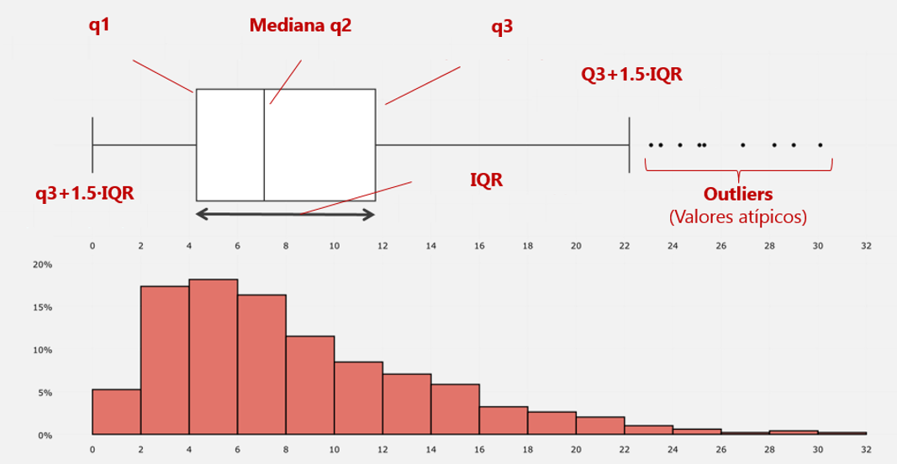
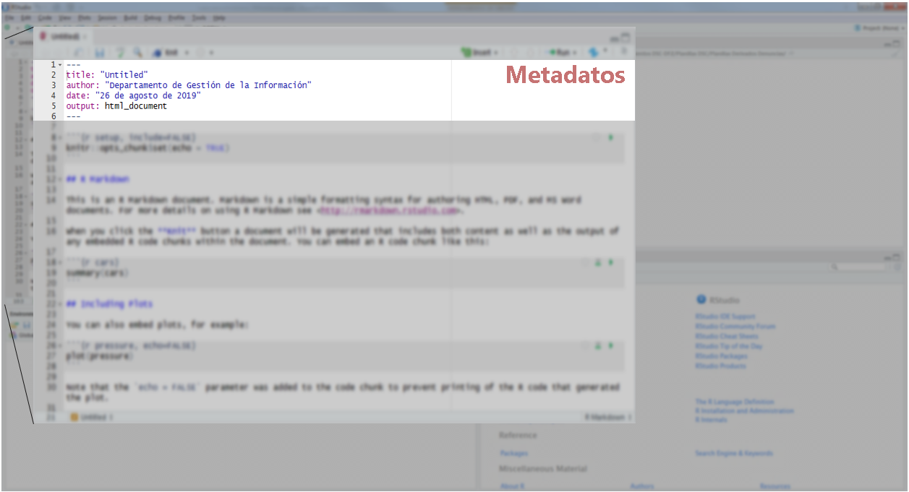
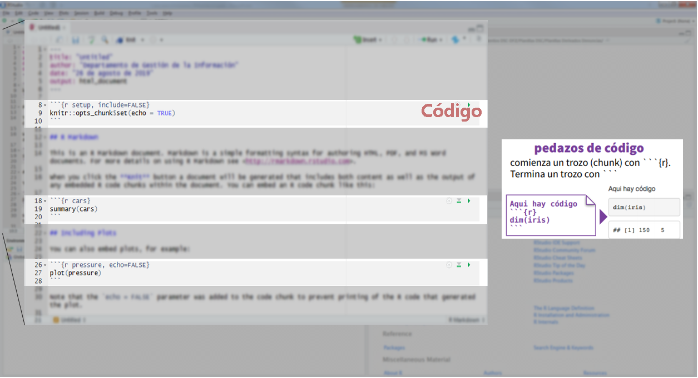
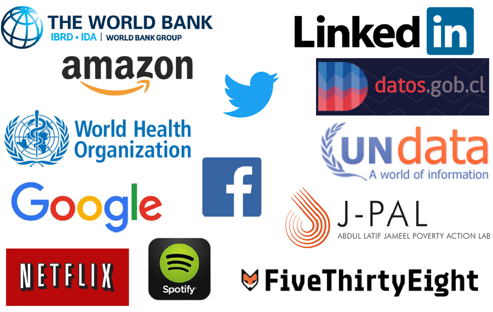
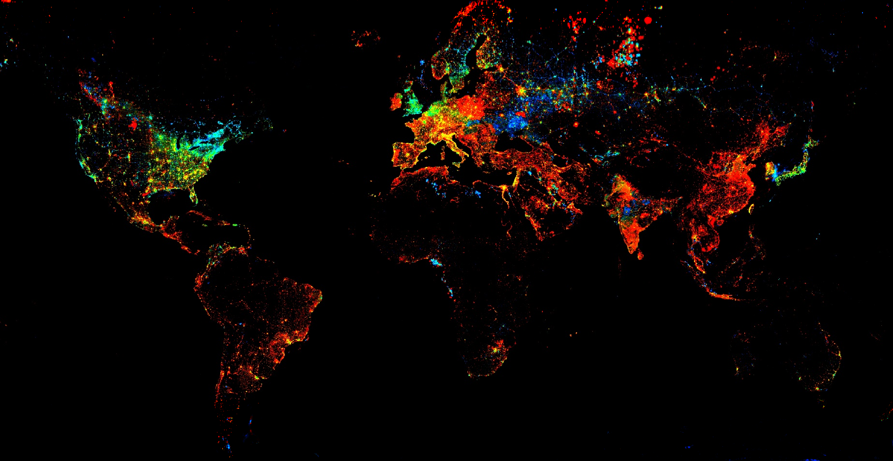
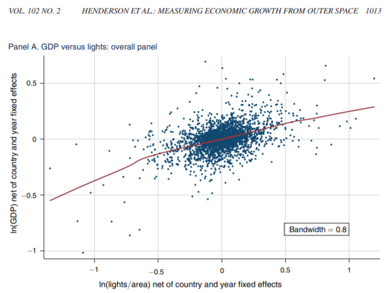
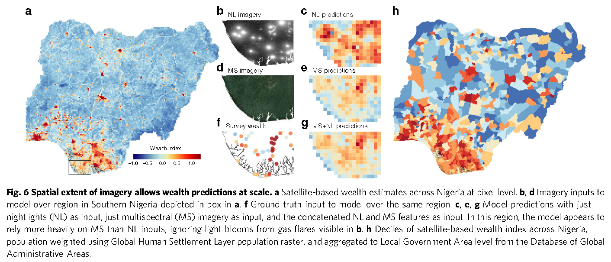
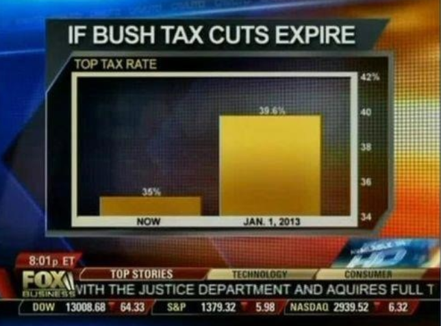

```{r setup, include=FALSE}
knitr::opts_chunk$set(
  echo = TRUE, 
  message = FALSE, 
  warning = FALSE,
  error = FALSE,
  fig.align = 'center',
  out.width='60%')

library(readr)
library(tidyverse)

datosONU <- read_csv("datos/DatosONU_select.csv")
```

## Antes de empezar algunas preguntas

```{r, echo=FALSE}
knitr::include_url("https://www.mentimeter.com/s/19884d9543efceeeac208ec51086b95c/814f6e060365/edit?")
```

## Y una consulta que se levantó

```{r, echo=FALSE, out.width='900px'}

```

## ¿Qué veremos hoy?

- Transformación de datos (`tidyr`)
- Introducción a reportería (**R Markdown**)

```{r, out.width='80%',  echo = FALSE, out.width='750px'}
knitr::include_graphics("Imagenes/ProcesoDS.png")
```

# Tidy data - Datos ordenados

## Tidy data - Datos ordenados

- Cada columna es una variable
- Cada fila es una observación
- Cada celda corresponde a un valor

```{r, out.width='80%',  echo = FALSE, out.width='750px'}
knitr::include_graphics("Imagenes/TidyData.png")
```

## `Tidyr` | Cambio en funciones

- `spread` --> `pivot_wider`

```{r, out.width='70%',  echo = FALSE}
knitr::include_graphics("Imagenes/pivot_wider.PNG")
```

## Pivot_wider {.smaller}

<div style="float: left; width: 45%;">
```{r}
table2
```
</div>

<div style="float: right; width: 45%;">
```{r}
table2 %>% 
  pivot_wider(names_from = type, 
              values_from = count)
```
</div>

## `Tidyr` | Cambio en funciones

- `gather` --> `pivot_longer`

```{r, out.width='80%',  echo = FALSE}
knitr::include_graphics("Imagenes/pivot_longer.PNG")
```

## Pivot_longer {.smaller}

<div style="float: left; width: 45%;">
```{r}
table4a
```
</div>

<div style="float: right; width: 45%;">
```{r}
table4a %>% 
  pivot_longer(2:3, 
               names_to = "year", 
               values_to = "value")
```
</div>

# Demo - Enfermedades respiratorias

## RStudio Cloud {.smaller}

RStudio Cloud >> UAI-BDPP-2020-M2 >> Clase03 >> **`3.1.EnfermedadesRespiratoriasOMS.R`**

## Enfermedades respiratorias {.smaller}

```{r}
glimpse(who)
```

## Donde comenzamos {.smaller}

```{r, include = FALSE}
tabla_final <- who %>% 
  select(-iso2, -iso3) %>% 
  pivot_longer(-c(country:year), names_to = "variables", values_to = "valores", values_drop_na = TRUE) %>% 
  mutate(variables = str_remove(variables, "new_"),
         variables = str_remove(variables, "new")) %>% 
  separate(variables, into = c("enfermedad", "otro"), sep = "_") %>% 
  separate(otro, into = c("sexo", "edad"), sep =  1) %>% 
  mutate(
    edad = case_when(
      edad == "014" ~ "0-14",
      edad == "1524" ~ "15-24",
      edad == "2534" ~ "25-34",
      edad == "3544" ~ "35-44",
      edad == "4554" ~ "45-54",
      edad == "5564" ~ "55-64",
      edad == "65" ~ "65+"
    ),
    sexo = case_when(
      sexo == "m" ~ "hombres",
      sexo == "f" ~ "mujeres"
    )
  ) %>% 
  filter(year == 2010) %>% 
  group_by(sexo, edad) %>% 
  summarise(total = sum(valores, na.rm = TRUE)) %>% 
  pivot_wider(names_from = edad, values_from = total)
```

```{r}
(enfermedades <- who %>% 
  select(-iso2, -iso3))
```

## Donde queremos llegar {.smaller}

```{r}
tabla_final
```

- ¿Edad?
- ¿Sexo?

## ¿Qué información tenemos disponible? {.smaller}

```{r}
names(enfermedades)
```

- __[*new o new_*]+[*enfermedad*]+[_]+[*sexo*]+[*RangoEdad*]__

## ¿Pivot_ ... longer o wider?

```{r}
enfermedades
```

## ¿Pivot_ ... longer o wider?

```{r, echo=FALSE}
knitr::include_url("https://www.mentimeter.com/s/19884d9543efceeeac208ec51086b95c/814f6e060365/edit?")
```

## Transformamos la forma de nuestros datos {.smaller}

```{r}
(enfermedades2 <- enfermedades %>% 
  pivot_longer(-c(country:year), 
               names_to = "variables", 
               values_to = "valores"))
```

- Tenemos una columna que contiene tres variables pero también una parte que no nos sirve mucho.

## Stringr

```{r, echo=FALSE}
knitr::include_url("https://stringr.tidyverse.org/reference/index.html")
```

## Eliminaremos parte de la columna "variables" que no nos sirve {.smaller}

```{r}
(enfermedades3 <- enfermedades2 %>% 
  mutate(variables = str_remove(variables, "new_"),
         variables = str_remove(variables, "new")))
```

- Ahora tenemos una columna que contiene tres variables. ¿Cómo las separamos?

## `separate` (i) {.smaller}

<div style="float: left; width: 45%;">
```{r}
enfermedades3
```
</div>

<div style="float: right; width: 45%;">
```{r}
(enfermedades4 <- enfermedades3 %>% 
  separate(variables, 
           into = c("enfermedad", "otro"), 
           sep = "_")) 
```
</div>

## `separate` (ii) {.smaller}

<div style="float: left; width: 45%;">
```{r}
enfermedades4
```
</div>

<div style="float: right; width: 45%;">
```{r}
(enfermedades5 <- enfermedades4 %>% 
  separate(otro, 
           into = c("sexo", "edad"), 
           sep =  1))
```
</div>
 
## Se podría llegar a lo mismo usando `stringr` {.smaller}

<div style="float: left; width: 45%;">
```{r, results='hide'}
enfermedades3 %>% 
  transmute(country, year,
            
    enfermedad = case_when(
      str_detect(variables, "rel") ~ 
        str_sub(variables, 1, 3),
      TRUE ~ str_sub(variables, 1,2)),
    
    sexo = case_when(
      str_detect(variables, "m") ~ "m",
      TRUE ~ "f"),
    
    edad = str_extract(variables, "\\d+"),
    valores
    )
```
</div>

<div style="float: right; width: 55%;">
```{r, echo = FALSE}
enfermedades3 %>% 
  transmute(country, year,
    enfermedad = case_when(
      str_detect(variables, "rel") ~ str_sub(variables, 1, 3),
      TRUE ~ str_sub(variables, 1,2)),
    sexo = case_when(
      str_detect(variables, "m") ~ "m",
      TRUE ~ "f"),
    edad = str_extract(variables, "\\d+"),
    valores
    )
```
</div>

## Modificaremos algunos valores para mayor entendimiento {.smaller}

<div style="float: left; width: 45%;">
```{r, results='hide'}
(enfermedades6 <- enfermedades5 %>% 
  mutate(
    edad = case_when(
      edad == "014" ~ "0-14",
      edad == "1524" ~ "15-24",
      edad == "2534" ~ "25-34",
      edad == "3544" ~ "35-44",
      edad == "4554" ~ "45-54",
      edad == "5564" ~ "55-64",
      edad == "65" ~ "65+"
    ),
    sexo = case_when(
      sexo == "m" ~ "hombres",
      sexo == "f" ~ "mujeres"
    )))
```
</div>

<div style="float: right; width: 55%;">
```{r, echo = FALSE}
(enfermedades6 <- enfermedades5 %>% 
  mutate(
    edad = case_when(
      edad == "014" ~ "0-14",
      edad == "1524" ~ "15-24",
      edad == "2534" ~ "25-34",
      edad == "3544" ~ "35-44",
      edad == "4554" ~ "45-54",
      edad == "5564" ~ "55-64",
      edad == "65" ~ "65+"
    ),
    sexo = case_when(
      sexo == "m" ~ "hombres",
      sexo == "f" ~ "mujeres"
    )))
```
</div>

## Calculamos el total de enfermedades por sexo y rango de edad {.smaller}

```{r}
(resumen_enfermedades <- enfermedades6 %>% 
  filter(year == 2010) %>% 
  group_by(sexo, edad) %>% 
  summarise(total = sum(valores, na.rm = TRUE)))
```

## `Pivot_wider` para dar la forma final a la tabla

```{r}
(tabla_final <- resumen_enfermedades %>% 
  pivot_wider(names_from = edad, values_from = total))
```

# Ejercicio

## Ejercicio (i) {.smaller}

RStudio Cloud >> UAI-BDPP-2020-M2 >> Clase03 >> **`3.2.PrimerEjercicioDatosONU.R`**

## Ejercicio (ii)

```{r, echo = FALSE}
#countdown_fullscreen(10)
knitr::include_url("https://apps.garrickadenbuie.com/countdown/")
```

## Respuesta 

# Break

## Break 

```{r, echo = FALSE}
#countdown_fullscreen(10)
knitr::include_url("https://apps.garrickadenbuie.com/countdown/")
```

# Reportería - R Markdown

## ¿Qué es R Markdown?

Entorno para la creación de reportes/documentos reproducibles

  - **HTML**
  - MS Word
  - PDF
  - MS Power Point
  - Y más...
  
```{r, out.width='70%',  echo = FALSE}
knitr::include_graphics("Imagenes/RMarkdown.PNG")
```

## R Markdown (i)

```{r, out.width='90%',  echo = FALSE}
knitr::include_graphics("Imagenes/RMarkdowni.PNG")
```

## R Markdown (ii)

```{r, out.width='90%',  echo = FALSE}

```

## R Markdown (iii)

```{r, out.width='90%',  echo = FALSE}
knitr::include_graphics("Imagenes/RMarkdowniii.PNG")
```

## Formato de texto (i)

```{r, out.width='80%',  echo = FALSE}
knitr::include_graphics("Imagenes/RMarkdownTexto.PNG")
```

## Formato de texto (ii)

```{r, out.width='80%',  echo = FALSE}
knitr::include_graphics("Imagenes/RMarkdownTextoii.PNG")
```

## R Markdown (iv)

```{r, out.width='90%',  echo = FALSE}

```

## Algunas opciones para el código

- `echo`: Mostrar o no el código en el documento
- `warning`: Mostrar o no mensajes de precaución
- `message`: Mostrar o no cualquier mensaje generado por el código
- `fig.height` y `fig.width`: Tamaño de los gráficos generados
- [Y muchas más...](https://rstudio.com/wp-content/uploads/2015/03/rmarkdown-reference.pdf?_ga=2.257640523.1785515642.1595105472-266277739.1560040459)

# Demo - Reportes con R Markdown

## RStudio Cloud

RStudio Cloud >> UAI-BDPP-2020-M2 >> Clase03 >> 

- **`3.3.IntroduccionRMarkdown.R`**

- **`3.4.ReporteEjemploAnalisisDesigualdad.R`**

- Ejercicio:

  + **`3.5.SegundoEjercicioReporteDatosONU.R`**

# Break

## Break 

```{r, echo = FALSE}
#countdown_fullscreen(10)
knitr::include_url("https://apps.garrickadenbuie.com/countdown/")
```

# ¿Por qué estas herramientas son importantes?

## Los datos son numerosos

```{r, echo=FALSE, out.width='750px'}

```

## Los datos son bonitos

```{r, echo=FALSE, out.width='850px'}

```

## Los datos son informativos

```{r, echo=FALSE, out.width='700px'}

```

## Los datos son poderosos

```{r, echo=FALSE, out.width='890px'}

```

*Yeh et al., 2020. Nature*

## Los datos son peligrosos

```{r, echo=FALSE, out.width='700px'}

```

## ¿Qué hacer entonces?

```{r, echo=FALSE, out.width='500px'}
knitr::include_graphics("Imagenes/ModernDS.png")
```

## Tarea

- Lunes 3 de agosto hasta las 23:59
- Entrega en documento `.Rmd`
- Ayudantía miércoles 29 de julio
- Hora de consulta 27 de julio

## Gracias

- pjaguirreh@gmail.com
- @PAguirreH
- https://github.com/pjaguirreh