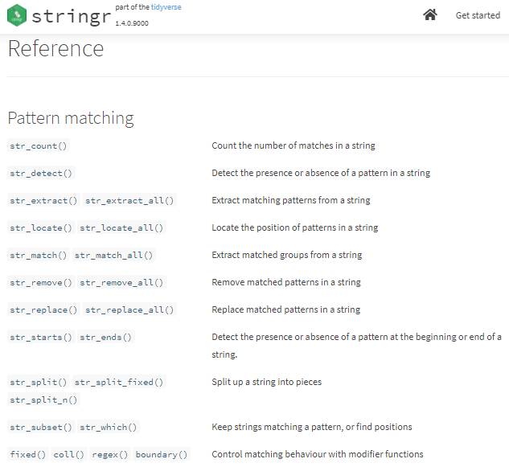

```{css, echo = FALSE}
#.remark-slide-content {
#  font-size: 28px;
#  padding: 20px 80px 20px 80px;
#}
#.remark-code, .remark-inline-code {
#  background: #f0f0f0;
#}
.small .remark-code {
  font-size: 14px;
}

.smaller .remark-code {
  font-size: 12px;
}

.tiny .remark-code {
  font-size: 11px;
}

.pull-left2 {
  float: left;
  width: 40%;
}

.pull-right2 {
  float: right;
  width: 54%;
}
```


```{r setup, include=FALSE}
options(htmltools.dir.version = FALSE)
library(knitr)
opts_chunk$set(
  fig.align="center",  
  fig.height=4, #fig.width=6,
  # out.width="748px", #out.length="520.75px",
  dpi=300, #fig.path='Figs/',
  cache=T,#, echo=F, warning=F, message=F,
  echo = TRUE,
  message = FALSE,
  warning = FALSE,
  error = FALSE,
  out.width = "90%"
  )
library(tidyverse)
library(hrbrthemes)
library(fontawesome)
library(patchwork)
xaringanExtra::use_scribble()
xaringanExtra::use_search(show_icon = FALSE)
htmltools::tagList(
  xaringanExtra::use_clipboard(
    button_text = "<i class=\"fa fa-clipboard\"></i>",
    success_text = "<i class=\"fa fa-check\" style=\"color: #90BE6D\"></i>",
  ),
  rmarkdown::html_dependency_font_awesome()
)

datosONU <- read_csv("../datos/DatosONU_select.csv")
```

# ¿Qué veremos hoy?

- Visualización de datos
- Manejo de datos
- **<span style="color:red">Transformación de datos/`R Markdown`</span>**
- Inferencia Estadística/Econometría

---

# Pero antes...

- `EjercicioManejoDatosAlcaldes.R`

---

# El contexto... nuevamente

```{r, out.width='80%',  echo = FALSE, out.width='750px'}
knitr::include_graphics("Imagenes/ProcesoDS.png")
```

---
class: inverse, center, middle
name: reg

# Tidy data - Datos ordenados

<html><div style='float:left'></div><hr color='#EB811B' size=1px width=796px></html>

---

# Tidy data - Datos ordenados

- Cada columna es una variable
- Cada fila es una observación
- Cada celda corresponde a un valor

```{r, out.width='80%',  echo = FALSE, out.width='750px'}
knitr::include_graphics("Imagenes/TidyData.png")
```

---

# Tidyr - Cambio en funciones

- **<span style="color:red">Antes</span>**: `spread`
- **<span style="color:green">Ahora</span>**: `pivot_wider`

```{r, out.width='70%',  echo = FALSE}
knitr::include_graphics("Imagenes/pivot_wider.PNG")
```

---

# pivot_wider()

.pull-left[
```{r, eval = FALSE}
table2
```

.small[
```{r, echo = FALSE, highlight.output = c(4,5)}
table2
```
]
]

--

.pull-right[
```{r, eval = FALSE}
table2 %>% 
  pivot_wider(names_from = type, 
              values_from = count)
```

.small[
```{r, echo = FALSE, highlight.output = c(4)}
table2 %>% 
  pivot_wider(names_from = type, 
              values_from = count)
```
]
]

---

# Tidyr - Cambio en funciones

- **<span style="color:red">Antes</span>**: `gather`
- **<span style="color:green">Ahora</span>**: `pivot_longer`

```{r, out.width='80%',  echo = FALSE}
knitr::include_graphics("Imagenes/pivot_longer.PNG")
```

---

# pivot_longer()

.pull-left[
```{r, highlight.output = c(4)}
table4a
```
]

--

.pull-right[
```{r, highlight.output = c(4,5)}
table4a %>% 
  pivot_longer(2:3, 
               names_to = "year", 
               values_to = "value")
```
]

---
class: inverse, center, middle
name: reg

# Demo - Tuberculosis

<html><div style='float:left'></div><hr color='#EB811B' size=1px width=796px></html>

---

# script

- `Clase03.R`

---

# Datos Tuberculosis

```{r, highlight.output = c(3,6)}
glimpse(who)
```

---

# Datos Tuberculosis

```{r, highlight.output = c(7:22)}
glimpse(who)
```

---

# Donde comenzamos

```{r, include = FALSE}
tabla_final <- who %>% 
  select(-iso2, -iso3) %>% 
  pivot_longer(-c(country:year), names_to = "variables", values_to = "valores", values_drop_na = TRUE) %>% 
  mutate(variables = str_remove(variables, "new_"),
         variables = str_remove(variables, "new")) %>% 
  separate(variables, into = c("enfermedad", "otro"), sep = "_") %>% 
  separate(otro, into = c("sexo", "edad"), sep =  1) %>% 
  mutate(
    edad = case_when(
      edad == "014" ~ "0-14",
      edad == "1524" ~ "15-24",
      edad == "2534" ~ "25-34",
      edad == "3544" ~ "35-44",
      edad == "4554" ~ "45-54",
      edad == "5564" ~ "55-64",
      edad == "65" ~ "65+"
    ),
    sexo = case_when(
      sexo == "m" ~ "hombres",
      sexo == "f" ~ "mujeres"
    )
  ) %>% 
  filter(year == 2010) %>% 
  group_by(sexo, edad) %>% 
  summarise(total = sum(valores, na.rm = TRUE)) %>% 
  pivot_wider(names_from = edad, values_from = total)
```

```{r}
(enfermedades <- who %>% 
  select(-iso2, -iso3))
```

---

# Donde queremos llegar

```{r}
tabla_final
```

- **¿Edad?**
- **¿Sexo?**

---

# ¿Qué información tenemos disponible?

```{r}
names(enfermedades)
```

- __[*new o new_*]+[*método diagnóstico*]+[_]+[*sexo*]+[*Rango de Edad*]__

---

# ¿pivot_ ... longer o wider?

.pull-left2[
.smaller[
```{r, eval = FALSE}
enfermedades
```
]
]

.pull-right2[
.small[
```{r, echo = FALSE}
enfermedades
```
]
]

---

# Transformar la forma

.pull-left2[
.smaller[
```{r, eval = FALSE}
enfermedades %>% 
  pivot_longer(-c(country:year), #<<
               names_to = "variables", #<<
               values_to = "valores") #<<
```
]
]

.pull-right2[
.small[
```{r, echo = FALSE}
enfermedades %>% 
  pivot_longer(-c(country:year), 
               names_to = "variables", 
               values_to = "valores") 
```
]
]

---

# stringr

```{r, echo=FALSE}

```

.center[**https://stringr.tidyverse.org/reference/index.html**]

---

# Donde estabamos

.pull-left2[
.smaller[
```{r, eval = FALSE}
enfermedades %>% 
  pivot_longer(-c(country:year), 
               names_to = "variables", 
               values_to = "valores")
```
]
]

.pull-right2[
.small[
```{r, echo = FALSE}
enfermedades %>% 
  pivot_longer(-c(country:year), 
               names_to = "variables", 
               values_to = "valores")
```
]
]

---

# Eliminaremos parte de "variables"

.pull-left2[
.smaller[
```{r, eval = FALSE}
enfermedades %>% 
  pivot_longer(-c(country:year), 
               names_to = "variables", 
               values_to = "valores") %>% 
  mutate(variables = str_remove(variables, #<<
                                "new_"), #<<
         variables = str_remove(variables, #<<
                                "new")) #<<
```
]
]

.pull-right2[
.small[
```{r, echo = FALSE}
enfermedades %>% 
  pivot_longer(-c(country:year), 
               names_to = "variables", 
               values_to = "valores") %>% 
  mutate(variables = str_remove(variables, 
                                "new_"),
         variables = str_remove(variables, 
                                "new"))
```
]
]


---

# Separamos la columna "variables"

.pull-left2[
.smaller[
```{r, eval = FALSE}
enfermedades %>% 
  pivot_longer(-c(country:year), 
               names_to = "variables", 
               values_to = "valores") %>% 
  mutate(variables = str_remove(variables, 
                                "new_"),
         variables = str_remove(variables, 
                                "new")) %>% 
  separate(variables, #<<
           into = c("enfermedad", "otro"), #<<
           sep = "_") #<<
```
]
]

.pull-right2[
.small[
```{r, echo = FALSE}
enfermedades %>% 
  pivot_longer(-c(country:year), 
               names_to = "variables", 
               values_to = "valores") %>% 
  mutate(variables = str_remove(variables, 
                                "new_"),
         variables = str_remove(variables, 
                                "new")) %>% 
  separate(variables, 
           into = c("enfermedad", "otro"), 
           sep = "_")
```
]
]

---

# Separamos la columna "otro"

.pull-left2[
.smaller[
```{r, eval = FALSE}
enfermedades %>% 
  pivot_longer(-c(country:year), 
               names_to = "variables", 
               values_to = "valores") %>% 
  mutate(variables = str_remove(variables, 
                                "new_"),
         variables = str_remove(variables, 
                                "new")) %>% 
  separate(variables, 
           into = c("enfermedad", "otro"), 
           sep = "_") %>% 
  separate(otro, #<<
           into = c("sexo", "edad"), #<<
           sep =  1) #<<
```
]
]

.pull-right2[
.small[
```{r, echo = FALSE}
enfermedades %>% 
  pivot_longer(-c(country:year), 
               names_to = "variables", 
               values_to = "valores") %>% 
  mutate(variables = str_remove(variables, 
                                "new_"),
         variables = str_remove(variables, 
                                "new")) %>% 
  separate(variables, 
           into = c("enfermedad", "otro"), 
           sep = "_") %>% 
  separate(otro, 
           into = c("sexo", "edad"), 
           sep =  1)
```
]
]
 
---

# Lo mismo usando paquete **stringr**

.pull-left2[
.smaller[
```{r, eval = FALSE}
enfermedades %>% 
  pivot_longer(-c(country:year), 
               names_to = "variables", 
               values_to = "valores") %>% 
  mutate(variables = str_remove(variables, 
                                "new_"),
         variables = str_remove(variables, 
                                "new")) %>% 
  transmute(country, year, #<<
    enfermedad = case_when( #<<
      str_detect(variables, "rel") ~ str_sub(variables, 1, 3), #<<
      TRUE ~ str_sub(variables, 1,2)), #<<
    sexo = case_when( #<<
      str_detect(variables, "m") ~ "m", #<<
      TRUE ~ "f"), #<<
    edad = str_extract(variables, "\\d+"), #<<
    valores) #<<
```
]
]

.pull-right2[
.small[
```{r, echo = FALSE}
enfermedades %>% 
  pivot_longer(-c(country:year), 
               names_to = "variables", 
               values_to = "valores") %>% 
  mutate(variables = str_remove(variables, 
                                "new_"),
         variables = str_remove(variables, 
                                "new")) %>% 
  transmute(country, year,
    enfermedad = case_when(
      str_detect(variables, "rel") ~ str_sub(variables, 1, 3),
      TRUE ~ str_sub(variables, 1,2)),
    sexo = case_when(
      str_detect(variables, "m") ~ "m",
      TRUE ~ "f"),
    edad = str_extract(variables, "\\d+"),
    valores
    )
```
]
]

---

# ¿transmute?

### Casos (`case`) cada 10.000 personas

.pull-left[
.smaller[

```{r}
table2 %>% 
  pivot_wider(names_from = type, 
              values_from = count) %>% 
  mutate(casos_pop = (cases/population)*10000)
```

]
]

.pull-right[
.smaller[

```{r}
table2 %>% 
  pivot_wider(names_from = type, 
              values_from = count) %>% 
  transmute(casos_pop = (cases/population)*10000)
```

]
]

---

# ¿case_when?

.pull-left[
.smaller[

```{r}
table2 %>% 
  pivot_wider(names_from = type, 
              values_from = count) %>% 
  mutate(indicador = ifelse(year == 1999, 
                            1, 
                            0))
```

]
]

.pull-right[
.smaller[

```{r}
table2 %>% 
  pivot_wider(names_from = type, 
              values_from = count) %>% 
  mutate(indicador = case_when(
    year == 1999 ~ 1,
    year != 1999 ~ 0
  ))
```

]
]

---

# ¿case_when?

.pull-left[
.smaller[

```{r}
table2 %>% 
  pivot_wider(names_from = type, 
              values_from = count) %>% 
  mutate(indicador = ifelse(year == 1999, 
                            1, 
                            0))
```

]
]

.pull-right[
.smaller[

```{r}
table2 %>% 
  pivot_wider(names_from = type, 
              values_from = count) %>% 
  mutate(indicador = case_when(
    year == 1999 ~ 1,
    TRUE ~ 0
  ))
```

]
]

---

# ¿case_when?

.pull-left[
.smaller[

```{r}
table2 %>% 
  pivot_wider(names_from = type, 
              values_from = count) %>% 
  mutate(indicador = ifelse(year == 1999, 
                            1,
                            ifelse(country == "Brazil", 
                                   2, 
                                   0)))
```

]
]

.pull-right[
.smaller[

```{r}
table2 %>% 
  pivot_wider(names_from = type, 
              values_from = count) %>% 
  mutate(indicador = case_when(
    year == 1999 ~ 1,
    country == "Brazil" ~ 2,
    TRUE ~ 0
  ))
```

]
]

---

# .

--- 

# Expresiones regulares

.pull-left2[
.smaller[
```{r, eval = FALSE}
enfermedades %>% 
  pivot_longer(-c(country:year), 
               names_to = "variables", 
               values_to = "valores") %>% 
  mutate(variables = str_remove(variables, 
                                "new_"),
         variables = str_remove(variables, 
                                "new")) %>% 
  transmute(country, year, 
    enfermedad = case_when( 
      str_detect(variables, "rel") ~ str_sub(variables, 1, 3), 
      TRUE ~ str_sub(variables, 1,2)), 
    sexo = case_when( 
      str_detect(variables, "m") ~ "m", 
      TRUE ~ "f"), 
    edad = str_extract(variables, "\\d+"), #<<
    valores) 
```
]
]

.pull-right2[

- Las expresiones regulares son herramientas/instrucciones para describir patrones en texto

- Recursos:
  + https://stringr.tidyverse.org/articles/regular-expressions.html
  + http://griverorz.net/big-data/06-text-analysis/01-intro-regex.nb.html
  + https://rpubs.com/ydmarinb/429756
  + https://lost-stats.github.io/Data_Manipulation/Regular_Expressions.html

]

---

# Lo mismo usando paquete **stringr**

.pull-left2[
.smaller[
```{r, eval = FALSE}
enfermedades %>% 
  pivot_longer(-c(country:year), 
               names_to = "variables", 
               values_to = "valores") %>% 
  mutate(variables = str_remove(variables, 
                                "new_"),
         variables = str_remove(variables, 
                                "new")) %>% 
  transmute(country, year, #<<
    enfermedad = case_when( #<<
      str_detect(variables, "rel") ~ str_sub(variables, 1, 3), #<<
      TRUE ~ str_sub(variables, 1,2)), #<<
    sexo = case_when( #<<
      str_detect(variables, "m") ~ "m", #<<
      TRUE ~ "f"), #<<
    edad = str_extract(variables, "\\d+"), #<<
    valores) #<<
```
]
]

.pull-right2[
.small[
```{r, echo = FALSE}
enfermedades %>% 
  pivot_longer(-c(country:year), 
               names_to = "variables", 
               values_to = "valores") %>% 
  mutate(variables = str_remove(variables, 
                                "new_"),
         variables = str_remove(variables, 
                                "new")) %>% 
  transmute(country, year,
    enfermedad = case_when(
      str_detect(variables, "rel") ~ str_sub(variables, 1, 3),
      TRUE ~ str_sub(variables, 1,2)),
    sexo = case_when(
      str_detect(variables, "m") ~ "m",
      TRUE ~ "f"),
    edad = str_extract(variables, "\\d+"),
    valores
    )
```
]
]

---

# Paso a paso

.pull-left2[
.smaller[
```{r, eval = FALSE}
enfermedades %>% 
  pivot_longer(-c(country:year), 
               names_to = "variables", 
               values_to = "valores") %>% 
  mutate(variables = str_remove(variables, 
                                "new_"),
         variables = str_remove(variables, 
                                "new")) %>% 
  transmute(country, year, 
    enfermedad = case_when( #<<
      str_detect(variables, "rel") ~ str_sub(variables, 1, 3), #<<
      TRUE ~ str_sub(variables, 1,2)), #<<
    valores)
```
]
]

.pull-right2[
.small[
```{r, echo = FALSE}
enfermedades %>% 
  pivot_longer(-c(country:year), 
               names_to = "variables", 
               values_to = "valores") %>% 
  mutate(variables = str_remove(variables, 
                                "new_"),
         variables = str_remove(variables, 
                                "new")) %>% 
  transmute(country, year,
    enfermedad = case_when(
      str_detect(variables, "rel") ~ str_sub(variables, 1, 3),
      TRUE ~ str_sub(variables, 1,2)),
    valores)
```
]
]

---

# Paso a paso

.pull-left2[
.smaller[
```{r, eval = FALSE}
enfermedades %>% 
  pivot_longer(-c(country:year), 
               names_to = "variables", 
               values_to = "valores") %>% 
  mutate(variables = str_remove(variables, 
                                "new_"),
         variables = str_remove(variables, 
                                "new")) %>% 
  transmute(country, year, 
    enfermedad = case_when( 
      str_detect(variables, "rel") ~ str_sub(variables, 1, 3), 
      TRUE ~ str_sub(variables, 1,2)), 
    sexo = case_when( #<<
      str_detect(variables, "m") ~ "m", #<<
      TRUE ~ "f"), #<<
    valores) 
```
]
]

.pull-right2[
.small[
```{r, echo = FALSE}
enfermedades %>% 
  pivot_longer(-c(country:year), 
               names_to = "variables", 
               values_to = "valores") %>% 
  mutate(variables = str_remove(variables, 
                                "new_"),
         variables = str_remove(variables, 
                                "new")) %>% 
  transmute(country, year,
    enfermedad = case_when(
      str_detect(variables, "rel") ~ str_sub(variables, 1, 3),
      TRUE ~ str_sub(variables, 1,2)),
    sexo = case_when(
      str_detect(variables, "m") ~ "m",
      TRUE ~ "f"),
    valores)
```
]
]

---

# Paso a paso

.pull-left2[
.smaller[
```{r, eval = FALSE}
enfermedades %>% 
  pivot_longer(-c(country:year), 
               names_to = "variables", 
               values_to = "valores") %>% 
  mutate(variables = str_remove(variables, 
                                "new_"),
         variables = str_remove(variables, 
                                "new")) %>% 
  transmute(country, year, 
    enfermedad = case_when( 
      str_detect(variables, "rel") ~ str_sub(variables, 1, 3), 
      TRUE ~ str_sub(variables, 1,2)), 
    sexo = case_when( 
      str_detect(variables, "m") ~ "m",
      TRUE ~ "f"), 
    edad = str_extract(variables, "\\d+"), #<<
    valores) 
```
]
]

.pull-right2[
.small[
```{r, echo = FALSE}
enfermedades %>% 
  pivot_longer(-c(country:year), 
               names_to = "variables", 
               values_to = "valores") %>% 
  mutate(variables = str_remove(variables, 
                                "new_"),
         variables = str_remove(variables, 
                                "new")) %>% 
  transmute(country, year,
    enfermedad = case_when(
      str_detect(variables, "rel") ~ str_sub(variables, 1, 3),
      TRUE ~ str_sub(variables, 1,2)),
    sexo = case_when(
      str_detect(variables, "m") ~ "m",
      TRUE ~ "f"),
    edad = str_extract(variables, "\\d+"),
    valores
    )
```
]
]

---

# Mismo resultado

.pull-left2[
.smaller[
```{r, eval = FALSE}
enfermedades %>% 
  pivot_longer(-c(country:year), 
               names_to = "variables", 
               values_to = "valores") %>% 
  mutate(variables = str_remove(variables, 
                                "new_"), 
         variables = str_remove(variables, 
                                "new")) %>% 
  separate(variables, #<<
           into = c("enfermedad", "otro"), #<<
           sep = "_") %>% #<<
  separate(otro, #<<
           into = c("sexo", "edad"), #<<
           sep =  1) #<<
```
]
]

.pull-right2[
.smaller[
```{r, eval = FALSE}
enfermedades %>% 
  pivot_longer(-c(country:year), 
               names_to = "variables", 
               values_to = "valores") %>% 
  mutate(variables = str_remove(variables, 
                                "new_"),
         variables = str_remove(variables, 
                                "new")) %>% 
  transmute(country, year, #<<
    enfermedad = case_when( #<<
      str_detect(variables, "rel") ~ str_sub(variables, 1, 3), #<<
      TRUE ~ str_sub(variables, 1,2)), #<<
    sexo = case_when( #<<
      str_detect(variables, "m") ~ "m", #<<
      TRUE ~ "f"), #<<
    edad = str_extract(variables, "\\d+"), #<<
    valores) #<<
```
]
]

---

# Cambios para más entendimiento

.pull-left2[
.smaller[
```{r, eval = FALSE}
enfermedades %>% 
  pivot_longer(-c(country:year), 
               names_to = "variables", 
               values_to = "valores") %>% 
  mutate(variables = str_remove(variables, 
                                "new_"), 
         variables = str_remove(variables, 
                                "new")) %>% 
  separate(variables, 
           into = c("enfermedad", "otro"), 
           sep = "_") %>% 
  separate(otro,
           into = c("sexo", "edad"),
           sep =  1) %>% 
  mutate( #<<
    edad = case_when( #<<
      edad == "014" ~ "0-14", #<<
      edad == "1524" ~ "15-24", #<<
      edad == "2534" ~ "25-34", #<<
      edad == "3544" ~ "35-44", #<<
      edad == "4554" ~ "45-54", #<<
      edad == "5564" ~ "55-64", #<<
      edad == "65" ~ "65+"), #<<
    sexo = case_when( #<<
      sexo == "m" ~ "hombres", #<<
      sexo == "f" ~ "mujeres")) #<<
```
]
]

.pull-right2[
.small[
```{r, echo = FALSE}
enfermedades %>% 
  pivot_longer(-c(country:year), 
               names_to = "variables", 
               values_to = "valores") %>% 
  mutate(variables = str_remove(variables, 
                                "new_"), 
         variables = str_remove(variables, 
                                "new")) %>% 
  separate(variables, 
           into = c("enfermedad", "otro"), 
           sep = "_") %>% 
  separate(otro,
           into = c("sexo", "edad"),
           sep =  1) %>% 
  mutate( #<<
    edad = case_when( #<<
      edad == "014" ~ "0-14", #<<
      edad == "1524" ~ "15-24", #<<
      edad == "2534" ~ "25-34", #<<
      edad == "3544" ~ "35-44", #<<
      edad == "4554" ~ "45-54", #<<
      edad == "5564" ~ "55-64", #<<
      edad == "65" ~ "65+"), #<<
    sexo = case_when( #<<
      sexo == "m" ~ "hombres", #<<
      sexo == "f" ~ "mujeres")) #<<
```
]
]

---

# Total por sexo/edad para 2010

.pull-left2[
.smaller[
```{r, eval = FALSE}
enfermedades %>% 
  pivot_longer(-c(country:year), 
               names_to = "variables", 
               values_to = "valores") %>% 
  mutate(variables = str_remove(variables, 
                                "new_"), 
         variables = str_remove(variables, 
                                "new")) %>% 
  separate(variables, 
           into = c("enfermedad", "otro"), 
           sep = "_") %>% 
  separate(otro,
           into = c("sexo", "edad"),
           sep =  1) %>% 
  mutate(
    edad = case_when(
      edad == "014" ~ "0-14",
      edad == "1524" ~ "15-24",
      edad == "2534" ~ "25-34",
      edad == "3544" ~ "35-44",
      edad == "4554" ~ "45-54",
      edad == "5564" ~ "55-64",
      edad == "65" ~ "65+"), 
    sexo = case_when( 
      sexo == "m" ~ "hombres", 
      sexo == "f" ~ "mujeres")) %>% 
  filter(year == 2010) %>% #<<
  group_by(sexo, edad) %>% #<<
  summarise(total = sum(valores, na.rm = TRUE)) #<<
```
]
]

.pull-right2[
.small[
```{r, echo = FALSE}
enfermedades %>% 
  pivot_longer(-c(country:year), 
               names_to = "variables", 
               values_to = "valores") %>% 
  mutate(variables = str_remove(variables, 
                                "new_"), 
         variables = str_remove(variables, 
                                "new")) %>% 
  separate(variables, 
           into = c("enfermedad", "otro"), 
           sep = "_") %>% 
  separate(otro,
           into = c("sexo", "edad"),
           sep =  1) %>% 
  mutate(
    edad = case_when( 
      edad == "014" ~ "0-14", 
      edad == "1524" ~ "15-24", 
      edad == "2534" ~ "25-34", 
      edad == "3544" ~ "35-44", 
      edad == "4554" ~ "45-54", 
      edad == "5564" ~ "55-64", 
      edad == "65" ~ "65+"), 
    sexo = case_when(
      sexo == "m" ~ "hombres", 
      sexo == "f" ~ "mujeres")) %>% 
  filter(year == 2010) %>% 
  group_by(sexo, edad) %>% 
  summarise(total = sum(valores, na.rm = TRUE))
```
]
]

---

# Tabla final

.pull-left2[
.tiny[
```{r, eval = FALSE}
enfermedades %>% 
  pivot_longer(-c(country:year), 
               names_to = "variables", 
               values_to = "valores") %>% 
  mutate(variables = str_remove(variables, 
                                "new_"), 
         variables = str_remove(variables, 
                                "new")) %>% 
  separate(variables, 
           into = c("enfermedad", "otro"), 
           sep = "_") %>% 
  separate(otro,
           into = c("sexo", "edad"),
           sep =  1) %>% 
  mutate(
    edad = case_when(
      edad == "014" ~ "0-14",
      edad == "1524" ~ "15-24",
      edad == "2534" ~ "25-34",
      edad == "3544" ~ "35-44",
      edad == "4554" ~ "45-54",
      edad == "5564" ~ "55-64",
      edad == "65" ~ "65+"), 
    sexo = case_when( 
      sexo == "m" ~ "hombres", 
      sexo == "f" ~ "mujeres")) %>% 
  filter(year == 2010) %>% 
  group_by(sexo, edad) %>% 
  summarise(total = sum(valores, na.rm = TRUE)) %>% 
  pivot_wider(names_from = edad,#<<
              values_from = total) #<<
```
]
]

.pull-right2[
.smaller[
```{r, echo = FALSE}
enfermedades %>% 
  pivot_longer(-c(country:year), 
               names_to = "variables", 
               values_to = "valores") %>% 
  mutate(variables = str_remove(variables, 
                                "new_"), 
         variables = str_remove(variables, 
                                "new")) %>% 
  separate(variables, 
           into = c("enfermedad", "otro"), 
           sep = "_") %>% 
  separate(otro,
           into = c("sexo", "edad"),
           sep =  1) %>% 
  mutate(
    edad = case_when( 
      edad == "014" ~ "0-14", 
      edad == "1524" ~ "15-24", 
      edad == "2534" ~ "25-34", 
      edad == "3544" ~ "35-44", 
      edad == "4554" ~ "45-54", 
      edad == "5564" ~ "55-64", 
      edad == "65" ~ "65+"), 
    sexo = case_when(
      sexo == "m" ~ "hombres", 
      sexo == "f" ~ "mujeres")) %>% 
  filter(year == 2010) %>% 
  group_by(sexo, edad) %>% 
  summarise(total = sum(valores, na.rm = TRUE)) %>% 
  pivot_wider(names_from = edad, values_from = total)
```
]
]

---
class: inverse, center, middle
name: reg

# Ejercicio

<html><div style='float:left'></div><hr color='#EB811B' size=1px width=796px></html>

---

# Ejercicio

- `EjercicioManejoTransformacionDatos`

---

class: inverse, center, middle
name: reg

# Reportería - R Markdown

<html><div style='float:left'></div><hr color='#EB811B' size=1px width=796px></html>

---

# ¿Qué es R Markdown?

Entorno para la creación de reportes/documentos reproducibles

  - **HTML**
  - MS Word
  - PDF
  - MS Power Point
  - Y más...
  
```{r, out.width='70%',  echo = FALSE}
knitr::include_graphics("Imagenes/RMarkdown.PNG")
```

---

# R Markdown

```{r, out.width='90%',  echo = FALSE}
knitr::include_graphics("Imagenes/RMarkdown0.PNG")
```

.center[**A diferencia de un script (`.R`), estos archivos serán `.Rmd`**]

---

# R Markdown

```{r, out.width='90%',  echo = FALSE}
knitr::include_graphics("Imagenes/RMarkdowni.PNG")
```

---

# R Markdown

```{r, out.width='90%',  echo = FALSE}
knitr::include_graphics("Imagenes/RMarkdownii.PNG")
```

---

# R Markdown

```{r, out.width='90%',  echo = FALSE}
knitr::include_graphics("Imagenes/RMarkdowniii.PNG")
```

---

# Formato de texto

```{r, out.width='80%',  echo = FALSE}
knitr::include_graphics("Imagenes/RMarkdownTexto.PNG")
```

---

# Formato de texto

```{r, out.width='80%',  echo = FALSE}
knitr::include_graphics("Imagenes/RMarkdownTextoii.PNG")
```

---

# R Markdown

```{r, out.width='90%',  echo = FALSE}
knitr::include_graphics("Imagenes/RMarkdowniv.PNG")
```

---

# "Pedazos de código" (*chunks*)

- Se pueden agregar de distintas formas:
  * Ocupando las teclas **Ctrl**+**Alt**+**I** (Apple: **Cmd**+**Alt**+**I**).
  * Utilizando el botón *Insert new code* en la barra de tareas del archivo RMarkdown.
  * Escribiendo los delimitadores de los *chunks* manualmente: ````{r}` y.
  
- Opciones de los *chunks* (se agregan en los encabezados de los *chunks* - ````{r}`)
  * `message = FALSE` previene que mensajes generados por el código aparezcan en el documento final.
  * `include = FALSE` previene que el código y los resultados del *chunk* aparezcan en el documento final. El código se ejecutará y los resultados estarán disponibles para ser usados en otros *chunks*.
  * `echo = FALSE` previene que el código aparezca en el resultado final pero el resultado si lo hará. Esto será muy útil cuando generemos tablas y/o gráficos
  * `warning = FALSE` previene que mensajes de error generados por el código aparezcan en el documento final.
  
Pueden revisar más opciones en la siguiente [Hoja de Referencia](https://rstudio.com/wp-content/uploads/2015/03/rmarkdown-spanish.pdf).

---
class: inverse, center, middle
name: reg

# Demostración

<html><div style='float:left'></div><hr color='#EB811B' size=1px width=796px></html>

---

# Demostración

- `DemoRMarkdown.Rmd`

---

# Presentación 9 de Junio 2020

```{r, echo = FALSE}

```

.center[**https://www.youtube.com/watch?v=QfeTzUF_8Nk**]

---

# Lo que se viene

- Tarea 1 (11 de julio)
- Ayudantía (jueves)
- "Hora de consultas" (miércoles)

---

# Próxima clase

- Inferencia estadísitca
- Intervalos de confianza
- Prueba de hipótesis
- Paquete `infer`

```{r, out.width='80%',  echo = FALSE, out.width='750px'}
knitr::include_graphics("Imagenes/ProcesoDS.png")
```