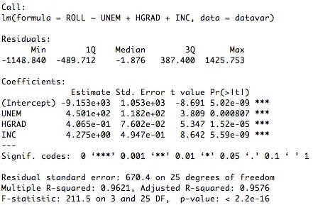
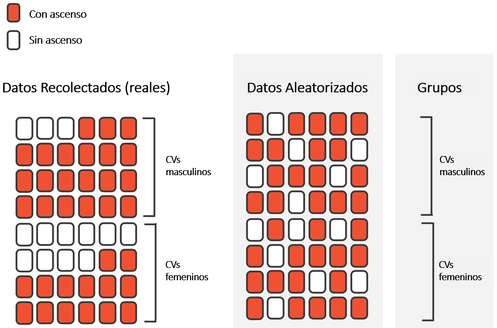

```{css, echo = FALSE}
#.remark-slide-content {
#  font-size: 28px;
#  padding: 20px 80px 20px 80px;
#}
#.remark-code, .remark-inline-code {
#  background: #f0f0f0;
#}
.small .remark-code {
  font-size: 14px;
}

.smaller .remark-code {
  font-size: 12px;
}

.tiny .remark-code {
  font-size: 11px;
}

.pull-left2 {
  float: left;
  width: 40%;
}

.pull-right2 {
  float: right;
  width: 54%;
}
```

```{r setup, include = FALSE, purl = FALSE}
options(htmltools.dir.version = FALSE)
library(knitr)
opts_chunk$set(
  fig.align="center",  
  fig.height=4, #fig.width=6,
  dpi=300, #fig.path='Figs/',
  cache=T,#, echo=F, warning=F, message=F,
  echo = TRUE,
  message = FALSE,
  warning = FALSE,
  error = FALSE,
  out.width = "90%"
  )
library(tidyverse)
library(hrbrthemes)
library(fontawesome)
library(patchwork)
library(infer)
xaringanExtra::use_scribble(pen_size = 1)
xaringanExtra::use_search(show_icon = FALSE)
htmltools::tagList(
  xaringanExtra::use_clipboard(
    button_text = "<i class=\"fa fa-clipboard\"></i>",
    success_text = "<i class=\"fa fa-check\" style=\"color: #90BE6D\"></i>",
  ),
  rmarkdown::html_dependency_font_awesome()
)
```

# ¿Qué veremos hoy?

- Visualización de datos
- Manejo de datos
- Transformación de datos
- **<span style="color:red">Inferencia Estadística/Econometría</span>**
  + <span style="color:red">Intervalos de confianza</span>
  + <span style="color:red">Prueba de hipótesis</span>

```{r, out.width='80%',  echo = FALSE, out.width='750px'}
knitr::include_graphics("../Imagenes/ProcesoDS.png")
```

---

# Describir vs Inferir

- La estadística descriptiva es una rama que apunta a **resumir información** de la mejor manera. 

- Es decir, reducir datos a un par de indicadores y/o visualizaciones tratando de perder la menor cantidad de información.

- La estadística descriptiva **no conlleva incertidumbre** ya que no buscamos extrapolar estas descripciones a otros datos.

--

- Por otro lado, la estadística inferencial busca **obtener conclusiones/aprendizajes** sobre algún fenómeno usando muestras.

- En otras palabras, usamos información de una **muestra** para concluir algo sobre una **población**.

- Dos de las herramientas más importantes en la estadística inferencial son los <span style="color:red">**intervalos de confianza**</span> y las <span style="color:red">**pruebas de hipótesis**</span>.

---

# Pie para la próxima clase

```{r regresiones0, echo = FALSE}

```

---
class: inverse, center, middle
name: reg

# Teorema del Límite Central (TLC)

<html><div style='float:left'></div><hr color='#EB811B' size=1px width=796px></html>

(y Ley de los Grandes Números - LGN)

---

# TLC/LGN

*Si ciertas condiciones se cumplen, las estimaciones muestrales se distribuirán de forma normal con media igual al parámetro poblacional. La dispersión será inversamente proporcional al tamaño muestral*

### Población vs Muestra

- **Población**, $N$: grupo bien definido de sujetos (por ejemplo, población de un país).
- **Muestra**, $n$: Subconjunto de individuos provenientes de una población que se obtienen a través de algún procedimiento de muestreo (ej. muestreo aleatorio simple).

---

# Censo

Asumamos que estos datos corresponden al total del país ( $N=10.000$).

```{r censo, highlight.output = c(3)}
censo <- read_csv("../datos/muestra_censo_2017.csv")
str(censo)
```

Analicemos la variable `edad`.

---

# Distribución de edad

```{r histedad, echo = FALSE}
censo %>% 
  ggplot(aes(x = edad)) +
  geom_histogram(col = "white") +
  theme_minimal() +
  labs(x = "Edad", y = "Frecuencia")
```

.center[**Claramente no sigue una distribución normal**]

---

# Sabemos $\mu$ y $\sigma$

Debido a que tenemos la información de todas las personas sabemos cual es el promedio y la desviación estándar de la población.

```{r mediasdpobcenso}
(datos_poblacion <- censo %>% 
  summarise(promedio = mean(edad, na.rm = TRUE),
            sd = sd(edad, na.rm = TRUE)))
```

Pero **practicamente nunca sabremos estos parámetros poblacionales**, y lo que tenemos que hacer es sacar conclusiones desde **muestras** (hacer estimaciones).

Si sacamos una muestra desde una población y estimamos un parámetro, por ejemplo la media llamamos a esto una **estimación puntual**. A esta estimación la llamaremos $\hat{\mu}$.

---

# Muestras

```{r, echo = FALSE}
set.seed(1)
```

**Una muestra** aleatoria de 100 observaciones ( $n=100$)

```{r samp1}
censo %>% sample_n(100) %>% 
  summarise(promedio = mean(edad))
```

$\hat{\mu}=39.08$

--

**Una segunda muestra** aleatoria de 100 observaciones ( $n=100$)

```{r samp2}
censo %>% sample_n(100) %>% 
  summarise(promedio = mean(edad))
```


$\hat{\mu}=36.15$

.center[**¿Qué pasa si repetimos esto muchas veces?**]
.center[**¿Cómo se distribuyen todas las estimaciones?**]

---

# 10.000 muestras con $n$=100

Sacamos **10.000 muestras aleatorias de 100 individuos**, calculamos el promedio de edad para cada muestra, y graficamos la distribución de cada uno de los promedios calculados:

```{r distpromediocenso, echo = FALSE, out.width="80%"}
guardar_mediacenso <- replicate(expr = mean(sample(censo$edad, 100)), n = 10000)

guardar_mediacenso %>% 
  enframe(value = "edad") %>% 
  ggplot(aes(x = edad)) +
  geom_histogram(col = "white", bins = 100) +
  theme_minimal() +
  labs(x = "Edad", y = "Frecuencia") +
  xlim(29, 43) +
  ylim(0, 900) +
  geom_vline(xintercept = mean(censo$edad), 
             col = "red",
             size = 1.5) +
  geom_vline(xintercept = mean(guardar_mediacenso), 
             col = "blue",
             lty = 2)
```

**¡La distribución de las estimaciones de cada muestra aproximan una distribución normal con media igual a la media poblacional! Decimos entonces, que nuestra estimación es insesgada**.

---

# 10.000 muestras con $n$=200

Sacamos **10.000 muestras aleatorias de 200 individuos**, calculamos el promedio de edad para cada muestra, y graficamos la distribución de cada uno de los promedios calculados:

```{r distpromediocenso11, echo = FALSE, out.width="80%"}
guardar_mediacenso2 <- replicate(expr = mean(sample(censo$edad, 200)), n = 10000)

guardar_mediacenso2 %>% 
  enframe(value = "edad") %>% 
  ggplot(aes(x = edad)) +
  geom_histogram(col = "white", bins = 100) +
  theme_minimal() +
  labs(x = "Edad", y = "Frecuencia") +
  xlim(29, 43) +
  ylim(0, 900) +
  geom_vline(xintercept = mean(censo$edad), 
             col = "red",
             size = 1.5) +
  geom_vline(xintercept = mean(guardar_mediacenso2), 
             col = "blue",
             lty = 2)
```

¡La distribución de las estimaciones de cada muestra aproximan una distribución normal con media igual a la media poblacional! Decimos entonces, que nuestra estimación es insesgada. **¡Y a mayor tamaño muestral menor la dispersión!**

---

# 10.000 muestras con $n$=300

Sacamos **10.000 muestras aleatorias de 300 individuos**, calculamos el promedio de edad para cada muestra, y graficamos la distribución de cada uno de los promedios calculados:

```{r distpromediocenso13, echo = FALSE, out.width="80%"}
guardar_mediacenso3 <- replicate(expr = mean(sample(censo$edad, 300)), n = 10000)

guardar_mediacenso3 %>% 
  enframe(value = "edad") %>% 
  ggplot(aes(x = edad)) +
  geom_histogram(col = "white", bins = 100) +
  theme_minimal() +
  labs(x = "Edad", y = "Frecuencia") +
  xlim(29, 43) +
  ylim(0, 900) +
  geom_vline(xintercept = mean(censo$edad), 
             col = "red",
             size = 1.5) +
  geom_vline(xintercept = mean(guardar_mediacenso3), 
             col = "blue",
             lty = 2)
```

¡La distribución de las estimaciones de cada muestra aproximan una distribución normal con media igual a la media poblacional! Decimos entonces, que nuestra estimación es insesgada. **¡Y a mayor tamaño muestral menor la dispersión!**

---

# 10.000 muestras con $n$=400

Sacamos **10.000 muestras aleatorias de 400 individuos**, calculamos el promedio de edad para cada muestra, y graficamos la distribución de cada uno de los promedios calculados:

```{r distpromediocenso14, echo = FALSE, out.width="80%"}
guardar_mediacenso4 <- replicate(expr = mean(sample(censo$edad, 400)), n = 10000)

guardar_mediacenso4 %>% 
  enframe(value = "edad") %>% 
  ggplot(aes(x = edad)) +
  geom_histogram(col = "white", bins = 100) +
  theme_minimal() +
  labs(x = "Edad", y = "Frecuencia") +
  xlim(29, 43) +
  ylim(0, 900) +
  geom_vline(xintercept = mean(censo$edad), 
             col = "red",
             size = 1.5) +
  geom_vline(xintercept = mean(guardar_mediacenso4), 
             col = "blue",
             lty = 2)
```

¡La distribución de las estimaciones de cada muestra aproximan una distribución normal con media igual a la media poblacional! Decimos entonces, que nuestra estimación es insesgada. **¡Y a mayor tamaño muestral menor la dispersión!**

---

# 10.000 muestras con $n$=500

Sacamos **10.000 muestras aleatorias de 500 individuos**, calculamos el promedio de edad para cada muestra, y graficamos la distribución de cada uno de los promedios calculados:

```{r distpromediocenso15, echo = FALSE, out.width="80%"}
guardar_mediacenso5 <- replicate(expr = mean(sample(censo$edad, 500)), n = 10000)

guardar_mediacenso5 %>% 
  enframe(value = "edad") %>% 
  ggplot(aes(x = edad)) +
  geom_histogram(col = "white", bins = 100) +
  theme_minimal() +
  labs(x = "Edad", y = "Frecuencia") +
  xlim(29, 43) +
  ylim(0, 900) +
  geom_vline(xintercept = mean(censo$edad), 
             col = "red",
             size = 1.5) +
  geom_vline(xintercept = mean(guardar_mediacenso5), 
             col = "blue",
             lty = 2)
```

¡La distribución de las estimaciones de cada muestra aproximan una distribución normal con media igual a la media poblacional! Decimos entonces, que nuestra estimación es insesgada. **¡Y a mayor tamaño muestral menor la dispersión!**

---

# 10.000 muestras con $n$=1000

Sacamos **10.000 muestras aleatorias de 1000 individuos**, calculamos el promedio de edad para cada muestra, y graficamos la distribución de cada uno de los promedios calculados:

```{r distpromediocenso2, echo = FALSE, out.width="80%"}
guardar_mediacenso6 <- replicate(expr = mean(sample(censo$edad, 1000)), n = 10000)

guardar_mediacenso6 %>% 
  enframe(value = "edad") %>% 
  ggplot(aes(x = edad)) +
  geom_histogram(col = "white", bins = 100) +
  theme_minimal() +
  labs(x = "Edad", y = "Frecuencia") +
  xlim(29, 43) +
  ylim(0, 900) +
  geom_vline(xintercept = mean(censo$edad), 
             col = "red",
             size = 1.5) +
  geom_vline(xintercept = mean(guardar_mediacenso6), 
             col = "blue",
             lty = 2)
```

¡La distribución de las estimaciones de cada muestra aproximan una distribución normal con media igual a la media poblacional! Decimos entonces, que nuestra estimación es insesgada. **¡Y a mayor tamaño muestral menor la dispersión!**

---

# Comparar distribuciones muestrales

.pull-left[

$n = 100$

```{r, collapse = TRUE}
mean(guardar_mediacenso)
sd(guardar_mediacenso)
```

$n = 300$

```{r, collapse = TRUE}
mean(guardar_mediacenso3)
sd(guardar_mediacenso3)
```

$n = 500$

```{r, collapse = TRUE}
mean(guardar_mediacenso5)
sd(guardar_mediacenso5)
```

]

.pull-right[

$n = 200$

```{r, collapse = TRUE}
mean(guardar_mediacenso2)
sd(guardar_mediacenso2)
```

$n = 400$

```{r, collapse = TRUE}
mean(guardar_mediacenso4)
sd(guardar_mediacenso4)
```

$n = 1000$

```{r, collapse = TRUE}
mean(guardar_mediacenso6)
sd(guardar_mediacenso6)
```

]

---

# TLC/LGN

*Si ciertas condiciones se cumplen, las estimaciones muestrales se distribuirán de forma normal con media igual al parámetro poblacional. La dispersión será inversamente proporcional al tamaño muestral*

<br>
<br>
<br>

$$\Large \hat{\mu} \sim aproximadamente\ \mathcal{N}(\mu, \frac{\sigma^2}{n})$$

<br>
<br>

$\sqrt{\frac{\sigma^2}{n}}=\frac{\sigma}{\sqrt{n}}=error\ estándar$

---

# A tener en cuenta

En general, si sacamos una **muestra aleatoria** de tamaño $n$ desde una población $N$, entonces:
- La muestra es **insesgada** y **representativa** de la población. Y a mayor $n$ menor dispersión.
- Los resultados basados en la muestra podrían ser **generalizados a la población**.
- La estimación puntual, $\hat{\mu}$, es una **"buena suposición"** del parametro poblacional desconocido, $\mu$.
- Entonces, en vez de hacer un censo (costoso en muchos sentidos), podemos hacer **inferencia sobre una población usando muestreo**.

--

```{r sesgo_var, echo = FALSE, out.width="30%"}
knitr::include_graphics("../Imagenes/sesgo_varianza.jpg")
```


---
class: inverse, center, middle
name: reg

# Intervalo de confianza

<html><div style='float:left'></div><hr color='#EB811B' size=1px width=796px></html>

---

# ¿Qué acabamos de hacer?

- Al hacer muestras repetitivas desde una población, obtenemos la **distribución muestral de la media de `edad`** y podemos ver que se distribuye normalmente.

- Al tomar distintas muestras pudimos ver que las estimaciones puntuales variaban. Esto lo denominamos **variación muestral** y se puede cuantificar usando el **error estándar**. A mayor $n$ (tamaño muestral), menor error estándar (o estimaciones más precisas).

--

- Ahora bien, en "la vida real" no podremos hacer lo que mostramos ya que generalmente **contaremos con una muestra (que ojalá sea lo más grande posible)**. Además, no sabremos el valor del parámetro real que queremos estimar.

- <span style="color:red">¿Cómo podemos considerar los efectos de la variación muestral si -usualmente- tenemos solo una muestra?</span>

- Para esto ocuparemos un **método de remuestreo** conocido como **bootstrapping**. Esto nos permitirá también obtener un rango de valores posibles para nuestro parámetro. Este rango de valores es lo que conocemos como **intervalos de confianza**.

---

# Asumamos que no sabemos $\mu$

### ¿Cuál es la edad promedio en Chile?

- Para responder esta pregunta podríamos entrevistar a todas las personas del país y preguntarles su edad (censo).

- Claramente esto es algo muy costoso por lo que normalmente lo que haríamos es **tomar una muestra de la población**. Digamos que en este caso solo contamos con una muestra, $n$, de **300 personas** obtenida desde la población, $N$, de 10.000.

--

.pull-left[
.small[
```{r, eval = FALSE}
set.seed(1) # para tener los mismos resultados
(muestra_censo <- censo %>% 
    sample_n(300) %>% 
    mutate(Id = row_number()) %>% 
    select(Id, edad))
```
]
]

.pull-right[
.small[
```{r, echo = FALSE}
set.seed(1) # para tener los mismos resultados
(muestra_censo <- censo %>% 
    sample_n(300) %>% 
    mutate(Id = row_number()) %>% 
    select(Id, edad))
```
]
]

---

# Explorar la muestra

.pull-left[
```{r}
muestra_censo %>% 
  ggplot(aes(x = edad)) +
  geom_histogram(color = "white")
```
]

.pull-right[
.small[
```{r}
(edad_promedio_muestra <- muestra_censo %>% 
  summarise(promedio_edad = mean(edad, 
                                 na.rm = TRUE)))
```
]
]

- Si estamos dispuestos a asumir que `muestra_censo` es una muestra representativa de nuestra población, entonces **una "buena suposición" de la edad promedio** de Chile sería **38.13**.
- $\hat{\mu}=38.13$ es nuestra estimación de $\mu$ (que en la práctica sería desconocido).
- Antes calculamos los efectos de la variación muestral sacando muchas muestras repetitivamente pero **ahora solo contamos con una muestra**.

---

# Bootstrapping

.pull-left[

1. Consideremos nuestra muestra de $n = 300$ observaciones/personas.
2. Imaginemos que ponemos 300 papeles con las edades de nuestra muestra en un gorro.
3. Sacaremos una observación, registraremos su valor (ej. edad = 46) y **pondremos de vuelta el papel** en el gorro
4. **Repetiremos el paso 3.** tantas veces como sea nuestro $n$. En este caso 300 veces.
5. Terminaremos con una **remuestra** con $n=300$ creada a partir de nuestra única muestra original, `muestra_censo`

]

.pull-right[

```{r img_bootstrap, echo = FALSE}
knitr::include_graphics("../Imagenes/Bootstrapping.PNG")
```


]

---

# Bootstrapping

- Lo que acabamos de hacer es una **remuestra** desde la muestra original. No estamos yendo a la población, $N$, a buscar otras $n=300$ personas.

- **¿Por qué volvemos a "poner en el gorro" cada valor remuestrado?** Porque de no hacerlo terminaríamos con exactamente la misma muestra original. Hacer el acto de "devolver" cada papel nos intruduce **variación muestral**.

- En otras palabras, lo que hacemos es un **muestreo con reemplazo** desde la muestra original de 300 observaciones.

```{r}
set.seed(5)
censo_muestra_r1 <- muestra_censo %>% 
  sample_n(300, 
           replace = TRUE) #<<
```

---

# Analizar la remuestra

Si observamos como se distribuye nuestra muestra original, `muestra_censo`, y la remuestra que acabamos de hacer, `censo_muestra_r1`, vemos que son similares (no idénticas).

.pull-left[

```{r, echo = FALSE}
ggplot(muestra_censo, aes(x = edad)) +
  geom_histogram(color = "white") +
  labs(title = "Muestra original de 300 observaciones")

muestra_censo %>% 
  summarise(promedio_edad = mean(edad, 
                                 na.rm = TRUE))
```
]

.pull-right[
```{r, echo = FALSE}
ggplot(censo_muestra_r1, aes(x = edad)) +
  geom_histogram(color = "white") +
  labs(title = "Remuestra de 300 observaciones")

censo_muestra_r1 %>% 
  summarise(promedio_edad = mean(edad, 
                                 na.rm = TRUE))
```
]

Obtenemos también un promedio distinto al calculado originalmente y esta **variación es debido al remuestreo con reemplazo** que hicimos. 

¿Qué pasaría si repetimos este ejercicio de remuestreo muchas veces? **Ojo, esto si es algo factible "en la vida real"**.

---

# Muchas remuestras

1. Consideremos nuestra muestra de $n = 300$ observaciones/personas.
2. Imaginemos que ponemos 300 papeles con las edades de nuestra muestra en un gorro.
3. Sacaremos una observación, registraremos su valor (ej. edad = 46) y pondremos de vuelta el papel en el gorro
4. Repetiremos el paso **3.** tantas veces como sea nuestro $n$. En este caso 300 veces.
5. Terminaremos con una **remuestra** con $n=300$ creada a partir de nuestra única muestra original, `muestra_censo`
6. **Hacemos lo anterior 1.000 veces**.

```{r imagen_dist, echo = FALSE, out.width="70%"}
knitr::include_graphics("../Imagenes/Infer0.png")
```

---

# Muchas remuestras

1. Consideremos nuestra muestra de $n = 300$ observaciones/personas.
2. Imaginemos que ponemos 300 papeles con las edades de nuestra muestra en un gorro.
3. Sacaremos una observación, registraremos su valor (ej. edad = 46) y pondremos de vuelta el papel en el gorro
4. Repetiremos el paso **3.** tantas veces como sea nuestro $n$. En este caso 300 veces.
5. Terminaremos con una **remuestra** con $n=300$ creada a partir de nuestra única muestra original, `muestra_censo`
6. **Hacemos lo anterior 1.000 veces**.

```{r cargar_remuestra}
(guardar_remuestras <- read_csv("../datos/remuestras_edad.csv"))
```

---

# Muchas remuestras

.pull-left[
.small[
```{r resumen_promedioremuestra}
(promedio_remuestras <- 
   guardar_remuestras %>%
      group_by(remuestra) %>%
      summarise(promedio_edad = mean(edad,
                                     na.rm = TRUE)))
```
]
]

.pull-right[
.small[
```{r graf_promedioremuestra}
promedio_remuestras %>% 
  ggplot(aes(x = promedio_edad)) +
  geom_histogram(bins = 15, color = "white")
```
]
]

---

# ¿Qué hicimos?

- Usamos **bootstrap como una forma de representar la variación muestral** vista anteriormente.

- La distribución que vimos recién se denomina **distribución bootstrap** y es una **aproximación de la distribución muestral** de la media.

- La distribución bootstrap probablemente **no tendrá el mismo "centro"** que la distribución muestral. En otras palabras, **bootstrap no nos permite mejorar la "calidad" de nuestra estimación**.

- Pero, la distribución bootstrap si **tendrá una forma y dispersión similar a la distribución muestral**. Entonces, si nos da una **buena estimación del error estándar**.

- Este último punto nos permitirá construir **intervalos de confianza**.

---

# Entendiendo intervalos de confianza

.pull-left[
- Podemos pescar tanto con una **caña** como con una **red**. La red probablemente te permite pescar más pescados que la caña.
- Digamos que $\mu$, el parámetro a estimar,  es un pescado.
- Una estimación puntual a partir de una muestra, $\hat{\mu}$, para representar $\mu$ sería como una caña.
- ¿Cómo sería una red? Tratemos de ver entre que dos valores de `edad` se encuentra el mayor número de estimaciones. ¿Entre 37 y 41? ¿36.5 y 41.5?
- Esta última idea es lo que llamaremos un intervalo de confianza. El **intervalo de confianza nos da un rango de valores posibles**.
]

.pull-right[

.center[ **Distribución bootstrap** ]

```{r, graf_promediomuestras2, echo = FALSE}
promedio_remuestras %>% 
  ggplot(aes(x = promedio_edad)) +
  geom_histogram(bins = 15, color = "white")
```
]

---

# ¿Qué necesitamos para construir un I.C.?

- Una **distribución bootstrap**.
- Un **nivel de confianza** (90%, **95%**, 99%). 
  * A mayor nivel de confianza, los intervalos serán más amplios. 
  * Normalmente trabajaremos con un nivel de confianza de 95%.

- Construiremos intervalos de confianza a través de dos métodos: 
  * **método de percentiles**.
  * **método del error estándar**.

---

# Método de percentiles

Características de `promedio_edad` en `promedio_remuestras`.

.pull-left[
.small[
```{r, eval = FALSE}
promedio_remuestras %>% 
  select(promedio_edad) %>% 
  summary()
```
]
]

.pull-right[
.small[
```{r, echo = FALSE}
promedio_remuestras %>% select(promedio_edad) %>% summary()
```
]
]

--

Si queremos saber **entre que dos valores** están, por ejemplo, **el 95% de las observaciones**, necesitamos saber **bajo qué valor están el 2.5% inferior de los datos** y **sobre qué valor están el 2.5% superior de los datos**. 

.small[
```{r}
promedio_remuestras %>% 
  arrange(-promedio_edad) %>% # Ordenamos los datos
  slice(25, 975) %>% # Tenemos 1.000 valores
  select(2)
```
]

---

# Método de percentiles

```{r metodo_percentiles}
(metodo_percentiles <- promedio_remuestras %>% 
  summarise(percentil_2.5 = quantile(promedio_edad, 0.025), # Calcular percentil 2.5
            percentil_97.5 = quantile(promedio_edad, 0.975))) # Calcular percentil 97.5
```


```{r metodo_percentiles_graf2, echo = FALSE, fig.width=10, fig.height=4}
promedio_remuestras %>% 
  ggplot(aes(x = promedio_edad)) +
  geom_histogram(bins = 15, color = "white") +
  geom_vline(xintercept = c(metodo_percentiles$percentil_2.5, 
                            metodo_percentiles$percentil_97.5),
             size = 1)
```

---

# Método error estándar

```{r pnormest}
pnorm(1.96, mean = 0, sd = 1) - pnorm(-1.96, mean = 0, sd = 1)
```

```{r normest, echo = FALSE, out.width="80%"}
dnorm(seq(-4,4,length = 100), mean = 0, sd = 1) %>% 
  enframe() %>% 
  ggplot(aes(x = seq(-4,4,length = 100), y = value)) +
  geom_line() +
  geom_area(data = slice(enframe(dnorm(seq(-4,4,length = 100), mean = 0, sd = 1)), 21:80), aes(x = seq(-4,4,length = 100)[21:80], y = value), fill = "red", alpha = 0.5) +
  theme_void()
```

$$\hat{\mu}\pm 1.96 \times EE$$

---

# Método error estándar

```{r metodo_ee}
(metodo_ee <- promedio_remuestras %>% 
  summarise(promedio = mean(promedio_edad), # Calcular promedio estándar
            EE = sd(promedio_edad)) %>%  # Calcular error
  mutate(lim_inf = promedio - (1.96*EE), # Calcular límite inferior I.C. #<<
         lim_sup = promedio + (1.96*EE))) # Calcular límite superior I.C. #<<
```

```{r metodo_ee_graf, echo = FALSE, fig.width=10, fig.height=4}
promedio_remuestras %>% 
  ggplot(aes(x = promedio_edad)) +
  geom_histogram(bins = 15, color = "white") +
  geom_vline(xintercept = c(metodo_percentiles$percentil_2.5, 
                            metodo_percentiles$percentil_97.5),
             size = 1) +
  geom_vline(xintercept = c(metodo_ee$lim_inf, 
                            metodo_ee$lim_sup),
             size = 1, color = "red", linetype = 2)
```

---

# Paquete **infer**

- `infer` es un paquete para inferencia estadística.
- Relacionado al `tidyverse`

.pull-left[
```{r}
muestra_censo %>% 
  summarise(promedio = mean(edad))
```
]

.pull-right[
```{r}
muestra_censo %>% 
  specify(response = edad) %>% 
  calculate(stat = "mean")
```
]

--

- El cálculo usando `infer` es más largo. ¿Para qué entonces?
- Nos presenta "verbos" más ligados a la estadística.
- Será útil cuando veamos prueba de hipótesis.
- Es más flexible para cuando queremos hacer inferencia para más de una variable.

---

# Paquete **infer**

.pull-left[
```{r, eval = FALSE}
muestra_censo %>% 
  specify(response = edad) #<<
```
]

.pull-right[
```{r, echo = FALSE, output.highlight = c(1)}
muestra_censo %>% 
  specify(response = edad)
```
]

- `specify` permite identificar la variable (o variables) sobre la cuál haremos los cálculos.
- Noten como en la práctica no cambia nada en el `data.frame`. En ese sentido es similar a `group_by`.

---

# Paquete **infer**

.pull-left[
```{r, eval = FALSE}
muestra_censo %>% 
  specify(response = edad) %>% 
  generate(reps = 1000, #<<
           type = "bootstrap") #<<
```
]

.pull-right[
```{r, echo = FALSE, output.highlight = c(3)}
muestra_censo %>% 
  specify(response = edad) %>% 
  generate(reps = 1000, 
           type = "bootstrap")
```
]

- `generate` nos permite generar las 1.000 remuestras bootstrap.
- El resultado tiene 300.000 filas debido a que son 1.000 remuestras de tamaño igual a 300.
- Se genera una columna "replicate" correspondiente a cada una de las 1.000 remuestras.

---

# Paquete **infer**

.pull-left[
```{r, eval = FALSE}
muestra_censo %>% 
  specify(response = edad) %>% 
  generate(reps = 1000, 
           type = "bootstrap") %>% 
  calculate(stat = "mean") #<<
```
]

.pull-right[
```{r, echo = FALSE}
muestra_censo %>% 
  specify(response = edad) %>% 
  generate(reps = 1000, 
           type = "bootstrap") %>% 
  calculate(stat = "mean")
```
]

- Con `calculate` transformamos cada una de las 1.000 remuestras de 300 observaciones, en 1.000 medias.
- Noten que el resultado son 1.000 filas con una columna correspondiente a cada "replica" y la otra con el cálculo hecho.

---

# Paquete **infer**

.pull-left[
```{r, eval = FALSE}
muestra_censo %>% 
  specify(response = edad) %>% 
  generate(reps = 1000, 
           type = "bootstrap") %>% 
  calculate(stat = "mean") %>% 
  visualise() #<<
```
]

.pull-right[
```{r, echo = FALSE}
muestra_censo %>% 
  specify(response = edad) %>% 
  generate(reps = 1000, 
           type = "bootstrap") %>% 
  calculate(stat = "mean") %>% 
  visualise()
```
]

```{r img_infer, echo = FALSE, out.width="70%"}
knitr::include_graphics("../Imagenes/Infer.png")
```

---

# Construir I.C. con **infer**

```{r}
set.seed(1)
guardar_remuestras_i <- muestra_censo %>% 
  specify(response = edad) %>% 
  generate(reps = 1000, 
           type = "bootstrap") %>% 
  calculate(stat = "mean")
```

--

.pull-left[

### Método percentiles

.small[
```{r}
guardar_remuestras_i %>% 
  get_confidence_interval(level = 0.95,
                          type = "percentile") #<<
```
]
]

.pull-right[

### Método error estándar

.small[
```{r}
guardar_remuestras_i %>% 
  get_confidence_interval(level = 0.95,
                          type = "se", #<<
                          point_estimate = edad_promedio_muestra)
```
]
]

---

# Interpretar I.C.

- Ya pudimos construir intervalos de confianza a partir de una muestra tomada desde una población. Ahora podemos **evaluar su efectividad**.

- La efectividad de un intervalo de confianza se juzga según si este **contiene o no el verdadero valor del parámetro poblacional**. *¿Capturó la red al pescado?*

- En nuestro ejemplo, ¿nuestros intervalos de confianza, $[35.8, 40.5]$ o $[35.6, 40.6]$, capturan el verdadero promedio de `edad`, $\mu=36.0179$?

- **¡Sí!** nuestros intervalos construídos con un 95% de nivel de confianza a partir de una muestra con $n=300$ incluyen al valor real del parámetro poblacional. **¿Ocurrirá esto para todas las muestras que tomemos?**

---

# Interpretar I.C.

.pull-left[
- 100 intervalos de confianza a partir de 100 muestras aleatorias distintas y considerando un nivel de confianza de 95%. 

- La linea negra corresponde al valor real del parámetro poblacional, $\mu$ (edad de la población).

- Las lineas horizontales corresponden a los intervalos de confianza y son de color gris si el intervalo incluye al valor real y rojas si no.

- De los 100 intervalos, 95 incluyen el valor real del parámetro. En otras palabras, un nivel de confianza de 95% significa que de cada 100 intervalos **esperamos** que 95 incluyan $\mu$.

]

.pull-right[
```{r muchos_ic_95, echo = FALSE, fig.height=10}
guardar_95 <- data.frame()
set.seed(4)
for (i in 1:100){
  
  x <- censo %>% 
    sample_n(100) %>% 
    specify(response = edad) %>% 
    generate(reps = 1000, type = "bootstrap") %>% 
    calculate(stat = "mean") 
  
  x_med <- x %>% 
    summarise(med = mean(stat))
  
  x_ci <- x %>% 
    get_confidence_interval(level = 0.95, type = "percentile") %>% 
    mutate(rep = i,
           med = x_med$med, .before = 1)
  
  guardar_95 <- bind_rows(guardar_95, x_ci)
}

guardar_95 %>% 
  mutate(contiene = ifelse(lower_ci <= datos_poblacion$promedio & upper_ci >= datos_poblacion$promedio, 
                           "si", "no")) %>%
  ggplot() +
  geom_errorbar(aes(x = rep, 
                    ymin = lower_ci, 
                    ymax = upper_ci,
                    color=contiene), width=.1) +
  geom_point(aes(x = rep, y = med, color = contiene), size = 0.7) +
  geom_hline(yintercept = datos_poblacion$promedio) +
  coord_flip() +
  theme_minimal() +
  labs(x = "N° de intervalo de confianza",
       y = "Edad") +
  scale_color_manual(values = c("red", "grey"))
```
]

---

# Distintos niveles de confianza

.pull-left[

### 95% nivel de confianza

```{r, echo = FALSE, fig.height=7}
guardar_95 %>% 
  mutate(contiene = ifelse(lower_ci <= datos_poblacion$promedio & upper_ci >= datos_poblacion$promedio, 
                           "si", "no")) %>%
  ggplot() +
  geom_errorbar(aes(x = rep, 
                    ymin = lower_ci, 
                    ymax = upper_ci,
                    color=contiene), width=.1) +
  geom_point(aes(x = rep, y = med, color = contiene), size = 0.7) +
  geom_hline(yintercept = datos_poblacion$promedio) +
  coord_flip() +
  theme_minimal() +
  labs(x = "N° de intervalo de confianza",
       y = "Edad") +
  scale_color_manual(values = c("red", "grey")) +
  ylim(25, 50)
```

]

.pull-right[

### 90% nivel de confianza

```{r muchos_ic_90, echo = FALSE, fig.height=7}
guardar_90 <- data.frame()
set.seed(5)
for (i in 1:100){
  
  x <- censo %>% 
    sample_n(100) %>% 
    specify(response = edad) %>% 
    generate(reps = 1000, type = "bootstrap") %>% 
    calculate(stat = "mean") 
  
  x_med <- x %>% 
    summarise(med = mean(stat))
  
  x_ci <- x %>% 
    get_confidence_interval(level = 0.9, type = "percentile") %>% 
    mutate(rep = i,
           med = x_med$med, .before = 1)
  
  guardar_90 <- bind_rows(guardar_90, x_ci)
}

guardar_90 %>% 
  mutate(contiene = ifelse(lower_ci <= datos_poblacion$promedio & upper_ci >= datos_poblacion$promedio, 
                           "si", "no")) %>%
  ggplot() +
  geom_errorbar(aes(x = rep, 
                    ymin = lower_ci, 
                    ymax = upper_ci,
                    color=contiene), width=.1) +
  geom_point(aes(x = rep, y = med, color = contiene), size = 0.7) +
  geom_hline(yintercept = datos_poblacion$promedio) +
  coord_flip() +
  theme_minimal() +
  labs(x = "N° de intervalo de confianza",
       y = "Edad") +
  scale_color_manual(values = c("red", "grey")) +
  ylim(25, 50)
```

]

.center[**Mayores niveles de confianza llevan a intervalos más amplios**]

---

# Distintos $n$

```{r ic_distintos_n, echo = FALSE}
guardar_95_100 <- data.frame()
set.seed(4)
for (i in 1:100){
  
  x <- censo %>% 
    sample_n(100) %>% 
    specify(response = edad) %>% 
    generate(reps = 1000, type = "bootstrap") %>% 
    calculate(stat = "mean") 
  
  x_med <- x %>% 
    summarise(med = mean(stat))
  
  x_ci <- x %>% 
    get_confidence_interval(level = 0.95, type = "percentile") %>% 
    mutate(rep = i,
           med = x_med$med, .before = 1)
  
  guardar_95_100 <- bind_rows(guardar_95_100, x_ci)
}


guardar_95_1000 <- data.frame()
set.seed(4)
for (i in 1:100){
  
  x <- censo %>% 
    sample_n(1000) %>% 
    specify(response = edad) %>% 
    generate(reps = 1000, type = "bootstrap") %>% 
    calculate(stat = "mean") 
  
  x_med <- x %>% 
    summarise(med = mean(stat))
  
  x_ci <- x %>% 
    get_confidence_interval(level = 0.95, type = "percentile") %>% 
    mutate(rep = i,
           med = x_med$med, .before = 1)
  
  guardar_95_1000 <- bind_rows(guardar_95_1000, x_ci)
}
```

.pull-left[

### $n=100$

```{r, echo = FALSE, fig.height=7}
guardar_95_100 %>% 
  mutate(contiene = ifelse(lower_ci <= datos_poblacion$promedio & upper_ci >= datos_poblacion$promedio, 
                           "si", "no")) %>%
  ggplot() +
  geom_errorbar(aes(x = rep, 
                    ymin = lower_ci, 
                    ymax = upper_ci,
                    color=contiene), width=.1) +
  geom_point(aes(x = rep, y = med, color = contiene), size = 0.7) +
  geom_hline(yintercept = datos_poblacion$promedio) +
  coord_flip() +
  theme_minimal() +
  labs(x = "N° de intervalo de confianza",
       y = "Edad") +
  scale_color_manual(values = c("red", "grey")) +
  ylim(25, 50)
```
]

.pull-right[

### $n=1000$

```{r, echo = FALSE, fig.height=7}
guardar_95_1000 %>% 
  mutate(contiene = ifelse(lower_ci <= datos_poblacion$promedio & upper_ci >= datos_poblacion$promedio, 
                           "si", "no")) %>%
  ggplot() +
  geom_errorbar(aes(x = rep, 
                    ymin = lower_ci, 
                    ymax = upper_ci,
                    color=contiene), width=.1) +
  geom_point(aes(x = rep, y = med, color = contiene), size = 0.7) +
  geom_hline(yintercept = datos_poblacion$promedio) +
  coord_flip() +
  theme_minimal() +
  labs(x = "N° de intervalo de confianza",
       y = "Edad") +
  scale_color_manual(values = c("red", "grey")) +
  ylim(25, 50)
```
]

.center[**Mayores tamaños muestrales llevan a intervalos más angostos**]

---

# Resumiendo...

- Como dijimos, "un nivel de confianza de 95% significa que de cada 100 intervalos que pudieramos construir, **esperaríamos** que 95 incluyan $\mu$."

- No es lo mismo que decir "hay un 95% de probabilidad de que el intervalo de confianza contenga a $\mu$".

---

# I.C "basado en teoría"

- Hasta este momento nuestros I.C. se construyeron usando el método de percentiles o el de error estándar **haciendo simulaciones**.

- Otro método es simplemente ocupar una fórmula "basada en teoría" del tipo: $I.C. = Estimación\ Puntual \pm (Valor\ Crítico \times Error\ Estándar)$

- **Esta fórmula es una aproximación**, usando solo la información de una muestra, a lo que obtenemos a través de simulaciones.

- Por ende, ya que no realizaremos remuestras en este caso, **necesitamos una fórmula para estimar el error estándar**. 

### Error estándar basado en teoría

- Para el caso de una media: $\frac{s}{\sqrt{n}}$. Donde $s$ es la desviación estándar de la muestra.

- Para una proporción: $\sqrt{\frac{\hat{p}(1-\hat{p})}{n}}$. Donde $\hat{p}$ es la proporción calculada desde la muestra.

---

# Error estándar de formas distintas

**Usando la dispersión de las remuestras (bootstrap)**

```{r, eval = FALSE}
promedio_remuestras %>% 
  summarise(sd = sd(promedio_edad, na.rm = TRUE)) %>% transmute(error_est = sd)
```

**Usando fórmula con la desviación estándar de la población**, $\frac{\sigma}{\sqrt{n}}$

```{r, eval = FALSE}
censo %>% 
  summarise(sd = sd(edad, na.rm = TRUE)) %>% transmute(error_est = sd/sqrt(300))
```

<span style="color:red">**Usando  fórmula con la desviación estándar de la muestra**</span>, $\frac{s}{\sqrt{n}}$

```{r, eval = FALSE}
muestra_censo %>% 
  summarise(sd = sd(edad, na.rm = TRUE)) %>% transmute(error_est = sd/sqrt(300))
```

**Comparar**

.center[
.small[
```{r, echo = FALSE}
bootstrap_ee <- promedio_remuestras %>% 
  summarise(sd = sd(promedio_edad, na.rm = TRUE)) %>% 
  transmute(bootstrap_ee = sd)

poblacion_ee <- censo %>% 
  summarise(sd = sd(edad, na.rm = TRUE)) %>% 
  transmute(poblacion_ee= sd/sqrt(300))

formula_ee <- muestra_censo %>% 
  summarise(sd = sd(edad, na.rm = TRUE)) %>% 
  transmute(formula_ee= sd/sqrt(300))

bind_cols(bootstrap_ee, poblacion_ee, formula_ee)
```
]
]

---

# I.C "basado en teoría"

$$
\begin{aligned}
I.C. &= Estimación\ Puntual \pm (Valor\ Crítico \times Error\ Estándar) \\
I.C. &= \hat{\mu} \pm (1.96 \times \frac{s}{\sqrt{n}})
\end{aligned}
$$

.small[
```{r}
muestra_censo %>% 
  summarise(mu = mean(edad, na.rm = TRUE),
            sd = sd(edad, na.rm = TRUE),
            formula_ee = sd/sqrt(300),
            IC_1 = mu - (1.96*formula_ee),
            IC_2 = mu + (1.96*formula_ee))
```
]

$$
\begin{aligned}
I.C. &= 38.13 \pm (1.96 \times 1.278) \\
I.C. &= 38.13 \pm (2.5) \\
I.C. &= [35.6,40.6]
\end{aligned}
$$

Al igual que en los otros I.C. que construimos, el promedio poblacional de `edad`, $\mu=36.0179$, también está incluído en este intervalo.

---
class: inverse, center, middle
name: reg

# Ejercicio

<html><div style='float:left'></div><hr color='#EB811B' size=1px width=796px></html>

---

# Ejercicio

- `EjercicioIntervaloConfianza.R`

---
class: inverse, center, middle
name: reg

# Prueba de hipótesis

<html><div style='float:left'></div><hr color='#EB811B' size=1px width=796px></html>

---

# Un caso real

- Un estudio de 1974 analizó el **efecto que el sexo (masculino/femenino) en las posibilidades de ser ascendido/a** en un trabajo.

- A 48 supervisores de una industria se les pidió que asumieran el rol de un director de RRHH y se les entregó **un CV** para que **decidieran si es que el o la candidato/a debiera ser ascendido/a**.

--

- Los **48 CV eran exactamente iguales con excepción del nombre**. A 24 de las personas se les dieron CVs con solo nombres "típicos de hombres" y al otro grupo de 24 solo con nombres "típicos de mujeres".

- Considerando la asignación aleatoria y la posibilidad de que el CV sea "hombre" o "mujer" solamente, este experimento serviría como una aproximación para aislar el efecto del sexo de una persona en ser o no ascendido/a.

--

.smaller[
```{r}
ascensos <- read_csv("../datos/ascensos.csv")
glimpse(ascensos)
```
]

---

# Resultados

.pull-left[
- 35 personas fueron seleccionadas para ser ascendidas.
- De los 24 CVs con nombres de **hombre**, **21 fueron ascendidos** (87.5%).
- De los 24 CVs con nombres de **mujer**, **14 fueron ascendidas** (58.3%).
- **29.2 puntos % de diferencia** entre hombres y mujeres.

]

.pull-right[
.smaller[
```{r}
ascensos %>% 
  group_by(sexo, decision) %>% 
  summarise(n = n()) %>% 
  ggplot(aes(x = sexo, y = n, fill = decision)) +
  geom_col() +
  labs(x = "Sexo en el CV")
```
]
]

--

- *¿Es esta evidencia concluyente de que en esta industria existe discriminación contra las mujeres a la hora de realizar ascensos laborales?*
- *¿Podría ser esta diferencia solo "por casualidad" en un mundo hipotético donde no existe discriminación __o es una diferencia significativa__?*

---

# Mundo hipotético

- Imaginemos un mundo donde la discriminación laboral hacia las mujeres no existe. Entonces, **en este mundo el ser mujer u hombre no tiene ninguna influencia** en si alguien es o no ascendido/a.

- En términos de nuestros datos, `ascensos`, la variable `sexo` sería irrelevante. Puesto de otra forma, podríamos reordenar nuestros datos para que los **35 ascensos se repartan aleatoriamente entre los 24 `masculino` y 24 `femenino`**.

--

```{r aleatorizacion_cvs, echo = FALSE, out.width="60%"}

```

---

# Mundo hipotético

- Imaginemos un mundo donde la discriminación laboral hacia las mujeres no existe. Entonces, **en este mundo el ser mujer u hombre no tiene ninguna influencia** en si alguien es o no ascendido/a.

- En términos de nuestros datos, `ascensos`, la variable `sexo` sería irrelevante. Puesto de otra forma, podríamos reordenar nuestros datos para que los **35 ascensos se repartan aleatoriamente entre los 24 `masculino` y 24 `femenino`**.

```{r, echo = FALSE, fig.height=3}
library(patchwork)
g1 <- ascensos %>% 
  group_by(sexo, decision) %>% 
  summarise(n = n()) %>% 
  ggplot(aes(x = sexo, y = n, fill = decision)) +
  geom_col() +
  labs(x = "Sexo en el CV",
       title = "Original") +
  theme(legend.position = "none")

ascensos_reordenado <- read_csv("../datos/ascensos_reordenado.csv")
g2 <- ascensos_reordenado %>% 
  group_by(sexo, decision) %>% 
  summarise(n = n()) %>% 
  ggplot(aes(x = sexo, y = n, fill = decision)) +
  geom_col() +
  labs(x = "Sexo en el CV",
       title = "Mundo hipotético",
       y = NULL)

g1|g2
```

---

# Mundo hipotético

```{r}
ascensos_reordenado %>% 
  group_by(sexo, decision) %>% 
  summarise(n = n()) %>% 
  pivot_wider(names_from = sexo, values_from = n)
```

- En este mundo hipotético de no discriminación, **18 de 24 hombres** fueron ascendidos (75%) y **17 de 24 mujeres** también (70.8%).
- La diferencia que en nuestra muestra original era de 29.2 puntos % **en este caso es de 4.2 puntos %**.
- Ahora, esta asignación aleatoria es solo un ejemplo. Podríamos repetir este proceso algunas veces más y tener una **distribución de diferencias**.

---

# 16 aleatorizaciones

Distribución de 16 veces reordenar nuestros datos para que los **35 ascensos se repartan aleatoriamente entre los 24 `masculino` y 24 `femenino`**.

```{r 16_aleat, echo = FALSE, out.width = "80%"}
ascensos_reordenado_v <- read_csv("../datos/ascensos_reordenado_varios.csv")

distribucion_dif <- ascensos_reordenado_v %>% 
  pivot_longer(3:18, names_to = "p", values_to = "sexo") %>% 
  group_by(decision, p, sexo) %>% 
  summarise(n = n()) %>% 
  group_by(p, sexo) %>% 
  arrange(p, sexo) %>% 
  mutate(prop = n/sum(n)) %>% 
  filter(decision == "con") %>% 
  select(p, sexo, prop) %>% 
  pivot_wider(names_from = sexo, values_from = prop) %>% 
  transmute(dif_m_f = m-f)

distribucion_dif %>%
  ggplot(aes(x = dif_m_f)) +
  geom_histogram(binwidth = 0.1, color = "white") +
  geom_vline(xintercept = 0.292, color = NA, size = 2) +
  labs(x = "Diferencia de % entre hombres y mujeres",
       y = "n")
```

.center[<span style="color:red">**¿Cómo se vería nuestro cálculo inicial (real) en esta distribución?**</span>]

---

# 16 aleatorizaciones

Distribución de 16 veces reordenar nuestros datos para que los **35 ascensos se repartan aleatoriamente entre los 24 `masculino` y 24 `femenino`**.

```{r 16_aleat2, echo = FALSE, out.width = "80%"}
distribucion_dif %>%
  ggplot(aes(x = dif_m_f)) +
  geom_histogram(binwidth = 0.1, color = "white") +
  geom_vline(xintercept = 0.292, color = "red", size = 2) +
  labs(x = "Diferencia de % entre hombres y mujeres",
       y = "n")
```

---

# ¿Qué significa esto?

- Recordemos que este histograma representa la distribución de la diferencia de ascensos entre hombres y mujeres en un **mundo hipotético de no discriminación**.
- De hecho, **la distribución esta centrada en cero**. Sin embargo, en este mundo hipotético igual pueden haber diferencias en ascensos debido a la **variación muestral**.
- Teniendo todo eso en consideración, **¿qué tan factible es una diferencia de 29.2 puntos porcentuales de más ascensos para hombres que mujeres en un mundo de no discriminación?**

```{r, echo = FALSE, out.width="60%"}
distribucion_dif %>%
  ggplot(aes(x = dif_m_f)) +
  geom_histogram(binwidth = 0.1, color = "white") +
  geom_vline(xintercept = 0.292, color = "red", size = 2) +
  labs(x = "Diferencia de % entre hombres y mujeres",
       y = "n")
```

---

# ¿Qué acabamos de hacer?

- El procedimiento que hicimos se conoce como __*prueba de hipótesis* usando *permutaciones*__. En este caso el acto de permutar fue aleatorizar los ascensos entre `masculino` y `femenino`.

- Las permutaciones son otra forma de **remuestreo** como el *bootstrap* que ya aplicamos. Mientras que el *bootstrap* fue un remuestreo con reemplazo, la __*permutación* es remuestreo sin reemplazo__.

- En este caso usamos las permutaciones para simular un mundo de no discriminación y el resultado fue que **la realidad es poco probable bajo ese mundo supuesto**. 

- En otras palabras, con la evidencia disponible tenderíamos a **rechazar que este mundo hipotético es factible** y que, por ende, **hay evidencia de que existe discriminación**.

- Nuestra estimación de **29.2 puntos porcentuales de diferencia parece ser claramente mayor a 0**, sugiriendo discriminación en contra de las mujeres. Pero, **¿es esta diferencia significativamente diferente a 0?**

- Las pruebas de hipótesis nos permitirán responder esto.

---

# Prueba de hipótesis: Algunos conceptos

Una <span style="color:red">hipótesis</span> **es una declaración respecto al valor de un parámetro poblacional desconocido** (por ej. $\mu$). Para el caso que vimos recién, este parámetro sería la diferencia entre la proporción de "CV masculinos" con ascenso menos la proporción de "CVs femeninos" con ascenso, $p_{m}-p_{f}$.

--

Una <span style="color:red">prueba de hipótesis</span> consiste en una prueba entre **dos hipótesis contrarias**: *(i)* una **hipótesis nula**, $H_0$, versus *(ii)* una **hipótesis alternativa**, $H_A$.

  + Generalmente **la hipótesis nula es una declaración de que no hay efecto** o no hay diferencia. Se habla de que la **hipótesis nula representa el status quo** o una situación de "no interés".

  + Por otro lado, **la hipótesis nula sería la declaración que se quiere establecer** y que se probará a través de la evidencia.

--

$$\small H_0:\ los\ hombres\ y\ las\ mujeres\ son\ ascendidos\ a\ tasas\ similares$$

$$\small H_A:\ los\ hombres\ son\ ascendidos\ a\ tasas\ más\ altas\ que\ las\ mujeres$$

---

# Prueba de hipótesis: Algunos conceptos

Una <span style="color:red">hipótesis</span> **es una declaración respecto al valor de un parámetro poblacional desconocido** (por ej. $\mu$). Para el caso que vimos recién, este parámetro sería la diferencia entre la proporción de "CV masculinos" con ascenso menos la proporción de "CVs femeninos" con ascenso, $p_{m}-p_{f}$.

Una <span style="color:red">prueba de hipótesis</span> consiste en una prueba entre **dos hipótesis contrarias**: *(i)* una **hipótesis nula**, $H_0$, versus *(ii)* una **hipótesis alternativa**, $H_A$.

  + Generalmente **la hipótesis nula es una declaración de que no hay efecto** o no hay diferencia. Se habla de que la **hipótesis nula representa el status quo** o una situación de "no interés".

  + Por otro lado, **la hipótesis nula sería la declaración que se quiere establecer** y que se probará a través de la evidencia.

$$\small H_0: p_m - p_f = 0$$

$$\small H_A: p_m - p_f >0$$

---

# Prueba de hipótesis: Algunos conceptos

Un <span style="color:red">estadístico</span> es una formula para una estimación/cálculo. Antes hablabamos de la estimación de la media muestral como $\hat{\mu}$ (promedio muestral). Para este ejemplo **nuestro estadístico sería la diferencia de proporciones**, $\hat{p}_{m}-\hat{p}_{f}$.

--

El <span style="color:red">estadístico observado</span> es el valor calculado/observado. En nuestro ejemplo sería **29.2 puntos porcentuales**.

--

La <span style="color:red">distribución nula</span> es la distribución del estadístico **asumiendo** que la hipótesis nula, $H_0$, es cierta. No decimos que $H_0$ sea necesariamente cierto sino que asumimos esto para ver **que tan factible es nuestro estadístico observado bajo este supuesto**.

--

```{r, echo = FALSE, out.width="60%"}
distribucion_dif %>%
  ggplot(aes(x = dif_m_f)) +
  geom_histogram(binwidth = 0.1, color = "white") +
  geom_vline(xintercept = 0.292, color = "red", size = 2) +
  labs(x = "Diferencia de % entre hombres y mujeres",
       y = "n")
```

---

# Prueba de hipótesis: Algunos conceptos

El **<span style="color:red">valor p o p-value</span>** es la probabilidad de observar un estadístico tan o más "extremo" que el que tenemos, **asumiendo que la hipótesis nula, $H_0$, es cierta**.

  + Podríamos decir que es una cuantificación de "sorpresa" de los resultados. En nuestro ejemplo, **¿qué tan "sorprendidos" estamos de que la diferencia en ascensos fuera 29.2 puntos % dada la distribución nula?**
  
  + Puesto de otra forma, ¿que proporción de los datos son más "extremos" que este resultado?

--

```{r, echo = FALSE, out.width="40%"}
distribucion_dif %>%
  ggplot(aes(x = dif_m_f)) +
  geom_histogram(binwidth = 0.1, color = "white") +
  geom_vline(xintercept = 0.292, color = "red", size = 2) +
  labs(x = "Diferencia de % entre hombres y mujeres",
       y = "n")
```

En este caso, **la respuesta es 0**. Por ende lo que observamos es **muy sorprendente** bajo la hipótesis nula, $H_0$. Tan raro es lo que vemos que lo más sensato sería **<span style="color:red">rechazar la hipótesis nula</span>** de que no existe diferencia.

---

# Prueba de hipótesis: Algunos conceptos

El <span style="color:red">nivel de significancia</span> es un punto de corte que establecemos para el $p.value$. Normalmente se le denomina $\alpha$.

  + Rechazaremos la hipótesis nula, $H_0$, si es que $p.value < \alpha$
  
  + En caso contrario, $p.value > \alpha$, decimos que "no rechazamos $H_0$" o "fallamos en rechazarla".
  
  + Valores comúnmente usados para $\alpha$ son 0.1 (10%), **0.05 (5%)**, y 0.01 (1%). 

---

# Prueba de hipótesis con **infer**

```{r img_infer2, echo = FALSE, out.width = "110%"}
knitr::include_graphics("../Imagenes/Infer2.png")
```

---

# Prueba de hipótesis con **infer**

```{r img_infer3, echo = FALSE, out.width = "110%"}
knitr::include_graphics("../Imagenes/Infer3.png")
```

---

# Prueba de hipótesis con **infer**

.pull-left[
.small[
```{r, eval = FALSE}
ascensos %>% 
  specify(formula = decision ~ sexo, #<<
          success = "Con ascenso") #<<
```
]
]

.pull-right[
.small[
```{r, echo = FALSE}
ascensos %>% 
  specify(formula = decision ~ sexo, 
          success = "Con ascenso") 
```
]
]

- A diferencia del ejemplo anterior con `infer`, ahora queremos ver el efecto de una **variable explicatoria**, `sexo`, en una **variable respuesta**, `decision`. 

- También le indicamos a la función que en este caso nos queremos enfocar en los casos "Con ascenso".

---

# Prueba de hipótesis con **infer**

.pull-left[
.small[
```{r, eval = FALSE}
ascensos %>% 
  specify(formula = decision ~ sexo, 
          success = "Con ascenso") %>% 
  hypothesise(null = "independence") #<<
```
]
]

.pull-right[
.small[
```{r, echo = FALSE}
ascensos %>% 
  specify(formula = decision ~ sexo, 
          success = "Con ascenso") %>% 
  hypothesise(null = "independence")
```
]
]

- Este es un nuevo paso que no vimos para los intervalos de confianza. 
- `null` tiene dos opciones: `point` o `independence`. El primero es para cuando trabajamos con "una muestra" y el segundo cuando tenemos dos.
- En este caso nuestras "dos muestras" son los CVs con nombres masculinos y los CVs con nombres femeninos.

---

# Prueba de hipótesis con **infer**

.pull-left[
.small[
```{r, eval = FALSE}
ascensos %>% 
  specify(formula = decision ~ sexo, 
          success = "Con ascenso") %>% 
  hypothesise(null = "independence") %>% 
  generate(reps = 1000, #<<
           type = "permute") #<<
```
]
]

.pull-right[
.small[
```{r, echo = FALSE}
ascensos %>% 
  specify(formula = decision ~ sexo, 
          success = "Con ascenso") %>% 
  hypothesise(null = "independence") %>% 
  generate(reps = 1000, 
           type = "permute")
```
]
]

- Acá generamos la aleatorización asumiendo que la hipótesis nula es cierta. Antes hicimos 16 veces esto, ahora 1.000.

- A diferencia de los intervalos de confianza, donde usamos `"bootstrap"`, ahora usamos `type = "permute"`.

---

# Prueba de hipótesis con **infer**

.pull-left[
.small[
```{r, eval = FALSE}
ascensos %>% 
  specify(formula = decision ~ sexo, 
          success = "Con ascenso") %>% 
  hypothesise(null = "independence") %>% 
  generate(reps = 1000, 
           type = "permute") %>% 
  calculate(stat = "diff in props", #<<
            order = c("masculino", "femenino")) #<<
```
]
]

.pull-right[
.small[
```{r, echo = FALSE}
set.seed(1)
ascensos %>% 
  specify(formula = decision ~ sexo, 
          success = "Con ascenso") %>% 
  hypothesise(null = "independence") %>% 
  generate(reps = 1000, 
           type = "permute") %>% 
  calculate(stat = "diff in props", 
            order = c("masculino", "femenino"))
```
]
]

- Teniendo las 1.000 replicas, ahora podemos **calcular el estadístico**. 

- En este caso sería la diferencia de proporción con ascensos para CVs "masculinos" y "femeninos", $\hat{p}_{m}-\hat{p}_{f}$

---

# Prueba de hipótesis con **infer**

.pull-left[
.small[
```{r, eval = FALSE}
(distribucion_nula <- ascensos %>% #<<
  specify(formula = decision ~ sexo, 
          success = "Con ascenso") %>% 
  hypothesise(null = "independence") %>% 
  generate(reps = 1000, 
           type = "permute") %>% 
  calculate(stat = "diff in props", 
            order = c("masculino", "femenino")))
```
]
]

.pull-right[
.small[
```{r, echo = FALSE}
set.seed(1)
(distribucion_nula <- ascensos %>% 
  specify(formula = decision ~ sexo, 
          success = "Con ascenso") %>% 
  hypothesise(null = "independence") %>% 
  generate(reps = 1000, 
           type = "permute") %>% 
  calculate(stat = "diff in props", 
            order = c("masculino", "femenino")))
```
]
]

- Crearemos un objeto `distribucion_nula` para guardar los 1.000 resultados de $\hat{p}_{m}-\hat{p}_{f}$.

---

# Prueba de hipótesis con **infer**

### ¿Cuál era el estadístico observado?

Podemos hacer este cálculo usando `infer`

```{r}
(dif_observada <- ascensos %>% 
  specify(formula = decision ~ sexo, 
          success = "Con ascenso") %>% 
  calculate(stat = "diff in props", 
            order = c("masculino", "femenino")))
```

**29.2 puntos porcentuales** más de ascensos para hombres que para mujeres.

---

# Prueba de hipótesis con **infer**

.pull-left[
.small[
```{r, eval = FALSE}
distribucion_nula %>% 
  visualise(bins = 10) #<<
```
]
]

.pull-right[
.small[
```{r, echo = FALSE}
distribucion_nula %>% 
  visualise(bins = 10)
```
]
]

- Visualicemos la distribución nula creada a partir de los 1.000 estadísticos calculados, $\hat{p}_{m}-\hat{p}_{f}$.

---

# Prueba de hipótesis con **infer**

.pull-left[
.small[
```{r, eval = FALSE}
distribucion_nula %>% 
  visualise(bins = 10) +
  shade_p_value(obs_stat = dif_observada, #<<
                direction = "right") #<<
```
]
]

.pull-right[
.small[
```{r, echo = FALSE}
distribucion_nula %>% 
  visualise(bins = 10) +
  shade_p_value(obs_stat = dif_observada, 
                direction = "right")
```
]
]

- Visualicemos la distribución nula creada a partir de los 1.000 estadísticos calculados, $\hat{p}_{m}-\hat{p}_{f}$.

- Y agreguemos el estadístico observado que guardamos como `dif_observada` (línea roja). 

--

- El argumento `direction = "right"` es debido a que $H_{A}:p_{m}-p_{f}>0$

- El área sombreada a la derecha de la línea roja corresponde al **p-value**.

- Pareciera que, **asumiendo como cierta la hipótesis nula, ver el resultado de 29.2 es poco probable**. ¿Qué tan poco?

---

# Prueba de hipótesis con **infer**

```{r}
distribucion_nula %>% 
  get_p_value(obs_stat = dif_observada, #<<
              direction = "right") #<<
```

- **La probabilidad de observar una diferencia en ascensos al menos tan grande como 29.2** puntos porcentuales, dado que la distribución nula sea cierta, es $0.019 = 1.9\%$.

- Ya que este **p-value** es menor al nivel de significancia planteado inicialmente, $\alpha=0.05$, **rechazamos la hipótesis nula**, $H_0:p_{m}-p_{f}=0$.

- En otras palabras, hay evidencia para hacernos cambiar de opinión sobre el *status quo*, $H_0$, y pensar que si hay discriminación.

- Noten  que la conclusión depende del nivel de $\alpha$ definido.

---

# Prueba de hipótesis vs I.C.

Una ventaja del paquete `infer` es que podemos pasar rápidamente de hacer una prueba de hipótesis a construir un intervalo de confianza.

.pull-left[
.small[
```{r, eval = FALSE}
distribucion_nula <- ascensos %>% 
  specify(formula = decision ~ sexo, 
          success = "Con ascenso") %>% 
  hypothesise(null = "independence") %>% #<<
  generate(reps = 1000, 
           type = "permute") %>% #<<
  calculate(stat = "diff in props", 
            order = c("masculino", "femenino"))
```
]
]

.pull-right[
.small[
```{r}
distribucion_bootstrap <- ascensos %>% 
  specify(formula = decision ~ sexo, 
          success = "Con ascenso") %>% 
  #hypothesise(null = "independence") %>% #<<
  generate(reps = 1000, 
           type = "bootstrap") %>% #<<
  calculate(stat = "diff in props", 
            order = c("masculino", "femenino"))
```
]
]

---

# Prueba de hipótesis vs I.C.

### Calculemos el intervalo de confianza (95%)

.pull-left[
.small[
```{r}
(ic_percentil <- distribucion_bootstrap %>% 
  get_confidence_interval(level = 0.95, 
                          type = "percentile"))
```
]
]

.pull-right[
.small[
```{r}
distribucion_bootstrap %>% 
  visualise() +
  shade_confidence_interval(endpoints = ic_percentil)
```
]
]

- Noten que en este intervalo de confianza **un valor que NO cae dentro es 0**. 

- Prácticamente toda la distribución está sobre 0, sugiriendo que la diferencia de ascensos es en favor de los hombres.

---

# Tipos de errores

- Aunque la evidencia que tenemos nos sugiere que debemos rechazar la hipótesis nula, $H_0$ de que no existe discriminación, podría ser que nos estemos equivocando. Esto debido a que solo trabajamos con una muestra.

- De forma similar, la evidencia de una muestra podría decirnos que no podemos rechazar la hipótesis nula cuando en realidad si deberíamos.

--

- El error de **rechazar la hipótesis nula**, $H_0$, **cuando esta es en realidad verdad** (ej. rechazar la hipótesis de no discriminación cuando en realidad no existe discriminación) se denomina **Error Tipo I**.

- Por otro lado, el error de **no rechazar la hipótesis nula cuando esta no es verdad** (ej. no rechazar la hipótesis de no discrimnación cuando en realidad existe discriminación) se denomina **Error Tipo II**.

```{r tipo_errores, echo = FALSE}
knitr::include_graphics("../Imagenes/TipoErrores.PNG")
```

---

# Tipos de errores

- La probabilidad de un **Error Tipo I** es igual a $\alpha$ (nivel de significancia).

- La probabilidad de un **Error Tipo II** se denomina $\beta$. Y el valor $1-\beta$ se denomina **poder** de la prueba de hipótesis.

--

- Idealmente, queremos que $\alpha=0$ y $\beta=0$ pero esto no es posible. De hecho, si nada más cambia, estos errores están inversamente relacionados. Al aumentar $\alpha$ disminuye $\beta$ y viceversa.

- Normalmente lo que se hace es fijar $\alpha$ (normalmente 0.05) y se busca minimizar $\beta$ (normalmente al buscar tener una muestra con $n$ lo más grande posible).

---

# Prueba de hipótesis basada en teoría

- Al igual como construimos I.C. a partir de formulas, podemos hacer lo mismo con las pruebas de hipótesis. 

- Nuevamente, estos métodos se desarrollaron hace mucho tiempo y se convirtieron en norma ante la imposibilidad de poder hacer miles de cálculos de forma simple y eficiente. 

- A través de las formulas derivadas hace tiempo se logra aproximar lo que hoy podemos hacer a través de simulaciones.

---

# Recordemos: Z-score

$$Z=\frac{X-\mu}{\sigma}$$

- El **Z-score** es una estandarización de una variable aleatoria, $X$, en términos de la media poblacional, $\mu$, y su desviación estándar, $\sigma$.

- Esto resulta en que cada valor de $X$ estandarizado ahora representa a cuantas desviaciones estándar de la media se encuentra ese valor.

- Al estandarizar podemos comparar variables.

- **Un valor estandarizado que ocuparemos normalmente en inferencia será el estadístico-t**:

$$\frac{\hat{\mu}-\mu}{\frac{s}{\sqrt{n}}} \sim t_{n-1}$$

---

# Distribución $t$

```{r, echo = FALSE}
curve(dnorm(x), 
      xlim = c(-4, 4), 
      xlab = "x", 
      lty = 2, 
      ylab = "Densidad", 
      main = "Distribuciones t vs N")

curve(dt(x, df = 2), 
      xlim = c(-4, 4), 
      col = 2, 
      add = T)

curve(dt(x, df = 4), 
      xlim = c(-4, 4), 
      col = 3, 
      add = T)

curve(dt(x, df = 25), 
      xlim = c(-4, 4), 
      col = 4, 
      add = T)

legend("topright", 
       c("N(0, 1)", "df = 2", "df = 4", "df = 25"), 
       col = 1:4, 
       lty = c(2, 1, 1, 1))
```

$$PDF=\frac{\Gamma (\frac{n}{2})}{\sqrt{(n-1)\pi}\Gamma (\frac{n-1}{2}) }(1+\frac{x^2}{n-1})^{-\frac{n}{2}}$$

---

# ¿Cómo usar esto en hipótesis?

### Ejemplo: Promedio de edad


$$H_0=35;\ H_A\neq35$$

--

.pull-left[
.small[
```{r}
muestra_censo %>% 
  summarise(promedio_muestra = mean(edad),
            s = sd(edad))

```
]

$$\small t=\frac{\hat{\mu}-\mu}{\frac{s}{\sqrt{n}}}=\frac{38.127-35}{\frac{22.1389}{\sqrt{300}}}=2.446$$

]

.pull-right[
```{r, echo = FALSE, fig.height=5}
ggplot(data.frame(x = c(-4, 4)), aes(x = x)) +
  stat_function(fun = dt, args = list(df = 299)) +
  geom_area(data = slice(enframe(dnorm(seq(-4,4,length = 100), 
                                       mean = 0, sd = 1)), 21:80), 
            aes(x = seq(-4,4,length = 100)[21:80], y = value), 
            fill = "orange", alpha = 0.5) +
  geom_text(aes(x = 3, y  = 0.028), label = "2.446", color = "red", size = 5) +
  geom_area(data = slice(enframe(dnorm(seq(-4,4,length = 100), 
                                       mean = 0, sd = 1)), 1:21), 
            aes(x = seq(-4,4,length = 100)[1:21], y = value), 
            fill = "red", alpha = 0.5) +
  geom_area(data = slice(enframe(dnorm(seq(-4,4,length = 100), 
                                       mean = 0, sd = 1)), 80:100), 
            aes(x = seq(-4,4,length = 100)[80:100], y = value), 
            fill = "red", alpha = 0.5) +
  geom_vline(xintercept = 2.446, color = "black", lty = 2) +
  geom_text(aes(x = 3, y  = 0.028), label = "2.446", color = "red", size = 5)  +
  theme_minimal() +
  labs(x = NULL, y = NULL)
```

]

--

<br>

.center[
```{r}
pt(2.446, df = 299, lower.tail = FALSE)*2
```

$p.value<\frac{\alpha}{2}=0.015<0.025$, se rechaza $H_0$
]

---
class: inverse, center, middle
name: reg

# Ejercicio

<html><div style='float:left'></div><hr color='#EB811B' size=1px width=796px></html>

---

# Ejercicio

- `EjercicioPruebaHipotesis.R`

---

# Próxima clase

- Regresiones

```{r regresiones, echo = FALSE}
library(AER)
data("CASchools")
datos_reg <- CASchools %>% 
  rename(ingresos = income) %>%
  transmute(distrito = district, colegio = school,
            Resultados = (read + math)/2,
            REP = students/teachers,
            ingresos,
            grupo_ingresos = as.factor(ifelse(ingresos >= median(ingresos), 1, 0)))

datos_reg %>% 
  ggplot(aes(REP, Resultados)) + 
  geom_point() + 
  geom_smooth(method = "lm", 
              se = FALSE, 
              size = 1.5) +
  theme_minimal()
```

---

# Próxima clase

```{r regresiones2, echo = FALSE}

```

