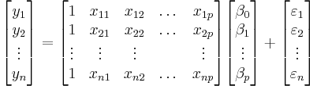

```{css, echo = FALSE}
#.remark-slide-content {
#  font-size: 28px;
#  padding: 20px 80px 20px 80px;
#}
#.remark-code, .remark-inline-code {
#  background: #f0f0f0;
#}
.small .remark-code {
  font-size: 14px;
}

.smaller .remark-code {
  font-size: 12px;
}

.tiny .remark-code {
  font-size: 11px;
}

.pull-left2 {
  float: left;
  width: 40%;
}

.pull-right2 {
  float: right;
  width: 54%;
}
```

```{r setup, include = FALSE, purl = FALSE}
options(htmltools.dir.version = FALSE)
library(knitr)
opts_chunk$set(
  fig.align="center",  
  fig.height=4, #fig.width=6,
  dpi=300, #fig.path='Figs/',
  cache=T,#, echo=F, warning=F, message=F,
  echo = TRUE,
  message = FALSE,
  warning = FALSE,
  error = FALSE,
  out.width = "90%"
  )
library(tidyverse)
library(ggExtra)
library(hrbrthemes)
library(fontawesome)
library(patchwork)
library(infer)
library(broom)
xaringanExtra::use_scribble(pen_size = 1)
xaringanExtra::use_search(show_icon = FALSE)
htmltools::tagList(
  xaringanExtra::use_clipboard(
    button_text = "<i class=\"fa fa-clipboard\"></i>",
    success_text = "<i class=\"fa fa-check\" style=\"color: #90BE6D\"></i>",
  ),
  rmarkdown::html_dependency_font_awesome()
)
```

# ¿Qué veremos hoy?

- Visualización de datos
- Manejo de datos
- Transformación de datos
- **<span style="color:red">Inferencia Estadística/Econometría</span>**
  + <span style="color:red">Regresiones lineales (simple y múltiple)</span>
  + <span style="color:red">¿Qué son? ¿Cómo se "construyen?</span>
  + <span style="color:red">Inferencia usando regresiones</span>

```{r, out.width='80%',  echo = FALSE, out.width='750px'}
knitr::include_graphics("../Imagenes/ProcesoDS.png")
```

---
class: inverse, center, middle
name: reg

# Distribuciones conjuntas

<html><div style='float:left'></div><hr color='#EB811B' size=1px width=796px></html>

---

# Medir la relación entre variables

### Covarianza

Medición de la variación/dependencia conjunta entre dos aleatorias.

$$
\begin{aligned}
\large
Cov(X,Y) &= \frac{\sum(X-\bar{X})(Y-\bar{Y})}{n} \\
                                                 \\
         & = E(XY)-E(X)E(Y)
\end{aligned}
$$

--

### Correlación

Normalización de la covarianza. Mismo signo que $Cov(X,Y)$ pero adimensional (entre -1 y 1)

$$
\begin{aligned}
\large
\rho_{x,y}&=\frac{\sigma_{X,Y}}{\sigma_X \sigma_Y} \\ 
                                                   \\ 
          &=\frac{Cov(X,Y)}{\sqrt{Var(X)Var(Y)}}
\end{aligned}
$$

---

# Relaciones entre variables

.pull-left[

```{r cov_cor, echo = FALSE, fig.height=8}
mtcars %>% 
  ggplot(aes(x = hp, y = mpg)) +
  geom_point(size = 3) +
  theme_minimal()
```

]

.pull-right[

```{r mtcars_datos, highlight.output = c(2,5)}
str(mtcars)
```

]

---

# Relaciones entre variables

.pull-left[

**Covarianza caballos de fuerza (`hp`)/millas por galón (`mpg`)**

```{r mtcars_cov}
mtcars %>% 
  summarise(covarianza = cov(hp, mpg))
```


**Correlación caballos de fuerza (`hp`)/millas por galón (`mpg`)**

```{r mtcars_cor}
mtcars %>% 
  summarise(correlacion = cor(hp, mpg))
```

]

.pull-right[

```{r, highlight.output = c(2,5)}
str(mtcars)
```

]

---

# Distribuciones conjuntas

Si $X$ e $Y$ son dos variables aleatorias, la **distribución conjunta** de $X$ e $Y$ permite calcular las probabilidades de eventos que involucren a ambas variables.

Por ejemplo, la probabilidad de que alguien mida entre 1.7 y 1.8 metros y que pese entre 60 y 80 kilogramos.

Desde una distribución conjunta podemos obtener **distribuciones marginales** y **distribuciones condicionales**.

--

### Esperanzas condicionales

Si $X$ e $Y$ no son independientes, entonces saber algo de $X$ me puede ayudar a predecir/explicar $Y$.

$E(Y|X)$ es una **función** que me dice para cada valor de $X$, la esperanza de $Y$ de aquellos individuos con ese valor de $X$.

---

# Distribuciones marginales

```{r dist_marginal1, echo = FALSE, out.width="110%"}
p <- mtcars %>% 
  ggplot(aes(x = hp, y = mpg)) +
  geom_point(size = 3) +
  theme_minimal()
ggMarginal(p, type = "densigram", 
           bins = 8,
           fill = "light blue")
```

---

# Distribuciones marginales

```{r dist_marginal2, echo = FALSE, out.width="110%"}
ggMarginal(p, type = "boxplot", fill = "light blue")
```

---

# Esperanzas condicionales

$$E(mpg|hp<100)$$

```{r dist_condicional1, echo = FALSE}
datos_mtcars <- mtcars %>% 
  mutate(select1 = ifelse(hp >= 52 & hp <100, 1, 0),
         select2 = ifelse(hp >= 100 & hp <160, 1, 0),
         select3 = ifelse(hp >= 160 & hp <230, 1, 0),
         select4 = ifelse(hp >= 230, 1, 0)) 

datos_mtcars %>% 
  ggplot(aes(x = hp, y = mpg)) +
  geom_point(size = 3) +
  geom_point(data = filter(datos_mtcars, select1 == 1), 
             color = "red", 
             size = 3) +
  geom_point(data = datos_mtcars %>% 
               filter(select1 == 1) %>% 
               summarise(hp = mean(hp),
                         mpg = mean(mpg)),
             color = "brown",
             shape = 3,
             size = 5,
             stroke = 2) +
  theme_minimal()
```


---

# Esperanzas condicionales

$$E(mpg|100 < hp<160)$$

```{r dist_condicional2, echo = FALSE}
datos_mtcars %>% 
  ggplot(aes(x = hp, y = mpg)) +
  geom_point(size = 3) +
  geom_point(data = filter(datos_mtcars, select2 == 1), 
             color = "red", 
             size = 3) +
  geom_point(data = datos_mtcars %>% 
               filter(select2 == 1) %>% 
               summarise(hp = mean(hp),
                         mpg = mean(mpg)),
             color = "brown",
             shape = 3,
             size = 5,
             stroke = 2) +
  theme_minimal()
```

---

# Esperanzas condicionales

$$E(mpg|160 < hp<230)$$

```{r dist_condicional3, echo = FALSE}
datos_mtcars %>% 
  ggplot(aes(x = hp, y = mpg)) +
  geom_point(size = 3) +
  geom_point(data = filter(datos_mtcars, select3 == 1), 
             color = "red", 
             size = 3) +
  geom_point(data = datos_mtcars %>% 
               filter(select3 == 1) %>% 
               summarise(hp = mean(hp),
                         mpg = mean(mpg)),
             color = "brown",
             shape = 3,
             size = 5,
             stroke = 2) +
  theme_minimal()
```

---

# Esperanzas condicionales

$$E(mpg|hp>230)$$

```{r dist_condicional4, echo = FALSE}
datos_mtcars %>% 
  ggplot(aes(x = hp, y = mpg)) +
  geom_point(size = 3) +
  geom_point(data = filter(datos_mtcars, select4 == 1), 
             color = "red", 
             size = 3) +
  geom_point(data = datos_mtcars %>% 
               filter(select4 == 1) %>% 
               summarise(hp = mean(hp),
                         mpg = mean(mpg)),
             color = "brown",
             shape = 3,
             size = 5,
             stroke = 2) +
  theme_minimal()
```

---

# Esperanzas condicionales

$$E(mpg|hp)=\hat{f}$$

```{r dist_condicional5, echo = FALSE}
x <- datos_mtcars %>% filter(select1 == 1) %>% 
  summarise(hp = mean(hp),mpg = mean(mpg)) %>% 
union(
datos_mtcars %>% filter(select2 == 1) %>% 
  summarise(hp = mean(hp),mpg = mean(mpg))) %>% 
union(
datos_mtcars %>% filter(select3 == 1) %>% 
  summarise(hp = mean(hp),mpg = mean(mpg))) %>% 
union(
datos_mtcars %>% filter(select4 == 1) %>% 
  summarise(hp = mean(hp),mpg = mean(mpg)))

datos_mtcars %>% 
  ggplot(aes(x = hp, y = mpg)) +
  geom_line(data = x,
             color = "brown", size = 1) +
  geom_point(size = 3) +
  geom_point(data = datos_mtcars %>% filter(select1 == 1) %>% summarise(hp = mean(hp),mpg = mean(mpg)),
             color = "brown", shape = 3, size = 5,stroke = 2) +
  geom_point(data = datos_mtcars %>% filter(select2 == 1) %>% summarise(hp = mean(hp),mpg = mean(mpg)),
             color = "brown", shape = 3, size = 5,stroke = 2) +
  geom_point(data = datos_mtcars %>% filter(select3 == 1) %>% summarise(hp = mean(hp),mpg = mean(mpg)),
             color = "brown", shape = 3, size = 5,stroke = 2) +
  geom_point(data = datos_mtcars %>% filter(select4 == 1) %>% summarise(hp = mean(hp),mpg = mean(mpg)),
             color = "brown", shape = 3, size = 5,stroke = 2) +
  theme_minimal()
```

---

# Esperanzas condicionales

.center[**ggplot2**: `geom_smooth()`]

```{r geom_smooth, echo = FALSE}
datos_mtcars %>% 
  ggplot(aes(x = hp, y = mpg)) +
  geom_point(size = 3) +
  geom_smooth(se = FALSE, color = "brown") +
  theme_minimal()
```


---
class: inverse, center, middle
name: reg

# Modelos

<html><div style='float:left'></div><hr color='#EB811B' size=1px width=796px></html>

---

# Modelos

**Objetivo**: representar la relación entre una variable dependiente $Y$ y una o varias variables explicativas/independientes $X_1, X_2,..., X_k$.

</br>

$$
\begin{aligned}
\hat{Y} &= E(Y|X) \\
  &= \hat{f}(X)
\end{aligned}
$$

</br>

- Si $Y$ es una variable *continua*: **regresión**
- Si $Y$ es una variable *categórica*: **clasificación** (próxima clase)

--

</br>
</br>

.center[*"Todos los modelos están mal... pero algunos son útiles"*]

---

# Inferencia vs Predicción

### Modelos para Inferencia/Explicación: 
  * Aprender y concluir algo sobre como se relacionan variables. Relaciones causales.
  * Evitar sesgo
  * Predicción *dentro de muestra*
  * $\hat{f}$ / $\hat{\beta}$ 

### Modelos para Predicción: 
  * Que la predicción esté lo más cerca posible del valor real
  * Evitar sobreajuste al entrenar modelos
  * Predicción *fuera de muestra*
  * $\hat{Y}$

--

Algunos algorítmos pueden servir para ambos objetivos pero con diferencias en la implementación (*ej. Regresión lineal para inferencia o para predicción*).

.center[**Nosotros no hablaremos de predicción (_Machine Learning_). Eso lo verán en el módulo 3.**]

---
class: inverse, center, middle
name: reg

# Regresión Lineal

<html><div style='float:left'></div><hr color='#EB811B' size=1px width=796px></html>

---

# Ecuación de la curva

Probablemente recordarán de alguna clase de matemáticas:

$$y = mx + b$$

donde $m$ es la pendiente y $b$ es el intercepto en el eje **y**. Por ejemplo:

```{r ec_recta, echo = FALSE, out.width="80%"}
x <- c(0, 1, 2, 3, 4, 5)
y <- c(-1, 1, 3, 5, 7, 9)
as.data.frame(x = x, y = y) %>% 
  ggplot() +
  aes(x = x, y = y) +
  geom_point(size = 2) +
  scale_y_continuous(breaks = c(-1, 1, 3, 5, 7, 9)) +
  scale_x_continuous(breaks = c(0, 1, 2, 3, 4, 5)) +
  geom_smooth(method = "lm", se = FALSE) +
  theme_minimal()
```

$$y = 2x -1$$

---

# Ec. de la curva vs Regresión

.pull-left[

Clase de **matemáticas**:

$y = b + mx$

$b$ es el intercepto en el eje

$m$ es la pendiente

]

.pull-right[

Clase de **estadística**:

$\hat{Y} = \hat{\beta}_0 +\hat{\beta}_1X + u$

$\hat{\beta}_0$ es el intercepto en el eje

$\hat{\beta}_1$ es la pendiente 

$u$ es el error/residual

]

<br>

- $\hat{\beta}_0$ y $\hat{\beta}_1$ se conocen también como coeficientes de regresión y serán **parámetros a estimar**.

- $\hat{Y}$ lo denominamos como los **valores ajustados** o bien los valores estimados por nuestra función para cada valor posible de $X$.

---

# Estudiantes/Profesor vs Resultados

```{r simular_datos_colegio, out.width='80%'}
datos_colegio <- data.frame(REP = c(15, 17, 19, 20, 22, 23.5, 25), 
                            Resultados = c(680, 640, 670, 660, 630, 660, 635))

ggplot(datos_colegio, aes(REP, Resultados)) +
  geom_point(size = 3) +
  theme_minimal()
```

---

# El modelo más simple

$$
\small
\begin{aligned}
\widehat{Y}_i &= E(Y) \\
\widehat{Y}_i &= \bar{Y}
\end{aligned}
$$
.small[
```{r modelo_simple, out.width='75%', eval = FALSE, echo = FALSE}
ggplot(datos_colegio, aes(REP, Resultados)) +
  geom_point(size = 3) +
  geom_abline(aes(intercept = mean(Resultados), slope = 0), #<<
              size = 2, col = "blue") +
  theme_minimal()
```
]

---

# El modelo más simple

$$
\small
\begin{aligned}
\widehat{Resultados}_i &= E(Resultados) \\
  &= \overline{Resultado} = 653.57
\end{aligned}
$$
.small[
```{r modelo_simple2, out.width='75%'}
ggplot(datos_colegio, aes(REP, Resultados)) +
  geom_point(size = 3) +
  geom_abline(aes(intercept = mean(Resultados), slope = 0), #<<
              size = 2, col = "blue") +
  theme_minimal()
```
]

---

# Una línea que describe esta relación 

$$
\small
\begin{aligned}
\widehat{Resultados}_i &= f(REP) \\
                       &= 713 - (3*REP_i)
\end{aligned}
$$

.small[
```{r una_curva, out.width='75%'}
ggplot(datos_colegio, aes(REP, Resultados)) +
  geom_point(size = 3) +
  geom_abline(aes(intercept = 713, slope = -3), #<<
              size = 2, col = "blue") +
  theme_minimal()
```
]

---

# Ahora muchas (50) líneas

$$\widehat{Resultados}_i = ¿? - (¿?*REP_i)$$

```{r muchas_curvas, out.width='90%', echo = FALSE}
set.seed(1)
curvas <- data.frame(int = sample(713:720, 50, replace = TRUE),
                 pend = -3 + rnorm(50, mean = 0, sd = 0.15))

ggplot(datos_colegio, aes(REP, Resultados)) +
  geom_point(size = 3) +
  geom_abline(aes(intercept = int, slope = pend), data = curvas, alpha = 0.5, col = "grey") +
  theme_minimal()
```

--

.center[**¿Cómo podemos elegir una de estas (u otra)?**]

---

# Residuales

$$\widehat{Resultados}_i = 713 - (3*REP_i)$$

```{r residuales0, echo = FALSE, out.width="75%"}
ggplot(datos_colegio, aes(REP, Resultados)) +
  geom_abline(aes(intercept = 713, slope = -3), size = 2, col = "blue") +
  geom_point(size = 3) +
  theme_minimal()
```

---

# Residuales

$$\widehat{Resultados}_i = 713 - (3*REP_i)$$

```{r residuales00, echo = FALSE, out.width="75%"}
datos_colegio_6 <- datos_colegio %>% 
  slice(6)

ggplot(datos_colegio, aes(REP, Resultados)) +
  geom_abline(aes(intercept = 713, slope = -3), size = 2, col = "blue") +
  geom_segment(x = 23.5, xend = 23.5, y = 642.5, yend = 660, color = "red", lty = 2, size = 1) +
  geom_point(size = 3) +
  geom_point(data = datos_colegio_6, 
             color = "red", 
             size = 4) +
  theme_minimal()
```

---

# Residuales

$$\widehat{Resultados}_i = 713 - (3*REP_i)$$

```{r residuales, echo = FALSE, out.width="75%"}
ggplot(datos_colegio, aes(REP, Resultados)) +
  geom_abline(aes(intercept = 713, slope = -3), size = 2, col = "blue") +
  geom_point(size = 3) +
  geom_point(data = datos_colegio_6, 
             color = "red", 
             size = 4) +
  geom_segment(x = 23.5, xend = 23.5, y = 642.5, yend = 660, color = "red", lty = 2, size = 1) +
  geom_segment(x = 0, xend = 23.5, y = 642.5, yend = 642.5, color = "red", lty = 2, size = 1) +
  geom_point(x = 23.5, y = 642.5, size = 2, col = "red") +
  geom_text(x = 24.1, y = 663, label = "(23.5; 660)", color = "red",
            size = 3.5) +
  geom_text(x = 24.1, y = 666, label = expression(paste("(",X[i],"; ", Y[i],")")), color = "red",
            size = 3.5) +
  geom_text(x = 23, y = 640.5, label = "(23.5; 642.5)", color = "red",
            size = 3.5) +
  geom_text(x = 23, y = 637.5, label = expression(paste("(",X[i],"; ", hat(Y)[i],")")), color = "red",
            size = 3.5) +
  theme_minimal()
```

.pull-right[
$$\small X_6=23.5;\ Y_6=660$$

$$\small \hat{Y}_6=713-(3*23.5)=642.5$$

$$\small u_6=(660-642.5)=17.5$$
]

---

# Residuales

$$\widehat{Resultados}_i = 713 - (3*REP_i)$$

```{r residuales2, echo = FALSE, out.width="75%"}
datos_colegio_2 <- datos_colegio %>% 
  slice(2)

ggplot(datos_colegio, aes(REP, Resultados)) +
  geom_point(size = 3) +
  geom_abline(aes(intercept = 713, slope = -3), 
              size = 2, 
              col = "blue") +
  geom_point(data = datos_colegio_2, color = "red", size = 4) +
  geom_point(data = datos_colegio_6, color = "red", size = 4) +
  geom_segment(x = 23.5, xend = 23.5, y = 642.5, yend = 660, color = "red", lty = 2, size = 1) +
  geom_segment(x = 17, xend = 17, y = 662, yend = 640, color = "red", lty = 2, size = 1) +
  geom_segment(x = 0, xend = 17, y = 662, yend = 662, color = "red", lty = 2, size = 1) +
  geom_point(x = 17, y = 662, size = 2, col = "red") +
  geom_point(x = 23.5, y = 642.5, size = 2, col = "red") +
  geom_text(x = 16.3, y = 639, label = "(17; 640)", color = "red", size = 3.5) +
  geom_text(x = 17.6, y = 664, label = "(17; 662)", color = "red", size = 3.5)   +
  theme_minimal()
```

.pull-left[
$$\small X_2=17;\ Y_6=640$$

$$\small \hat{Y}_2=713-(3*17)=662$$

$$\small u_2=(660-642.5)=-22$$
]

.pull-right[
$$\small X_6=23.5;\ Y_6=660$$

$$\small \hat{Y}_6=713-(3*23.5)=642.5$$

$$\small u_6=(660-642.5)=17.5$$
]

---

# Suma de Cuadrados Residuales

$$\widehat{Resultados}_i = 713 - (3*REP_i)$$

```{r residuales3, echo = FALSE, out.width="75%"}
datos_colegio_fit <- datos_colegio %>% mutate(fit = 713-(3*REP), resid = Resultados-fit)

ggplot(datos_colegio_fit, aes(REP, Resultados)) +
  geom_abline(aes(intercept = 713, slope = -3), size = 2, col = "blue") +
  geom_segment(aes(x = REP, xend = REP,
                                             y = Resultados, yend = fit), 
               color = "red", lty = 2, size = 1) +
  geom_point(size = 3) +
  geom_point(aes(y = fit), size = 2, color = "red") + 
  theme_minimal()
```


$$u_1=12;\ u_2=-22;\ u_3=14;\ u_4=7;\ u_5=-17;\ u_6=17.5;\ u_7=-3$$
--

.center[
**Suma de cuadrados residuales** = $\sum_{i}^{7}(u_{i}^2) = \sum_{i}^{7}((Y_{i}-\hat{Y}_{i})^2) = 1477.25$
]

---

# Suma de Cuadrados Residuales

$$\widehat{Resultados}_i = E(Resultados) = 653.57$$

```{r residuales4, echo = FALSE, out.width="75%"}
data_model_simp <- datos_colegio %>% 
  mutate(fit = mean(datos_colegio$Resultados),
         resid = Resultados-fit) 

data_model_simp %>% 
  ggplot(aes(x = REP, y = Resultados,
             xend = REP, yend = fit)) +
  geom_abline(aes(intercept = 713, slope = -3), size = 1, col = "blue", alpha = 0.1) +
  geom_segment(color = "red", lty = 2, size = 1) +
  geom_abline(aes(intercept = mean(Resultados), slope = 0), 
              size = 2, 
              col = "blue") +
  geom_point(size = 3) +
  geom_point(aes(y = fit), color = "red", size = 2) +
  theme_minimal()
```

$$u_1=26.4;\ u_2=-13.6;\ u_3=16.4;\ u_4=6.4;\ u_5=-23.6;\ u_6=6.4;\ u_7=-18.6$$

.center[
**Suma de cuadrados residuales** = $\sum_{i}^{7}(u_{i}^2) = \sum_{i}^{7}((Y_{i}-\hat{Y}_{i})^2) = 2135.71$
]

---

# Suma de Cuadrados Residuales

$$\widehat{Resultados}_i = 740 - (4.3*REP_i)$$

```{r residuales5, echo = FALSE, out.width="75%"}
datos_colegio_fit <- datos_colegio %>% mutate(fit = 740-(4.3*REP), resid = Resultados-fit)

datos_colegio_fit %>% 
  ggplot(aes(x = REP, y = Resultados,
             xend = REP, yend = fit)) +
  geom_abline(aes(intercept = 713, slope = -3), size = 1, col = "blue", alpha = 0.1) +
  geom_abline(aes(intercept = mean(Resultados), slope = 0), size = 1, col = "blue", alpha = 0.2) +
  geom_segment(color = "red", lty = 2, size = 1) +
  geom_abline(aes(intercept = 740, slope = -4.3), size = 2, col = "blue") +
  geom_point(size = 3) +
  geom_point(aes(y = fit), color = "red", size = 2) +
  theme_minimal()
```

$$u_1=4.5;\ u_2=-26.9;\ u_3=11.7;\ u_4=6;\ u_5=-15.4;\ u_6=21;\ u_7=2.5$$

.center[
**Suma de cuadrados residuales** = $\sum_{i}^{7}(u_{i}^2) = \sum_{i}^{7}((Y_{i}-\hat{Y}_{i})^2) = 1603.26$
]

---

# Suma de Cuadrados Residuales

$$\widehat{Resultados}_i = 713.57 - (2.97*REP_i)$$

```{r residuales6, echo = FALSE, out.width="75%"}
datos_colegio_fit <- datos_colegio %>% mutate(fit = 713.568-(2.968*REP), resid = Resultados-fit)

ggplot(datos_colegio_fit, aes(x = REP, y = Resultados, xend = REP, yend = fit)) +
  geom_abline(aes(intercept = 713, slope = -3), size = 1, col = "blue", alpha = 0.1) +
  geom_abline(aes(intercept = mean(Resultados), slope = 0), size = 1, col = "blue", alpha = 0.2) +
  geom_abline(aes(intercept = 740, slope = -4.3), size = 1, col = "blue", alpha = 0.2) +
  geom_segment(color = "red", lty = 2, size = 1)  +
  geom_abline(aes(intercept = 713.568, slope = -2.968), size = 2, col = "blue") +
  geom_point(size = 3) +
  geom_point(aes(y = fit), color = "red", size = 2) +
  theme_minimal()
```

$$u_1=10.9;\ u_2=-23.1;\ u_3=12.8;\ u_4=5.8;\ u_5=-18.3;\ u_6=16.2;\ u_7=-4.4$$

.center[
**Suma de cuadrados residuales** = $\sum_{i}^{7}(u_{i}^2) = \sum_{i}^{7}((Y_{i}-\hat{Y}_{i})^2) = 1466.85$
]

---

# ¿Cómo se estiman los coeficientes?

### Mínimos Cuadrados Ordinarios (*OLS en inglés*)

- Modelo de regresión simple (una variable independiente) a estimar:

$$\hat{Y} = \hat{\beta}_0 + \hat{\beta}_1 X$$

--

- ¿Cómo se estiman los parámetros?
  * **objetivo**: *minimizar la suma del cuadrado de los residuales *
  
$$
\begin{aligned}
\min\sum_{i=1}^nu_i^2 &= \min\sum_{i=1}^n(Y_i-\hat{Y}_i)^2 \\
&= \min_{{\hat{\beta}_0},{\hat{\beta}_1}}\sum_{i=1}^n(Y_i-(\hat{\beta}_0 + \hat{\beta}_1X_i))^2
\end{aligned}
$$

--

- Parámetros estimados:

$$
\begin{aligned}
\hat{\beta}_1 &= \frac{Cov(X,Y)}{Var(X)}=\rho_{x,y}\frac{\sigma_Y}{\sigma_X}\\
\hat{\beta}_0 &= \bar{Y} - \hat{\beta}_1 \bar{X}
\end{aligned}
$$

---

# "Mejor" línea

La "mejor línea" (o la que **minimiza la suma de cuadrados residuales**) es, de hecho: 

$$
\small 
\begin{aligned}
\widehat{Resultados}_i &= 713.57 - (2.97*REP_i) \\
E(Resultados|REP)      &= 713.57 - (2.97*REP) \\
\end{aligned}
$$

--

.pull-left[
.small[
```{r mejor_linea, out.width="80%", eval = FALSE}
ggplot(datos_colegio, aes(REP, Resultados)) +
  geom_point(size = 3) +
  geom_smooth(method = "lm", #<<
              se = FALSE, #<<
              size = 2) + #<<
  theme_minimal()
```
]
]

.pull-right[
.smaller[
```{r mejor_linea_ext, out.width="80%", echo = FALSE}
ggplot(datos_colegio, aes(REP, Resultados)) +
  geom_point(size = 3) +
  geom_smooth(method = "lm", se = FALSE, size = 2) + #<<
  theme_minimal()
```
]
]

$$\small \widehat{Resultados}_i = \hat{\beta_0} + \hat{\beta_1}REP_i$$

$\hat{\beta}_1=-2.97$ se interpreta como que **cada aumento en una unidad de `REP` esta asociado, en promedio, a una disminución de 2.97 unidades en `Resultados`**. 

$\hat{\beta}_0=713.57$ es el valor promedio de `Resultados` cuando `REP` es igual a 0 (no necesariamente tiene interpretación práctica).

---

# Predicción/Interporlación

$$
\begin{aligned}
\widehat{Resultados}_i &= 713.57 - (2.97*REP_i) \\
                       &= E(Resultados|REP)
\end{aligned}
$$

.pull-left[
.center[
```{r, echo = FALSE}
datos_colegio
```
]
]


.pull-right[
.smaller[
Aún cuando nuestra curva **fue estimada** usando 7 valores, podemos usar la curva para "predecir" el valor de `Resultados` esperado para otros valores de `REP`.

$$
\small
\begin{aligned}
E(Resultados|REP = 18) &=713.57-(2.97*18) \\
                       &=660.11
\end{aligned}
$$

]
]


```{r, echo = FALSE, out.width = "45%"}
ggplot(datos_colegio_fit, aes(x = REP, y = Resultados)) +
  geom_segment(aes(x = 18, xend = 18,
                   y = 630, yend = 660.11), 
               color = "red", lty = 2, size = 1) +
  geom_segment(aes(x = 15, xend = 18,
                   y = 660.11, yend = 660.11), 
               color = "red", lty = 2, size = 1) +
  geom_abline(aes(intercept = 713.568, slope = -2.968), 
              size = 2, col = "blue") +
  geom_point(size = 3) +
  geom_point(aes(x = 18, y = 660.11), color = "red", size = 2) +
  theme_minimal()
```

---
class: inverse, center, middle

# Ahora con "datos reales"

<html><div style='float:left'></div><hr color='#EB811B' size=1px width=796px></html>

(Disponibles en el paquete **AER**)

---

# Datos California (USA)

```{r datos_colegios_california, highlight.output = c(6,7,13,15)}
library(AER)
data("CASchools")
str(CASchools)
```

---

# Preparar datos

.small[
```{r preparar_datos}
(datos_reg <- CASchools %>% 
  rename(ingresos = income) %>%
  transmute(distrito = district, colegio = school,
            Resultados = (read + math)/2,
            REP = students/teachers,
            ingresos,
            grupo_ingresos = as.factor(ifelse(ingresos >= median(ingresos), 1, 0)),
            computadores = computer,
            almuerzo = lunch))

glimpse(datos_reg)
```
]

---

# Relación entre variables

.small[
```{r graf_relacion, out.width='60%'}
datos_reg %>% 
  ggplot(aes(REP, Resultados)) + 
  geom_point() +
  theme_minimal()
```
]

---

# Graficar la curva de regresión 

.small[
```{r graf_relacion2, out.width='60%'}
datos_reg %>% 
  ggplot(aes(REP, Resultados)) + 
  geom_point() +
  geom_smooth(method = "lm", se = FALSE) + #<<
  theme_minimal()
```
]

La curva graficada corresponde a $\widehat{Resultados}_i = \hat{\beta}_0+\hat{\beta}_1REP_i$

**¿Cuáles son los coeficientes ( $\hat{\beta}_0$ , $\hat{\beta}_1$)?**

---

# Estimar coeficientes "a mano"

$$
\begin{aligned}
\hat{\beta}_1 &= \frac{Cov(X,Y)}{Var(X)} \\
\hat{\beta}_0 &= \bar{Y} - \hat{\beta}_1 \bar{X}
\end{aligned}
$$

--

```{r coeficientes_a_mano, highlight.output = c(1,2)} 
(coeficientes <- datos_reg %>% 
  transmute(Y = Resultados,
            X = REP) %>% 
  summarise(beta_1 = cov(X,Y)/var(X),
            beta_0 = mean(Y)-(beta_1*mean(X))))
```

---

# Por suerte **R** lo hace más simple

.small[
```{r reg_en_R, highlight.output = c(11,12)}
modelo1 <- lm(Resultados ~ REP, data = datos_reg)
summary(modelo1)
```
]

**El aumento en una unidad de `REP` esta asociada con una disminución, en promedio, de -2.28 unidades de `Resultados`.**

---

# ¿Qué tan bien **ajustada** es la curva?

```{r graf_solo, echo = FALSE}
datos_reg %>% 
  ggplot(aes(REP, Resultados)) + 
  geom_point() + 
  geom_smooth(method = "lm", 
              se = FALSE, 
              size = 1.5) +
  theme_minimal() 
```

El término "ajustar" se refiere a que tan cerca de todos los puntos se encuentra la línea. En otras palabras, **¿cuánto explica la línea calculada la relación entre estas variable?**

Una de las métricas más utilizadas para representar esto es el $R^2$.

---

# $R^2$ - Coeficiente de determinación

### Suma de Cuadrados Totales (SCT)

```{r SCT, echo = FALSE}
datos_reg %>% 
  ggplot(aes(REP, Resultados)) + 
  geom_point() +
  geom_segment(
    x = datos_reg$REP,
    xend = datos_reg$REP,
    y = mean(datos_reg$Resultados),
    yend = datos_reg$Resultados,
    color = "red",
    alpha = 0.2
  ) + 
  geom_abline(intercept = mean(datos_reg$Resultados), 
              slope = 0,
              size = 1, color = "blue") +
  theme_minimal()
```

$$SCT = \sum_{i=1}^{n}(Y_i - \bar{Y})^2$$

---

# $R^2$ - Coeficiente de determinación

### Suma de Cuadrados Residuales (SCR)

```{r SCR, echo = FALSE}
detalles_reg <- augment(lm(Resultados ~ REP, data = datos_reg))

datos_reg %>% 
  ggplot(aes(REP, Resultados)) + 
  geom_point() +
  geom_segment(
    x = datos_reg$REP,
    xend = datos_reg$REP,
    y = detalles_reg$.fitted,
    yend = datos_reg$Resultados,
    color = "red",
    alpha = 0.2
  ) + 
  geom_abline(intercept = 698.9329, 
              slope = -2.279808,
              size = 1, color = "blue") +
  theme_minimal()
```

$$SCR=\sum_{i=1}^n u_i^2 = \sum_{i=1}^n (Y_i-\hat{Y}_i)^2$$
---

# $R^2$ - Coeficiente de determinación

### Suma de Cuadrados Explicados (SCE)

```{r SCE, echo = FALSE}
datos_reg %>% 
  ggplot(aes(REP, Resultados)) +
  geom_segment(
    x = datos_reg$REP,
    xend = datos_reg$REP,
    y = detalles_reg$.fitted,
    yend = datos_reg$Resultados,
    color = "light grey",
    alpha = 0.6
  ) +
  geom_segment(
    x = datos_reg$REP,
    xend = datos_reg$REP,
    y = mean(datos_reg$Resultados),
    yend = detalles_reg$.fitted,
    color = "red",
    alpha = 0.2
  ) + 
  geom_point() + 
  geom_abline(intercept = 698.9329, 
              slope = -2.279808,
              size = 1, color = "blue") + 
  geom_abline(intercept = mean(datos_reg$Resultados), 
              slope = 0,
              size = 1, color = "blue") +
  theme_minimal()
```

$$SCE=\sum_{i=1}^n (\hat{Y_i}-\bar{Y})^2$$

---

# $R^2$ - Coeficiente de determinación

- Suma de Cuadrados Residuales (SCR): 
$$\sum_{i=1}^n u_i^2 = \sum_{i=1}^n (Y_i-\hat{Y}_i)^2$$

- Suma de Cuadrados Explicados (SCE): 
$$\sum_{i=1}^n (\hat{Y_i}-\bar{Y})^2$$

- Suma de Cuadrados Totales (SCT): 
$$SCT = SCE + SCR = \sum_{i=1}^{n}(Y_i - \bar{Y})^2$$

--

Teniendo estos valores, el coeficiente de determinación corresponde a:

$$R^2 = \frac{SCE}{SCT} = 1 - \frac{SCR}{SCT}$$

--

Noten que $R^2 \in [0,1]$, con 0 correspondiente a un nulo ajuste y 1 a un ajuste perfecto (todos los puntos sobre la curva estimada)

---

# ¿Cómo se ve esto?

```{r R_0_1, echo = FALSE, out.width='100%'}
library(patchwork)

set.seed(1)
x <- rnorm(100)
y <- x + rnorm(100, sd = 1000)
data <- data.frame(y, x) 

graf1 <- data %>% 
  ggplot(aes(x, y)) + 
  geom_point() + 
  geom_smooth(method = "lm", se = FALSE) + 
  theme_minimal() +
  labs(title = expression(paste(R^{2}, " = 0"))) +
  theme(plot.title = element_text(hjust = 0.5))

x2 <- rnorm(100)
y2 <- x2 + rnorm(100, sd = 0)
data2 <- data.frame(y2, x2) 

graf2 <- data %>% 
  ggplot(aes(x2, y2)) + 
  geom_point() + 
  geom_smooth(method = "lm", se = FALSE) + 
  theme_minimal() +
  labs(title = expression(paste(R^{2}, " = 1"))) +
  theme(plot.title = element_text(hjust = 0.5))

graf1 + graf2
```

---

# Calcular $R^2$ "a mano"

$$R^2=\frac{SCE}{SCT}=\frac{\sum_{i=1}^n (\hat{Y_i}-\bar{Y})^2}{\sum(Y_i - \bar{Y})^2}$$

.small[
```{r r2_a_mano, highlight.output = c(2)}
datos_reg %>% 
  transmute(X = REP,
            Y = Resultados) %>%
  summarise(SCE = sum(((coeficientes$beta_0+(coeficientes$beta_1*X))-mean(Y))^2),
            SCT = sum((Y-mean(Y))^2),
            R2 = round(SCE/SCT, 5))
```
]

--

Interpretamos este valor como que **nuestra variable independiente, `REP`, explica un 5.1% de la variación de la variable dependiente, `Resultados`**.

---

# Calcular $R^2$ en **R**

```{r summary_modelo, highlight.output = c(17)}
summary(modelo1)
```

---

# Variable independiente no numérica

Hasta ahora solo vimos un ejemplo donde tanto la variable dependiente, $Y$, como la variable independiente, $X$ son numéricas.

.center[**¿Cómo sería una regresión con una variable independiente categórica?**]

--

```{r, highlight.output = c(8)}
glimpse(datos_reg)
```

<br>

$$
\begin{align}
grupo\_ingresos =
    \begin{cases}
      0 & si\ ingresos\ en\ el\ 50\%\ inferior \\
      1 & si\ ingresos\ en\ el\ 50\%\ superior
    \end{cases}
\end{align}
$$

---

# Variable independiente no numérica

```{r graf_var_indep, out.width = "80%"}
datos_reg %>% 
  ggplot(aes(x = REP, y = Resultados, col = grupo_ingresos)) +
  geom_point() +
  theme_minimal()
```

.center[**Los colegios de mayores ingresos parecieran tener mejores resultados**.]

---

# Variable independiente no numérica

.small[
```{r, fig.height=6, fig.width=14, echo = FALSE}
pvarind1 <- datos_reg %>% 
  ggplot(aes(x = grupo_ingresos, y = Resultados)) +
  geom_boxplot() +
  theme_minimal()

pvarind2 <- datos_reg %>% 
  ggplot(aes(x = Resultados, fill = grupo_ingresos)) +
  geom_density(alpha = 0.5) +
  theme_minimal()

pvarind1 | pvarind2
```
]

.pull-left[
.small[
```{r, eval = FALSE}
datos_reg %>% 
  group_by(grupo_ingresos) %>% 
  summarise(resultados_prom = mean(Resultados))
```
]
]

.pull-right[
.small[
```{r, echo = FALSE, highlight.output = c(4,5)}
datos_reg %>% 
  group_by(grupo_ingresos) %>% 
  summarise(resultados_prom = mean(Resultados))
```
]
]

.center[**Los colegios de más ingresos tienden a  tener mejores resultados**.]

---

# Regresión con **grupo_ingresos**

$$\small \widehat{Resultados}_i=\hat{\beta}_0 + \hat{\beta}_1 1_{g.ing. = 1}$$

.small[
```{r, highlight.output = c(6,7)}
(modelo2 <- lm(Resultados~grupo_ingresos, data = datos_reg))
```
]

--

```{r, fig.height = 3.6, fig.width= 9, echo = FALSE}
datos_reg %>% 
  mutate(grupo_ingresos = as.numeric(grupo_ingresos)-1) %>% 
  ggplot(aes(x = grupo_ingresos, y = Resultados)) +
  geom_point(color = "light grey", alpha = 0.3, size = 2) +
  geom_smooth(method = "lm", se = FALSE) +
  geom_point(x = 0, y = 643.96, color = "red", size = 3) +
  geom_point(x = 1, y = 664.349, color = "red", size = 3) +
  theme_minimal() +
  xlim(-0.5, 1.5)
```


---

# Regresión con **grupo_ingresos**

$$\small \widehat{Resultados}_i=\hat{\beta}_0 + \hat{\beta}_1 1_{g.ing. = 1}$$

.small[
```{r, highlight.output = c(6,7)}
(modelo2 <- lm(Resultados~grupo_ingresos, data = datos_reg))
```
]

$$
\small
\begin{align}
\widehat{Resultados}_i&=643.96 + (20.39*1_{g.ing. = 1}) \\
E(Resultados|grupo\_ingresos)&=643.96 + (20.39*1_{g.ing. = 1})
\end{align}
$$

.pull-left[

$$
\begin{aligned}
\scriptsize E(Resultados|GrupoIng=0) & \scriptsize =643.96 + (20.39*0) \\ 
                                     & \scriptsize =643.96
\\
\scriptsize E(Resultados|GrupoIng=1) & \scriptsize =643.96 + (20.39*1) \\
                                     & \scriptsize =664.35
\end{aligned}
$$
]

.pull-right[
.small[
```{r, echo = FALSE}
datos_reg %>% 
  group_by(grupo_ingresos) %>% 
  summarise(resultados_prom = mean(Resultados))
```
]
]

Pertenecer al 50% superior de ingresos está asociado con un aumento, en promedio, de 20.39 unidades en `Resultado`.

---

# ¿Qué es esto?

```{r estructura_modelo1}
str(modelo2)
```

---

# Tipos de objetos

</br>

```{r tipos_objetos, echo = FALSE, out.width='800px'}
knitr::include_graphics("../Imagenes/TipoDatos.png")
```

---

# Paquete **broom**

.smaller[
```{r broom_tidy}
library(broom)
tidy(modelo1)
```

```{r broom_glance}
glance(modelo1)
```

```{r broom_augment}
augment(modelo1)
```
]

---

# Comparar modelos

#### $R^2$ de $\widehat{Resultados}_i=\hat{\beta}_0 + \hat{\beta}_1 REP$

```{r}
glance(modelo1) %>% select(r.squared) %>% pull(1)
```

`REP` **explica un 5.1%** de la variación en `Resultados`.

<br>

#### $R^2$ de $\widehat{Resultados}_i=\hat{\beta}_0 + \hat{\beta}_1 1_{g.ing. = 1}$

```{r}
glance(modelo2) %>% select(r.squared) %>% pull(1)
```
`grupo_ingresos` **explica un 28.7%** de la variación en `Resultados`.

---

# Analizar modelos

.pull-left[
#### $\small \widehat{Resultados}_i=\hat{\beta}_0 + \hat{\beta}_1 REP$

.smaller[
```{r}
tidy(modelo1)
```
]
]

.pull-right[
#### $\small \widehat{Resultados}_i=\hat{\beta}_0 + \hat{\beta}_1 1_{g.ing. = 1}$

.smaller[
```{r}
tidy(modelo2)
```
]
]

--

- Para cada parámetro de están realizando las siguientes pruebas de hipótesis:
$$
\small
\begin{align}
H_0: \beta_j=0 \\
H_A: \beta_j \neq 0
\end{align}
$$

--

- Para probar estas hipótesis tenemos las estimaciones y sus errores estándar. Con estos podemos generar una métrica estandarizada (**estadístico t**), $\small \frac{\hat{\beta_j}-\beta_j}{EE_{\beta_j}}$.

- Estos estadísticos nos permiten calcular **p-values** para ver que tan extremas son nuestras estimaciones bajo la hipótesis nula, $\small \beta_j=0$.

- Noten que todos los **p-value** son MUY bajos. Decimos entonces, que **los parámetros estimados son estadísticamente significativos**.


---
class: inverse, center, middle
name: reg

# Regresión Lineal Múltiple

<html><div style='float:left'></div><hr color='#EB811B' size=1px width=796px></html>

---

# Regresión Lineal Múltiple

- ¿Es factible que solo `REP` o solo `grupo_ingresos` influyan en `Resultados`?

--

$$
\small
Resultados=\beta_0+\beta_1REP+\beta_2A+\\beta_3B+\epsilon
$$

- ¿Qué pasa si no se incluyen otras variables relacionadas?

--

#### Paradoja de Simpson

```{r paradoja_simpson, echo = FALSE, out.width='60%'}
set.seed(1)
x1 <- rnorm(100)
x2 <- rnorm(100) + 1
x3 <- rnorm(100) + 2
y1 <- -x1 + rnorm(100) 
y2 <- -x2 + 4 + rnorm(100) 
y3 <- -x3 + 8 + rnorm(100)
df1 <- data.frame(x = x1, y = y1, cat = as.factor(rep(1,100)))
df2 <- data.frame(x = x2, y = y2, cat = as.factor(rep(2,100)))
df3 <- data.frame(x = x3, y = y3, cat = as.factor(rep(3,100)))
df <- rbind(df1, df2, df3)

simpson1 <- ggplot(df, aes(x = x, y = y)) +
  geom_point() + 
  geom_smooth(method = "lm", se = FALSE, col = "black", size = 1.3) +
  theme_bw() +
  theme(legend.position = "none")

simpson2 <- ggplot(df, aes(x = x, y = y, group = cat, color = cat)) +
  geom_point() + 
  geom_smooth(method = "lm", se = FALSE) +
  theme_bw() +
  theme(legend.position = "none")

(simpson1|simpson2)
```

- "Sesgo de variable omitida"

---

# Regresión Lineal Múltiple

### ¿Cómo se estiman los parámetros?

En forma matricial:

$$Y=X\beta+\epsilon$$

```{r, echo = FALSE, out.width='550px'}

```

Lo que debemos hacer es estimar el vector de parámetros $\hat{\beta}$ 

$$\hat{\beta}=(X'X)^{-1}X'Y$$

Terminando finalmente con $\hat{Y}=X\hat{\beta}$

---

# Estimar coeficientes "a mano"

$$\widehat{Resultados}_i=\hat{\beta_0} + \hat{\beta}_1REP_i + \hat{\beta}_2ingresos_i$$

$$\hat{\beta}=(X'X)^{-1}X'Y$$

```{r, highlight.output = c(3,4)}
Y <- datos_reg %>% 
  select(Resultados) %>% 
  as.matrix()

X <- datos_reg %>% 
  mutate(intercepto = rep(1, nrow(.))) %>% 
  select(intercepto, REP, ingresos) %>% 
  as.matrix()

solve(t(X) %*% X) %*% (t(X) %*% Y)
```

---

# Por suerte **R** lo hace más simple

$$\widehat{Resultados}_i=\hat{\beta_0}  + \hat{\beta}_1REP_i + \hat{\beta}_2ingresos_i$$

.small[
```{r modelo3, highlight.output = c(12, 13)}
modelo3 <- lm(Resultados ~ REP + ingresos, data = datos_reg)
summary(modelo3)
```
]

---

# Interpretación

```{r}
tidy(modelo3)
```

- El aumento en una unidad de `REP` esta, en promedio, asociado con una disminución de -0.65 en `Resultados` **manteniendo `ingresos` constante** (o controlando por `ingresos`).

- El aumento en una unidad de `ingresos` esta, en promedio, asociado con un aumento de 1.84 en `Resultados` **manteniendo `REP` constante** (o controlando por `REP`).

--

- Pero **OJO**, el p-value asociado a `REP` es 0.065 por lo que **no es estadísticamente significativo al 0.05** nivel de significancia (si lo sería considerando un nivel de significancia de 0.1).

- Por otro lado, `ingresos` **si es estadísticamente significativo** (p-value <<< 0.05).


---

# Comparemos

Comparemos los valores de $R^2$ para `modelo1` (simple) y `modelo2` (simple) y `modelo3` (múltiple)

--

.small[
```{r}
glance(modelo1) %>% select(r.squared) %>% pull(1)
glance(modelo2) %>% select(r.squared) %>% pull(1)
glance(modelo3) %>% select(r.squared) %>% pull(1)
```
]

--

- `modelo3` explica más del 50% de la variación en `Resultados`.

--

- Pero **OJO** con el $R^2$: aumentará siempre que sumemos variables (o al menos no bajará).

---

# $R^2$ ajustado

$$R^2_{adj}=1-\left( \frac{SCE}{SCT}\frac{n-1}{n-k-1}\right)=1-\left( \frac{\sum_{i=1}^n (Y_i-\hat{Y}_i)^2}{\sum(Y_i - \bar{Y})^2}\frac{n-1}{n-k-1}\right)$$

$n$ es el número de observaciones y $k$ es el número de variables independientes.

--

- Si la nueva variable no "aporta nueva información", $R^2_{adj}$ no aumenta
- Debido a lo anterior, $R^2_{adj}$ suele ser mejor para la comparación entre modelos
  
--

.small[
```{r}
glance(modelo1) %>% select(adj.r.squared) %>% pull(1)
glance(modelo2) %>% select(adj.r.squared) %>% pull(1)
glance(modelo3) %>% select(adj.r.squared) %>% pull(1)
```
]

---

# $R^2$ no es la única métrica

$R^2$, $R^2_{adj}$, **AIC**, **BIC**, **LogLikehood**, **deviance**.

.small[
```{r}
glance(modelo1)
```
]

.small[
```{r}
glance(modelo2)
```
]

.small[
```{r}
glance(modelo3)
```
]

---
class: inverse, center, middle
name: reg

# Ejercicio

<html><div style='float:left'></div><hr color='#EB811B' size=1px width=796px></html>

---

# Ejercicio

- `EjercicioRegresion.R`

---
class: inverse, center, middle
name: reg

# Interacciones y transformaciones

<html><div style='float:left'></div><hr color='#EB811B' size=1px width=796px></html>

---

# Modelo simple

$$Resultados_i=\hat{\beta_0} + \hat{\beta_1}REP_i$$

```{r, echo = FALSE}
tidy(lm(Resultados ~ REP, data = datos_reg))
```

```{r, echo = FALSE}
base <- datos_reg %>% 
  ggplot(aes(x = REP, y = Resultados)) +
  geom_point(aes(col = grupo_ingresos)) +
  theme_minimal() +
  theme(legend.position = "none")
```

```{r, out.width='75%', echo = FALSE}
datos_reg %>% 
  ggplot(aes(x = REP, y = Resultados)) +
  geom_point() +
  theme_minimal() +
  theme(legend.position = "none") +
  geom_smooth(method = "lm", se = FALSE)
```

---

# Modelo múltiple

$$Resultados_i=\hat{\beta_0} + \hat{\beta_1}REP_i + \hat{\beta_2}1_{g.ing=1}$$

```{r, echo = FALSE}
reg_int1 <- lm(Resultados ~ REP + grupo_ingresos, data = datos_reg)
tidy(reg_int1)
```

--

<br>

$$
\small
\begin{align}
E(Resultados|grupo\_ingresos=1)&=682-(1.92*REP)+(19.9*1) \\
E(Resultados|grupo\_ingresos=1)&=701.9-(1.92*REP)
\end{align}
$$

<br>

$$
\small
\begin{align}
E(Resultados|grupo\_ingresos=0)&=682-(1.92*REP)+(19.9*0) \\
E(Resultados|grupo\_ingresos=0)&=682-(1.92*REP)
\end{align}
$$


---

# Modelo múltiple

$$Resultados_i=\hat{\beta_0} + \hat{\beta_1}REP_i + \hat{\beta_2}1_{g.ing=1}$$

```{r, echo = FALSE}
tidy(reg_int1)
```

```{r, out.width='75%', echo = FALSE}
base +
  geom_line(data = filter(augment(reg_int1), grupo_ingresos == 1),
            aes(x = REP, y = .fitted), col = "#00BFC4", size = 1) +
  geom_line(data = filter(augment(reg_int1), grupo_ingresos == 0),
            aes(x = REP, y = .fitted), col = "#F8766D", size = 1)
```

---

# Modelo con interacción

$$Resultados_i=\hat{\beta_0} + \hat{\beta_1}REP_i + \hat{\beta_2}1_{g.ing=1}+\hat{\beta_3}(REP_i*1_{g.ing=1})$$

```{r, echo = FALSE}
reg_int2 <- lm(Resultados ~ REP*grupo_ingresos, data = datos_reg)
tidy(reg_int2)
```

--

<br>

$$
\small
\begin{align}
E(Resultados|grupo\_ingresos=1)&=664-(1.01*REP)+(62.5*1)-(2.17*REP*1) \\
E(Resultados|grupo\_ingresos=1)&=726.5-(3.18*REP)
\end{align}
$$

<br>

$$
\small
\begin{align}
E(Resultados|grupo\_ingresos=0)&=664-(1.01*REP)+(62.5*0)-(2.17*REP*0) \\
E(Resultados|grupo\_ingresos=0)&=664-(1.01*REP)
\end{align}
$$

---

# Modelo con interacción

$$Resultados_i=\hat{\beta_0} + \hat{\beta_1}REP_i + \hat{\beta_2}1_{g.ing=1}+\hat{\beta_3}(REP_i*1_{g.ing=1})$$

```{r, echo = FALSE}
tidy(reg_int2)
```

```{r, out.width='70%', echo = FALSE}
base +
  geom_smooth(aes(col = grupo_ingresos),
              method = "lm", se = FALSE)
```

---

# Otro tipo de interacción

$$\widehat{Y}_i=\hat{\beta_0}+\hat{\beta_1}X_i$$

```{r, echo = FALSE, out.width = "80%"}
data.frame(X = rnorm(200)) %>% 
  mutate(Y = (X^2)+(2*X)+10 + rnorm(200)) %>% 
  ggplot(aes(x = X, y = Y)) +
  geom_point() +
  geom_smooth(method = "lm", se = FALSE) +
  theme_minimal()
```

```{r reg_cuadrado, echo = FALSE}
data.frame(X = rnorm(200)) %>% 
  mutate(Y = (X^2)+(2*X)+10 + rnorm(200)) %>% 
  lm(Y ~ X, data = .) %>% 
  glance() %>% 
  select(adj.r.squared)
```

---

# Otro tipo de interacción

$$\widehat{Y}_i=\hat{\beta_0}+\hat{\beta_1}X_i+\hat{\beta_2}X_i^2$$

```{r reg_cuadrado2, echo = FALSE, out.width = "80%"}
data.frame(X = rnorm(200)) %>% 
  mutate(Y = (X^2)+(2*X)+10 + rnorm(200)) %>% 
  ggplot(aes(x = X, y = Y)) +
  geom_point() +
  geom_smooth(method = "lm", se = FALSE, formula = y ~ poly(x, 2)) +
  theme_minimal()
```

```{r, echo = FALSE}
data.frame(X = rnorm(200)) %>% 
  mutate(Y = (X^2)+(2*X)+10 + rnorm(200),
         X_2 = X^2) %>% 
  lm(Y ~ X + X_2, data = .) %>% 
  glance() %>% 
  select(adj.r.squared)
```

---

# Transformaciones de variables

### Transformación "cosméticas"

.tiny[
```{r}
modelo3 <- lm(Resultados ~ REP + ingresos, data = datos_reg)
tidy(modelo3)
```
]

Si dividimos la variable ingresos (miles de USD) por 10, lo resultante es una variable que representa decenas de miles de USD.

--

.pull-left[
.tiny[
```{r}
datos_reg %>% 
  mutate(ingresos_nuevo = ingresos/10) %>% 
  lm(Resultados ~ REP + ingresos_nuevo, data = .) %>% 
  tidy()
```
]
]

.pull-right[
- El coeficiente, $\hat{\beta}$, cambia en orden de magnitud: la interpretación es que un aumento en 10.000 USD de ingreso se asocia en promedio con un aumento de 18.4 en `Resultados`.

- Pero noten que el estadístico t y su respectivo p-value no cambian.
]

---

# Transformaciones de variables

### Transformación logarítmica

**¿Qué es un logarítmo?**

| Forma exponencial |Forma logarítmica  |
| ----------------- |:-------               |
| $10^2=100$        | $log_{10}(100)=2$       |
| $10^3=1000$       | $log_{10}(1000)=3$      |
| $10^4=10000$      | $log_{10}(10000)=4$     |
| $e^1=2.718...$    | $log_{e}(2.718)=1$      |
| $e^2=7.389...$    | $log_{e}(7.389)=2$      |
| $e^3=20.085...$   | $log_{e}(20.085)=3$     |

---

# Transformaciones de variables

### Transformación logarítmica

<br>

|Modelo            |Ecuación                      |Interpretación  |
| ---------------- |:-------                      |:------- |
|Lineal-Lineal     | $Y=\beta_0+\beta X$           |Un cambio de una unidad en $X$ esta asociado con un cambio de $\beta$ unidades en $Y$    |
|Log-Lineal        | $log(Y)=\beta_0+\beta X$      |Un cambio de una unidad en $X$ esta asociado con un cambio de $(100*\beta)\%$ en $Y$    |
|Lineal-Log        | $Y=\beta_0+\beta log(X)$      |Un cambio de 1% en $X$ esta asociado con un cambio de $\frac{\beta}{100}$ unidades en $Y$    |
|Log-Log           | $log(Y)=\beta_0+\beta log(X)$ |Un cambio de 1% en $X$ esta asociado con un cambio de $\beta\%$ en $Y$    |

---

# Transformaciones de variables

```{r t1, echo = FALSE, out.width="80%"}
datos_reg <- datos_reg %>% filter(computadores !=0)

t1 <- datos_reg %>% 
  ggplot(aes(x = ingresos, y = computadores)) +
  geom_point() +
  theme_minimal() 

ggMarginal(t1, type = "densigram", 
           bins = 8,
           fill = "light blue")
```

--

.small[
```{r}
coef(lm(computadores ~ ingresos, data = datos_reg))
```
]

Un cambio de una unidad en `ingresos` esta asociado con un cambio de 5.7 unidades en `computadores`.


---

# Transformaciones de variables

```{r t2, echo = FALSE, out.width="80%"}
t2 <- datos_reg %>% 
  ggplot(aes(x = ingresos, y = log(computadores))) +
  geom_point() +
  theme_minimal() 

ggMarginal(t2, type = "densigram", 
           bins = 8,
           fill = "light blue")
```

.small[
```{r}
coef(lm(log(computadores) ~ ingresos, data = datos_reg))
```
]

Un cambio de una unidad en `ingresos` esta asociado con un cambio de 3.45% en `computadores`.

---

# Transformaciones de variables

```{r t3, echo = FALSE, out.width="80%"}
t3 <- datos_reg %>% 
  ggplot(aes(x = log(ingresos), y = computadores)) +
  geom_point() +
  theme_minimal() 

ggMarginal(t3, type = "densigram", 
           bins = 8,
           fill = "light blue")
```

.small[
```{r}
coef(lm(computadores ~ log(ingresos), data = datos_reg))
```
]

Un cambio de 1% en `ingresos` esta asociado con un cambio de 1.4 unidades en `computadores`.

---

# Transformaciones de variables

```{r t4, echo = FALSE, out.width="80%"}
t4 <- datos_reg %>% 
  ggplot(aes(x = log(ingresos), y = log(computadores))) +
  geom_point() +
  theme_minimal() 

ggMarginal(t4, type = "densigram", 
           bins = 8,
           fill = "light blue")
```

.small[
```{r}
coef(lm(log(computadores) ~ log(ingresos), data = datos_reg))
```
]

Un cambio de 1% en `ingresos` esta asociado con un cambio de 0.7% en `computadores`.

---

# Transformaciones de variables

### ¿Importa la base del logaritmo?

.small[
```{r, highlight.output = c(2)}
coef(lm(log(computadores, base = exp(1)) ~ log(ingresos, base = exp(1)), data = datos_reg))

coef(lm(log(computadores, base = 10) ~ log(ingresos, base = 10), data = datos_reg))

coef(lm(log(computadores, base = 1234) ~ log(ingresos, base = 1234), data = datos_reg))
```
]

**Noten que el coeficiente, $\hat{\beta}$, no cambia.**

---
class: inverse, center, middle
name: reg

# Juntando todo

<html><div style='float:left'></div><hr color='#EB811B' size=1px width=796px></html>

---

# Censo USA 2000 

```{r cargar_censo}
(census <- read_csv("../datos/census2000.csv") %>% 
  filter(hours > 500, income > 5000, age <60 ) %>% 
  mutate(ingresos_hora = income/hours) %>% 
  group_by(edad = age, sexo = sex) %>% 
  summarise(ingresos_hora = mean(ingresos_hora)) %>% 
   mutate(log_ingresos_hora = log(ingresos_hora)))
```

---

# Modelo simple

$$\widehat{ingresos\_ hora}=\hat{\beta_0}+\hat{\beta_1}edad$$

.center[
.smaller[
```{r, eval = FALSE}
lm(ingresos_hora ~ edad, data = census)
```
]
]

.pull-left[
.small[
```{r, echo = FALSE}
reg0 <- lm(ingresos_hora ~ edad, data = census)
tidy(reg0) %>% 
  select(1,2,4,5)
```
]
]

.pull-right[
```{r graf_final0, echo = FALSE}
census %>% 
  ggplot(aes(x = edad, y = ingresos_hora)) +
  geom_point() +
  geom_smooth(method = "lm", se = FALSE) +
  theme_minimal()
```
]

$$\widehat{ingresos\_ hora}=5.49+(0.289*edad)$$

El aumento en una unidad de `edad` esta asociado a un aumento, en promedio, de 0.289 unidades en `ingresos_hora`.

---

# Transformación a **Y**

$$\widehat{log(ingresos\_ hora)}=\hat{\beta_0}+\hat{\beta_1}edad$$

.center[
.smaller[
```{r, eval = FALSE}
lm(log_ingresos_hora ~ edad, data = census)
```
]
]

.pull-left[
.small[
```{r, echo = FALSE}
reg1 <- lm(log_ingresos_hora ~ edad, data = census)
tidy(reg1) %>% 
  select(1,2,4,5)
```
]
]

.pull-right[
```{r graf_final1, echo = FALSE}
census %>% 
  ggplot(aes(x = edad, y = log_ingresos_hora)) +
  geom_point() +
  geom_smooth(method = "lm", se = FALSE) +
  theme_minimal()
```
]

$$\widehat{log(ingresos\_ hora)}=2.03+(0.019*edad)$$

El aumento en una unidad de `edad` esta asociado a un aumento, en promedio, de 1.9% en `ingresos_hora`.

---

# Curvas por grupo

$$\widehat{log(ingresos\_hora)}=\hat{\beta_0}+\hat{\beta_1}edad+\hat{\beta_2}1_{M}$$

.center[
.smaller[
```{r, eval = FALSE}
lm(log_ingresos_hora ~ edad + sexo, data = census)
```
]
]

.pull-left[
.smaller[
```{r, echo = FALSE}
reg2 <- lm(log_ingresos_hora ~ edad + sexo, data = census)
tidy(reg2) %>% 
  select(1,2,4,5)
```
]
]

.pull-right[
```{r graf_final2, echo = FALSE}
census %>% 
  ggplot(aes(x = edad, y = log_ingresos_hora, col = sexo)) +
  geom_point() +
  geom_line(data = filter(augment(reg2), sexo == "M"),
            aes(x = edad, y = .fitted), col = "#00BFC4", size = 1) +
  geom_line(data = filter(augment(reg2), sexo == "F"),
            aes(x = edad, y = .fitted), col = "#F8766D", size = 1) +
  theme_minimal()
```
]

$$\widehat{log(ingresos\_hora)}=1.91+(0.019*edad)+(0.237*1_{M})$$

--

<br>

$$
\begin{align}
E(log(ingresos\_hora)|sexo=F)&=1.91+(0.019*edad) \\
E(log(ingresos\_hora)|sexo=M)&=2.15+(0.019*edad)
\end{align}
$$

---

# Permitir pendientes distintas

$$\widehat{log(ingresos\_hora)}=\hat{\beta_0}+\hat{\beta_1}edad+\hat{\beta_2}1_{M}+\hat{\beta_3}(edad*1_{M})$$

.center[
.smaller[
```{r, eval = FALSE}
lm(log_ingresos_hora ~ edad*sexo, data = census)
```
]
]

.pull-left[
.smaller[
```{r, echo = FALSE}
reg3 <- lm(log_ingresos_hora ~ edad*sexo + sexo, data = census)
tidy(reg3) %>% 
  select(1,2,4,5)
```
]
]

.pull-right[
```{r graf_final3, echo = FALSE}
census %>% 
  ggplot(aes(x = edad, y = log_ingresos_hora, col = sexo)) +
  geom_point() +
  geom_smooth(method = "lm", se = FALSE) +
  theme_minimal()
```
]

$$\widehat{log(ingresos\_hora)}=2.11+(0.014*edad)-(0.165*1_{M})+(0.01*edad*1_{M})$$

--

<br>

$$
\begin{align}
E(log(ingresos\_hora)|sexo=F)&=2.11+(0.014*edad) \\
E(log(ingresos\_hora)|sexo=M)&=1.95+(0.024*edad)
\end{align}
$$

---

# Ojo, se puede visualizar directamente

.small[
```{r}
census %>% 
  ggplot(aes(x = edad, y = log_ingresos_hora, col = sexo)) +
  geom_point() +
  geom_smooth(method = "lm", se = FALSE) +
  theme_minimal()
```
]

---

# Capturar la curvatura

$$\small \widehat{log(ingresos\_hora)}=\hat{\beta_0}+\hat{\beta_1}edad+\hat{\beta_2}1_{M}+\hat{\beta_3}edad^2+\hat{\beta_4}(edad*1_{M})$$

.center[
.smaller[
```{r, eval = FALSE}
lm(log_ingresos_hora ~ edad*sexo + I(edad^2), data = census)
```
]
]

.pull-left[
.smaller[
```{r, echo = FALSE}
reg4 <- lm(log_ingresos_hora ~ edad*sexo + sexo + I(edad^2), data = census)
tidy(reg4) %>% 
  select(1,2,4,5)
```
]
]

.pull-right[
```{r graf_final4, echo = FALSE}
census %>% 
  ggplot(aes(x = edad, y = log_ingresos_hora, col = sexo)) +
  geom_point() +
  geom_line(data = filter(augment(reg4), sexo == "M"),
            aes(x = edad, y = .fitted), col = "#00BFC4", size = 1) +
  geom_line(data = filter(augment(reg4), sexo == "F"),
            aes(x = edad, y = .fitted), col = "#F8766D", size = 1) +
  theme_minimal()
```
]

$$\small \widehat{log(ingresos\_hora)}=0.89+(0.084*edad)-(0.165*1_{M})-(0.001*edad^2)+(0.01*edad*1_{M})$$

--

<br>

$$
\begin{align}
E(log(ingresos\_hora)|sexo=F)&=0.89+(0.084*edad)-(0.001*edad^2) \\
E(log(ingresos\_hora)|sexo=M)&=0.73+(0.094*edad)-(0.001*edad^2)
\end{align}
$$

---

# Permitir curvaturas distintas

$$\small \widehat{log(ingresos\_hora)}=\hat{\beta_0}+\hat{\beta_1}edad+\hat{\beta_2}1_{M}+\hat{\beta_3}edad^2+\hat{\beta_4}(edad*1_{M})+\hat{\beta_5}(edad^2*1_{M})$$

.center[
.smaller[
```{r, eval = FALSE}
lm(log_ingresos_hora ~ edad*sexo + I(edad^2)*sexo, data = census)
```
]
]

.pull-left[
.smaller[
```{r, echo = FALSE}
reg5 <- lm(log_ingresos_hora ~ edad*sexo + sexo + I(edad^2)*sexo, data = census)
tidy(reg5) %>% 
  select(1,2,4,5)
```
]
]

.pull-right[
```{r graf_final5, echo = FALSE}
census %>% 
  ggplot(aes(x = edad, y = log_ingresos_hora, col = sexo)) +
  geom_point() +
  geom_line(data = filter(augment(reg5), sexo == "M"),
            aes(x = edad, y = .fitted), col = "#00BFC4", size = 1) +
  geom_line(data = filter(augment(reg5), sexo == "F"),
            aes(x = edad, y = .fitted), col = "#F8766D", size = 1) +
  theme_minimal()
```
]

$$
\small
\begin{align}
\widehat{log(ingresos\_hora)}=&0.99+(0.078*edad)-(0.377*1_{M})-(0.001*edad^2)+(0.02*edad*1_{M})\\&-(0.0001*edad^2*1_{M})
\end{align}
$$

--

<br>

$$
\small
\begin{align}
E(log(ingresos\_hora)|sexo=F)&=0.99+(0.078*edad)-(0.001*edad^2) \\
E(log(ingresos\_hora)|sexo=M)&=0.61+(0.098*edad)-(0.0099*edad^2)
\end{align}
$$

---
class: inverse, center, middle
name: reg

# ¿Qué modelo elegir?

<html><div style='float:left'></div><hr color='#EB811B' size=1px width=796px></html>

---

# $R^2_{adj}$

.pull-left[
```{r}
glance(reg1) %>% select(2)
glance(reg2) %>% select(2)
glance(reg3) %>% select(2)
```
]

.pull-right[
```{r}
glance(reg4) %>% select(2)
glance(reg5) %>% select(2)
```
]

---

# Estadístico F

$$F=\frac{(SCR_R-SCR_{SR})/q}{SCR_{SR}/(n-k-1)}=\frac{(R^2_{SR}-R^2_{R})/q}{(1-R^2_{SR})/(n-k-1)}$$

El estadístico F es una forma de comparar **pares** de modelos. Se compara un modelo **Restringido (R)** y con un  modelo **Sin Restricción (SR)**.

<br>

- Modelo SR: $\hat{Y}=\hat{\beta_0}+\hat{\beta_1}X_1+\hat{\beta_2}X_2$
- Modelo R: $\hat{Y}=\hat{\beta_0}+\hat{\beta_1}X_1$

<br>

Esta prueba entrega su respectivo **p.value** considerando una hipótesis nula, $H_0$, del tipo *"El modelo con más variables (SR) no agrega información útil en comparación al modelo R"*.

---

# Estadístico F

.pull-left[
.tiny[
```{r, highlight.output=c(7)}
anova(reg1, reg2)
anova(reg2, reg3)
```
]
]

.pull-right[
.tiny[
```{r, highlight.output=c(7)}
anova(reg3, reg4)
anova(reg4, reg5)
```
]
]

---

# Criterios de información

Los criterios de información son medidas de calidad relativa para nuestros modelos estadísticos. En general, hablamos de dos: *Akaike Information Criterion* (AIC) y *Bayesian Information Criterion* (BIC). **Valor más bajo es mejor**.

.small[
```{r}
(BIC <- data.frame(reg1 = glance(reg1) %>% pull(BIC), reg2 = glance(reg2) %>% pull(BIC),
                   reg3 = glance(reg3) %>% pull(BIC), reg4 = glance(reg4) %>% pull(BIC),
                   reg5 = glance(reg5) %>% pull(BIC)))
```
]

--

Estos indicadores se pueden modelar probabilísticamente.

$$\small P(M_i) \approx \frac{e^{-\frac{1}{2}[BIC(M_i-BIC_{min})]}}{\sum_{r=1}^{R}e^{-\frac{1}{2}[BIC(M_r-BIC_{min})]}}$$

.small[
```{r}
probs <- exp(-0.5*(BIC-min(BIC)))/sum(exp(-0.5*(BIC-min(BIC))))
round(probs, 3)
```
]

**BIC** nos da el mismo resultado que el **estadístico F**.

---

# Análisis de residuales

```{r}
augment(reg0)
```

---

# No tan buen ajuste

### Modelo

```{r, echo = FALSE, out.width = "45%"}
X <- rnorm(200)
Y <- X^3+10+rnorm(200)

data.frame(X = X, Y = Y) %>% 
  ggplot(aes(x = X, y = Y)) +
  geom_point() +
  geom_smooth(method = "lm", se = FALSE) +
  theme_minimal()
```


### Análisis residuales

.pull-left[
```{r, echo = FALSE}
reg_ej <- lm(Y~X, data = data.frame(X = X, Y = Y))
augment(reg_ej) %>%
  ggplot(aes(x = .resid)) +
  geom_histogram(aes(y = stat(density)), bins = 12, color = "white") +
  geom_density(size = 1, color = "red") +
  theme_minimal()
```
]

.pull-right[
```{r, echo = FALSE}
augment(reg_ej) %>%
  ggplot(aes(x = .fitted, y = .resid)) + 
  geom_point() +
  geom_abline(intercept = 0, slope = 0, lty = 2, color = "red") +
  geom_smooth(se = FALSE) +
  theme_minimal()
```
]

---

# Mejor ajuste

### Modelo

```{r, echo = FALSE, out.width = "45%"}
X <- rnorm(200)
Y <- X+10+rnorm(200)

data.frame(X = X, Y = Y) %>% 
  ggplot(aes(x = X, y = Y)) +
  geom_point() +
  geom_smooth(method = "lm", se = FALSE) +
  theme_minimal()
```

### Análisis residuales

.pull-left[
```{r, echo = FALSE}
reg_ej <- lm(Y~X, data = data.frame(X = X, Y = Y))
augment(reg_ej) %>%
  ggplot(aes(x = .resid)) +
  geom_histogram(aes(y = stat(density)), bins = 12, color = "white") +
  geom_density(size = 1, color = "red") +
  theme_minimal()
```
]

.pull-right[
```{r, echo = FALSE}
augment(reg_ej) %>%
  ggplot(aes(x = .fitted, y = .resid)) + 
  geom_point() +
  geom_abline(intercept = 0, slope = 0, lty = 2, color = "red") +
  geom_smooth(se = FALSE) +
  theme_minimal()
```
]

---

# Primer modelo ingresos_hora/edad

### Modelo

```{r, echo = FALSE, out.width="45%"}
census %>% 
  ggplot(aes(x = edad, y = ingresos_hora)) +
  geom_point() +
  geom_smooth(method = "lm", se = FALSE) +
  theme_minimal()
```

### Análisis residuales

.pull-left[
```{r, echo = FALSE}
augment(reg0) %>%
  ggplot(aes(x = .resid)) +
  geom_histogram(aes(y = stat(density)), bins = 12, color = "white") +
  geom_density(size = 1, color = "red") +
  theme_minimal()
```
]

.pull-right[
```{r, echo = FALSE}
augment(reg0) %>%
  ggplot(aes(x = .fitted, y = .resid)) + 
  geom_point() +
  geom_abline(intercept = 0, slope = 0, lty = 2, color = "red") +
  geom_smooth(se = FALSE) +
  theme_minimal()
```
]

---

# Último modelo ingresos_hora/edad

### Modelo

```{r, echo = FALSE, out.width="45%"}
census %>% 
  ggplot(aes(x = edad, y = log_ingresos_hora, col = sexo)) +
  geom_point() +
  geom_line(data = filter(augment(reg5), sexo == "M"),
            aes(x = edad, y = .fitted), col = "#00BFC4", size = 1) +
  geom_line(data = filter(augment(reg5), sexo == "F"),
            aes(x = edad, y = .fitted), col = "#F8766D", size = 1) +
  theme_minimal()
```

### Análisis residuales

.pull-left[
```{r, echo = FALSE}
augment(reg5) %>%
  ggplot(aes(x = .resid)) +
  geom_histogram(aes(y = stat(density)), bins = 12, color = "white") +
  geom_density(size = 1, color = "red") +
  theme_minimal()
```
]

.pull-right[
```{r, echo = FALSE}
augment(reg5) %>%
  ggplot(aes(x = .fitted, y = .resid)) + 
  geom_point() +
  geom_abline(intercept = 0, slope = 0, lty = 2, color = "red") +
  geom_smooth(se = FALSE) +
  theme_minimal()
```
]

---

# Para concluir

### Una idea general

- Dada una verdad: 
$$Y = \beta_0 + \beta_1X + \epsilon$$

--

- Realizamos una estimación: 
$$\hat{Y} = \hat{\beta_0} + \hat{\beta_1}X$$

--

</br>

$$Datos \rightarrow Cálculos \rightarrow Estimación \xrightarrow[]{si\ todo\ sale\ bien} Verdad$$
--

</br>

$$X,Y \rightarrow (X'X)^{-1}X'Y \rightarrow \hat{\beta} \xrightarrow[]{si\ todo\ sale\ bien} \beta$$

---

# Próxima clase

- Modelo Logit
- Casos prácticos